# **JEE (Main)–2025 (Online) Session–2** **Question Paper with Solutions** **(Mathematics, Physics, And Chemistry)** **2 April 2025 Shift – 1**

Time: 3 hrs.

M.M : 300

## **IMPORTANT INSTRUCTIONS:**

- (1) The test is of **3 hours** duration.
- (2) This test paper consists of 75 questions. Each subject (PCM) has 25 questions. The maximum marks are 300.
- (3) This question paper contains Three Parts. Part-A is Physics, Part-B is Chemistry and Part-C is Mathematics. Each part has only two sections: Section-A and Section-B.
- (4) Section - A : Attempt all questions.
- (5) Section - B : Attempt all questions.
- (6) Section - A (01 - 20) contains 20 multiple choice questions which have only one correct answer. Each question carries +4 marks for correct answer and -1 mark for wrong answer.
- (7) Section - B (21 – 25) contains 5 Numerical value based questions. The answer to each question should be rounded off to the nearest integer. Each question carries +4 marks for correct answer and -1 mark for wrong answer.

## **SECTION-A**

1. The largest  $n \in \mathbb{N}$  such that  $3^n$  divides  $50!$  is:

**Ans. (2)**

**Sol.**  $2^\alpha \cdot 3^\beta \cdot 5^\gamma$

$$\begin{aligned} B &= \left\lfloor \frac{50}{3} \right\rfloor + \left\lfloor \frac{50}{3^2} \right\rfloor + \left\lfloor \frac{50}{3^3} \right\rfloor + \left\lfloor \frac{50}{3^4} \right\rfloor \\ &= 16 + 5 + 1 \\ &= 22 \end{aligned}$$

Maximum value of n is 22

2. Let one focus of the hyperbola  $H: \frac{x^2}{a^2} - \frac{y^2}{b^2} = 1$  be at  $(\sqrt{10}, 0)$  and the corresponding directrix be  $x = \frac{9}{\sqrt{10}}$ . If  $e$  and  $l$  respectively are the eccentricity and the length of the latus rectum of  $H$ , then  $9(e^2 + l)$  is equal to:

Ans. (3)

**Sol.**  $ae = \sqrt{10}$  and  $\frac{a}{e} = \frac{9}{10}$

$$\Rightarrow a^2 = 9 \text{ and } e = \frac{\sqrt{10}}{3}$$

Now  $(ae)^2 = a^2 + b^2$

$$10 = 9 + b^2 \Rightarrow b^2 = 1$$
$$\ell = \frac{2b^2}{a} = \frac{2(1)}{3}$$
$$\Rightarrow 9(e^2 + \ell)$$
$$= 9\left(\frac{10}{9} + \frac{2}{3}\right)$$
$$= 10 + 6$$
$$= 16$$

3. The number of sequences of ten terms, whose terms are either 0 or 1 or 2, that contain exactly five 1s and exactly three 2s, is equal to

(1) 360                                        (2) 45  
(3) 2520                                      (4) 1820

**Ans. (3)**

**Sol.** 11111 222 00

$$\text{No. of sequences} = \frac{10!}{5!3!2!} = 2520$$

Note : Sequence can start with 0.

4. Let  $f: \mathbf{R} \rightarrow \mathbf{R}$  be a twice differentiable function such that  $(\sin x \cos y)(f(2x+2y) - f(2x-2y)) = (\cos x \sin y)(f(2x+2y) + f(2x-2y))$ , for all  $x, y \in \mathbf{R}$ .

If  $f'(0) = \frac{1}{2}$ , then the value of  $24 f''\left(\frac{5\pi}{3}\right)$  is:

**Ans. (2)**

**Sol.**  $(\sin x \cos y) (f(2x + 2y) - f(2x - 2y)) = (\cos x \sin y) (f(2x + 2y) + f(2x - 2y))$

$$f(2x + 2y)(\sin(x-y)) = f(2x - 2y)\sin(x + y)$$

$$\frac{f(2x+2y)}{\sin(x+y)} = \frac{f(2x-2y)}{\sin(x-y)}$$

Put  $2x + 2y = m$ ,  $2x - 2y = n$

$$\frac{f(m)}{\sin\left(\frac{m}{2}\right)} = \frac{f(n)}{\sin\left(\frac{n}{2}\right)} = K$$

$$\Rightarrow f(m) = K \sin\left(\frac{m}{2}\right)$$

$$\therefore f(x) = K \sin\left(\frac{x}{2}\right)$$

$$f(x) = \frac{K}{2} \cos\left(\frac{x}{2}\right)$$

$$\text{Put } x = 0; \frac{1}{2} = \frac{K}{2} \Rightarrow K = 1$$

$$f'(x) = \frac{1}{2} \cos \frac{x}{2}$$

$$f''(x) = -\frac{1}{4} \sin \frac{x}{2}$$

$$4f''\left(\frac{5\pi}{3}\right) = \left(-\frac{1}{4} \sin\left(\frac{5\pi}{6}\right)\right) 24$$

$$= \frac{-24}{8} = -3$$

5. Let  $A = \begin{bmatrix} \alpha & -1 \\ 6 & \beta \end{bmatrix}$ ,  $\alpha > 0$ , such that  $\det(A) = 0$  and

$\alpha + \beta = 1$ . If  $I$  denotes  $2 \times 2$  identity matrix, then the matrix  $(I + A)^8$  is:

$$(1) \begin{bmatrix} 4 & -1 \\ 6 & -1 \end{bmatrix} \quad (2) \begin{bmatrix} 257 & -64 \\ 514 & -127 \end{bmatrix}$$

$$(3) \begin{bmatrix} 1025 & -511 \\ 2024 & -1024 \end{bmatrix} \quad (4) \begin{bmatrix} 766 & -255 \\ 1530 & -509 \end{bmatrix}$$

Ans. (4)

Sol.  $|A| = 0$

$$\alpha\beta + 6 = 0$$

$$\alpha\beta = -6$$

$$\alpha + \beta = 1$$

$$\Rightarrow \alpha = 3, \beta = -2$$

$$A = \begin{bmatrix} 3 & -1 \\ 6 & -2 \end{bmatrix}$$

$$A^2 = \begin{bmatrix} 3 & -1 \\ 6 & -2 \end{bmatrix} \begin{bmatrix} 3 & -1 \\ 6 & -2 \end{bmatrix} = \begin{bmatrix} 3 & -1 \\ 6 & -2 \end{bmatrix}$$

$$\therefore A^2 = A$$

$$A = A^2 = A^3 = A^4 = A^5$$

$$(I + A)^8$$

$$= I + {}^8C_1 A^7 + {}^8C_2 A^6 + \dots + {}^8C_8 A^8$$

$$= I + A ({}^8C_1 + {}^8C_2 + \dots + {}^8C_8)$$

$$= I + A(2^8 - 1)$$

$$= \begin{bmatrix} 1 & 0 \\ 0 & 1 \end{bmatrix} + \begin{bmatrix} 765 & -255 \\ 1530 & -510 \end{bmatrix}$$

$$= \begin{bmatrix} 766 & -255 \\ 1530 & -509 \end{bmatrix}$$

6. The term independent of  $x$  in the expansion of

$$\left( \frac{(x+1)}{\left(x^{\frac{2}{3}} + 1 - x^{\frac{1}{3}}\right)} - \frac{(x+1)}{\left(x - x^{\frac{1}{2}}\right)} \right)^{10}, x > 1 \text{ is:}$$

(1) 210

(2) 150

(3) 240

(4) 120

Ans. (1)

$$\text{Sol. } \left( \frac{(x+1)}{\left(x^{\frac{2}{3}} + 1 - x^{\frac{1}{3}}\right)} - \frac{(x-1)}{\left(x - x^{\frac{1}{2}}\right)} \right)^{10}$$

$$= \left( \left( x^{\frac{1}{3}} + 1 \right) - \left( \frac{\sqrt{x} + 1}{\sqrt{x}} \right) \right)^{10}$$

$$= \left( x^{\frac{1}{3}} - \frac{1}{\sqrt{x}} \right)^{10}$$

$$T_{r+1} = {}^{10}C_r (x)^{\frac{10-r}{3}} (-1)^r (x)^{-\frac{r}{2}}$$

$$\frac{10-r}{3} - \frac{r}{2} = 0$$

$$(20 - 2r) - 3r = 0$$

$$r = 4$$

$$\Rightarrow {}^{10}C_4 (-1)^4 = 210$$

7. If  $\theta \in [-2\pi, 2\pi]$ , then the number of solutions of  $2\sqrt{2} \cos^2 \theta + (2 - \sqrt{6}) \cos \theta - \sqrt{3} = 0$ , is equal to:

(1) 12

(2) 6

(3) 8

(4) 10

Ans. (3)

$$\text{Sol. } 2\sqrt{2} \cos^2 \theta + 2 \cos \theta - \sqrt{6} \cos \theta - \sqrt{3} = 0$$

$$(2 \cos \theta - \sqrt{3}) (\sqrt{2} \cos \theta + 1) = 0$$

$$\cos \theta = \frac{\sqrt{3}}{2}, \frac{-1}{\sqrt{2}}$$

Number of solution = 8

8. Let  $a_1, a_2, a_3, \dots$  be in an A.P. such that

$$\sum_{k=1}^{12} a_{2k-1} = -\frac{72}{5} a_1, a_1 \neq 0. \text{ If } \sum_{k=1}^n a_k = 0, \text{ then } n \text{ is:}$$

- (1) 11 (2) 10  
(3) 18 (4) 17

**Ans. (1)**

**Sol.** Let  $a_1 = a$ , common difference =  $d$

$$a_1 + a_3 + a_5 + \dots + a_{23} = -\frac{72}{5} a$$

$$\frac{12}{2} [2a + 11 \times 2d] = -\frac{72}{5} a$$

$$12a + 132d = -\frac{72}{5} a$$

$$132a + 132 \times 5d = 0$$

$$a = -5d$$

$$\frac{n}{2} (2a + (n-1)d) = 0 \Rightarrow -10d + nd - d = 0$$

$$n = 11$$

9. If the function  $f(x) = 2x^3 - 9ax^2 + 12a^2x + 1$ , where  $a > 0$ , attains its local maximum and local minimum values at  $p$  and  $q$ , respectively, such that  $p^2 = q$ , then  $f(3)$  is equal to:

- (1) 55 (2) 10  
(3) 23 (4) 37

**Ans. (4)**

**Sol.**  $f(x) = 6x^2 - 18ax + 12a^2$

$$f'(x) = 6(x^2 - 3ax + 2a^2)$$

roots are  $a, 2a$

$$p^2 = q \Rightarrow a^2 = 2a$$

$$a = 2$$

$$f(x) = 2x^3 - 18x^2 + 48x + 1$$

$$f(3) = 37$$

10. Let  $z$  be a complex number such that  $|z| = 1$ . If

$$\frac{2+k^2z}{k+\bar{z}} = kz, k \in \mathbb{R}, \text{ then the maximum distance}$$

of  $k + ik^2$  from the circle  $|z - (1 + 2i)| = 1$  is:

- (1)  $\sqrt{5} + 1$  (2) 2  
(3) 3 (4)  $\sqrt{3} + 1$

**Ans. (1)**

$$\text{Sol. } \frac{2+k^2z}{k+\bar{z}} = kz$$

$$|z|^2 k = 2$$

$$k = 2$$

point  $p(2, 4)$ ; center  $(1, 2)$

distance from circle

$$(x-1)^2 + (y-2)^2 = 1 \text{ is max.}$$

$$\text{if } (OP + r) = \sqrt{1+4} + 1 = \sqrt{5} + 1$$

11. If  $\bar{a}$  is nonzero vector such that its projections on the vectors  $2\hat{i} - \hat{j} + 2\hat{k}$ ,  $\hat{i} + 2\hat{j} - 2\hat{k}$  and  $\hat{k}$  are equal, then a unit vector along  $\bar{a}$  is:

$$(1) \frac{1}{\sqrt{155}} (-7\hat{i} + 9\hat{j} + 5\hat{k}) \quad (2) \frac{1}{\sqrt{155}} (-7\hat{i} + 9\hat{j} - 5\hat{k})$$

$$(3) \frac{1}{\sqrt{155}} (7\hat{i} + 9\hat{j} + 5\hat{k}) \quad (4) \frac{1}{\sqrt{155}} (7\hat{i} + 9\hat{j} - 5\hat{k})$$

**Ans. (3)**

**Sol.** Let  $\bar{a} = a_1\hat{i} + a_2\hat{j} + a_3\hat{k}$

$$a_1^2 + a_2^2 + a_3^2 = 1$$

$$\text{Let } \bar{b} = 2\bar{i} - \bar{j} + 2\bar{k}, \bar{c} = \bar{i} - 2\bar{j} - 2\bar{k}$$

$$\bar{d} = \bar{k}$$

$$\frac{\bar{a} \cdot \bar{b}}{|\bar{b}|} = \frac{\bar{a} \cdot \bar{c}}{|\bar{c}|} = \frac{\bar{a} \cdot \bar{d}}{|\bar{d}|}$$

$$\frac{2a_1 - a_2 + 2a_3}{3} = \frac{a_1 + 2a_2 - 2a_3}{3} = a_3$$

By solving

$$a_1 = \frac{7}{\sqrt{155}}, a_2 = \frac{9}{\sqrt{155}}, a_3 = \frac{5}{\sqrt{155}}$$

12. Let  $A$  be the set of all functions  $f: \mathbb{Z} \rightarrow \mathbb{Z}$  and  $R$  be a relation on  $A$  such that  $R = \{(f, g) : f(0) = g(1) \text{ and } f(1) = g(0)\}$ . Then  $R$  is:

- (1) Symmetric and transitive but not reflective  
(2) Symmetric but neither reflective nor transitive  
(3) Reflexive but neither symmetric nor transitive  
(4) Transitive but neither reflexive nor symmetric

**Ans. (2)**

**Sol.**  $R = \{(f, g) : f(0) = g(1) \text{ and } f(1) = g(0)\}$

Reflexive:  $(f, f) \in R$

$= f(0) = f(1)$  and  $f(1) = f(0) \rightarrow$  must hold

$\Rightarrow$  but this is not true for all function

so not reflexive

Symmetric: If  $(f, g) \in R \Rightarrow (g, f) \in R$

Now,  $g(0) = f(1)$  and  $g(1) = f(0) \rightarrow$  true

$\therefore$  symmetric

Transitive : If  $(f, g) \in R$  and  $(g, h) \in R$

$\Rightarrow (f, h) \in R$

Now  $(f, g) \in R \Rightarrow f(0) = g(1)$  and  $f(1) = g(0)$

$(g, h) \in R \Rightarrow g(0) = h(1)$  and  $g(1) = h(0)$

For  $(f, h) \in R$  we need  $f(0) = h(1)$  and  $f(1) = h(0)$

Now  $f(0) = g(1) = h(0)$  and  $f(1) = g(0) = h(1)$

Hence not transitive

13. For  $\alpha, \beta, \gamma, \in \mathbf{R}$ , if  $\lim_{x \rightarrow 0} \frac{x^2 \sin \alpha x + (\gamma - 1)e^{x^2}}{\sin 2x - \beta x} = 3$ ,

then  $\beta + \gamma - \alpha$  is equal to:

- (1) 7 (2) 4  
(3) 6 (4) -1

**Ans. (1)**

**Sol.** 
$$\lim_{x \rightarrow 0} \frac{x^2(\alpha x) + (\gamma - 1)\left(1 + \frac{x^2}{2}\right)}{2x - \frac{8x^3}{6} - \beta x} = 3$$

$$\lim_{x \rightarrow 0} \frac{(\gamma - 1) + (\gamma - 1)x^2 + \alpha x^3}{(2 - \beta)x - \frac{4}{3}x^3} = 3$$

$$\gamma - 1, \beta = 2, \frac{-3\alpha}{4} = +3 \Rightarrow \alpha = -4$$

$$\beta + \gamma - \alpha = 7$$

14. If the system of linear equations

$$3x + y + \beta z = 3$$

$$2x + \alpha y - z = -3$$

$$x + 2y + z = 4$$

has infinitely many solutions, then the value of  $22\beta - 9\alpha$  is :

- (1) 49 (2) 31  
(3) 43 (4) 37

**Ans. (2)**

**Sol.** 
$$\Delta = \begin{vmatrix} 3 & 1 & \beta \\ 2 & \alpha & -1 \\ 1 & 2 & 1 \end{vmatrix} = 0$$

$$3\alpha + 4\beta - \alpha\beta + 3 = 0$$

$$\Delta_3 = \begin{vmatrix} 3 & 1 & 3 \\ 2 & \alpha & -3 \\ 1 & 2 & 4 \end{vmatrix} = 0$$

$$9\alpha + 19 = 0$$

$$\alpha = \frac{-19}{9}, \beta = \frac{6}{11}$$

$$\Rightarrow 22\beta - 9\alpha = 31$$

15. Let  $P_n = \alpha^n + \beta^n$ ,  $n \in \mathbf{N}$ . If  $P_{10} = 123$ ,  $P_9 = 76$ ,  $P_8 = 47$  and  $P_1 = 1$ , then the quadratic equation having roots  $\frac{1}{\alpha}$  and  $\frac{1}{\beta}$  is :

- (1)  $x^2 - x + 1 = 0$  (2)  $x^2 + x - 1 = 0$   
(3)  $x^2 - x - 1 = 0$  (4)  $x^2 + x + 1 = 0$

**Ans. (2)**

**Sol.**  $\alpha^{10} + \beta^{10} = 123$

$$\alpha + \beta = 1$$

$$\alpha^9 + \beta^9 = 76$$

$$\alpha^8 + \beta^8 = 47$$

$$P_{10} = P_9 + P_8$$

$$x^2 = x + 1 \Rightarrow x^2 - x - 1 = 0$$

$$\alpha + \beta = 1, \alpha\beta = -1$$

$$\frac{1}{\alpha} + \frac{1}{\beta} = \frac{\alpha + \beta}{\alpha\beta} = \frac{1}{-1} = -1, \frac{1}{\alpha\beta} = -1$$

16. If S and S' are the foci of the ellipse  $\frac{x^2}{18} + \frac{y^2}{9} = 1$  and P be a point on the ellipse, then  $\min(SP, S'P) + \max(SP, S'P)$  is equal to :

- (1)  $3(1 + \sqrt{2})$  (2)  $3(6 + \sqrt{2})$   
(3) 9 (4) 27

**Ans. (4)**

Sol.

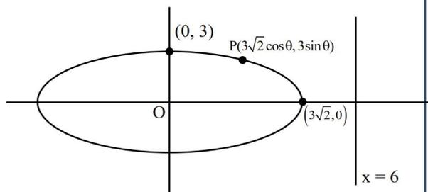

Diagram of an ellipse centered at the origin O. The ellipse passes through points (0, 3), (3√2 cos θ, 3 sin θ), and (3√2, 0). A vertical line x = 6 is shown to the right of the ellipse.

$$PS + PS' = 2 \times 3\sqrt{2}$$

$$b^2 = a^2(1 - e^2) \Rightarrow 9 = 18(1 - e^2)$$

$$\Rightarrow e = \frac{1}{\sqrt{2}}$$

$$\text{Directrix } x = \frac{a}{e} = \frac{3\sqrt{2}}{\frac{1}{\sqrt{2}}} = 6$$

$$\begin{aligned} PS \cdot PS' &= \left| \frac{1}{\sqrt{2}} (3\sqrt{2} \cos \theta - 6) \frac{1}{\sqrt{2}} (3\sqrt{2} \cos \theta + 6) \right| \\ &= \frac{1}{2} |18 \cos^2 \theta - 36| \end{aligned}$$

$$\begin{aligned} (PS \cdot PS')_{\max} &= 18; (PS \cdot PS')_{\min} = 9 \\ \text{sum} &= 27 \end{aligned}$$

17. Let the vertices Q and R of the triangle PQR lie on the line  $\frac{x+3}{5} = \frac{y-1}{2} = \frac{z+4}{3}$ , QR = 5 and the coordinates of the point P be (0, 2, 3). If the area of the triangle PQR is  $\frac{m}{n}$  then :

- (1)  $m - 5\sqrt{21}n = 0$  (2)  $2m - 5\sqrt{21}n = 0$   
 (3)  $5m - 2\sqrt{21}n = 0$  (4)  $5m - 21\sqrt{2}n = 0$

Ans. (2)

Sol.

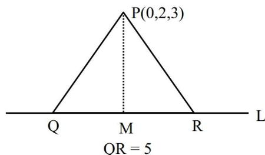

Diagram of a triangle PQR with vertex P at (0, 2, 3). The base QR lies on a line L. M is the foot of the perpendicular from P to QR. QR = 5.

$$M(5\lambda - 3, 2\lambda + 1, 3\lambda - 4)$$

$$\text{Drs of PM} \Rightarrow 5\lambda - 3, 2\lambda - 1, 3\lambda - 7$$

$$\text{Drs of line L} \Rightarrow 5, 2, 3$$

$$\text{PM} \perp \text{L}$$

$$\Rightarrow (5\lambda - 3)5 + (2\lambda - 1)2 + (3\lambda - 7)3 = 0$$

$$\Rightarrow \lambda = 1$$

$$\therefore M(2, 3, -1)$$

$$\text{PM} = \sqrt{4+1+16} = \sqrt{21}$$

$$\text{Area} = \frac{1}{2} \times 5 \times \sqrt{21} = \frac{m}{n}$$

$$2m - 5\sqrt{21}n = 0$$

18. Let ABCD be a tetrahedron such that the edges AB, AC and AD are mutually perpendicular. Let the areas of the triangles ABC, ACD and ADB be 5, 6 and 7 square units respectively. Then the area (in square units) of the  $\Delta BCD$  is equal to :

- (1)  $\sqrt{340}$  (2) 12  
 (3)  $\sqrt{110}$  (4)  $7\sqrt{3}$

Ans. (3)

Sol.  $\text{Ar}(\Delta BCD)$

$$\begin{aligned} &= \sqrt{(\text{Ar}(\Delta ABC))^2 + (\text{Ar}(\Delta ACD))^2 + (\text{Ar}(\Delta ADB))^2} \\ &= \sqrt{5^2 + 6^2 + 7^2} \\ &= \sqrt{110} \end{aligned}$$

19. Let  $a \in \mathbf{R}$  and A be a matrix of order  $3 \times 3$  such that

$$\det(A) = -4 \text{ and } A + I = \begin{bmatrix} 1 & a & 1 \\ 2 & 1 & 0 \\ a & 1 & 2 \end{bmatrix}, \text{ where I is the}$$

identity matrix of order  $3 \times 3$ .

If  $\det((a+1)\text{adj}((a-1)A))$  is  $2^m 3^n$ ,  $m, n \in \{0, 1, 2, \dots, 20\}$ , then  $m + n$  is equal to :

- (1) 14 (2) 17  
 (3) 15 (4) 16

Ans. (4)

**Sol.** A = 
$$\begin{bmatrix} 1 & a & 1 \\ 2 & 1 & 0 \\ a & 1 & 2 \end{bmatrix} - I = \begin{bmatrix} 0 & a & 1 \\ 2 & 0 & 0 \\ a & 1 & 1 \end{bmatrix}$$

|A| = -4  $\Rightarrow$  2 - 2a = -4  $\Rightarrow$  a = 3

|a + 1| adj (a - 1)A = |4 adj 3A|

= 43 |adj 3A|

= 43  $\times$  |3A|3-1 = 64 |3A|2

= 64  $\times$  (33)2 |A|2

= 26  $\times$  36  $\times$  16

2m  $\times$  3n = 210  $\times$  36

$\therefore$  m = 10, n = 6

$\Rightarrow$  m + n = 16

**20.** Let the focal chord PQ of the parabola y2 = 4x make an angle of 60° with the positive x-axis, where P lies in the first quadrant. If the circle, whose one diameter is PS, S being the focus of the parabola, touches the y-axis at the point (0,  $\alpha$ ), then 5 $\alpha^2$  is equal to :

(1) 15

(2) 25

(3) 30

(4) 20

**Ans.** (1)

**Sol.**

$\tan 60^\circ = \frac{2t-0}{t^2-1} = \sqrt{3} \Rightarrow t = \sqrt{3}$

$\therefore$  P(3, 2 $\sqrt{3}$ )

Circle :

(x - 1)(x - 3) + (y - 0)(y - 2 $\sqrt{3}$ ) = 0

at x = 0

$\Rightarrow$  3 + y2 - 2 $\sqrt{3}$  y = 0

$\Rightarrow$  y =  $\sqrt{3}$  =  $\alpha$

5 $\alpha^2$  = 15

**21.** Let [ ] denote the greatest integer function. If  $\int_{0}^{c} \left[ \frac{1}{e^{x-1}} \right] dx = \alpha - \log_e 2$ , then  $\alpha^3$  is equal to \_\_\_\_\_.

**Ans.** (8)

**Sol.** f(x) =  $\frac{1}{e^{x-1}} = e^{1-x}$

f(x) = 2 | f(x) = 1

$\frac{1}{e^{x-1}} = 2$  | x = 1

x = 1 - ln2

f(0) = e1-0 = 2.71

f(e3) = e1-e3  $\in$  (0, 1)

I =  $\int_{0}^{1-\ln 2} 2 dx + \int_{1-\ln 2}^{1} 1 dx + \int_{1}^{e^3} 0 dx$

= 2(1 - ln2 - 0) + 1(1 - 1 + ln2) + 0

$\alpha - \ln 2 = 2 - \ln 2$

$\alpha = 2$

$\alpha^3 = 8$

**22.** Let f : R  $\to$  R be a thrice differentiable odd function satisfying

f'(x)  $\ge$  0, f'(x) = f(x), f(0) = 0, f'(0) = 3. Then 9f(log33) is equal to \_\_\_\_\_.

**Ans.** (36)

**Sol.** f''(x) = f(x)

$\Rightarrow$  f'(x)  $\cdot$  f''(x) = f'(x)  $\cdot$  f(x)

$\Rightarrow \frac{(f'(x))^2}{2} = \frac{(f(x))^2}{2} + C$

$\Rightarrow (f'(x))^2 = (f(x))^2 + C'$

f(0) = 0, f'(0) = 3  $\Rightarrow$  C' = 9

$\therefore (f'(x))^2 = (f(x))^2 + 9$

f'(x) =  $\sqrt{(f(x))^2 + 9}$   $\because$  f'(x)  $\ge$  0

$\int \frac{dy}{\sqrt{y^2 + 9}} = \int dx \Rightarrow \ln |y + \sqrt{y^2 + 9}| = x + C$

$\Rightarrow f(0) = 0 \Rightarrow C = \ln 3$

$\Rightarrow y + \sqrt{y^2 + 9} = 3e^x$

at x = ln3 ; y = 4

$\therefore 9f(\ln 3) = 36$

23. If the area of the region

$$\{(x,y): |4-x^2| \leq y \leq x^2, y \leq 4, x \geq 0\}$$

is  $\left(\frac{80\sqrt{2}}{\alpha} - \beta\right)$ ,  $\alpha, \beta \in \mathbb{N}$ , then  $\alpha + \beta$  is equal to \_\_\_\_\_.

Ans. (22)

Sol.

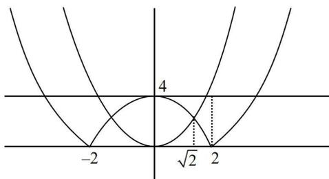

Graph showing the region bounded by y = 4 - x^2, y = x^2, and y = 4 for x ≥ 0. The region is shaded and bounded by the y-axis, the line y = 4, and the parabolas. The x-axis is marked with -2, sqrt(2), and 2. The y-axis is marked with 4.

$$A = \int_0^4 \sqrt{4+y} \, dy - \int_0^2 \sqrt{4-y} \, dy - \int_2^4 \sqrt{y} \, dy$$

$$= \left( \frac{(4+y)^{3/2}}{3/2} \right)_0^4 + \left( \frac{(4-y)^{3/2}}{3/2} \right)_0^2 - \left( \frac{y^{3/2}}{3/2} \right)_0^4$$

$$\frac{80\sqrt{2}}{3} - 16 = \frac{40\sqrt{2}}{3} - 16$$

$$\alpha = 6, \beta = 16$$

$$\alpha + \beta = 22$$

24. Three distinct numbers are selected randomly from the set  $\{1, 2, 3, \dots, 40\}$ . If the probability, that the selected numbers are in an increasing G.P. is  $\frac{m}{n}$ ,  $\gcd(m, n) = 1$ , then  $m + n$  is equal to \_\_\_\_\_.

Ans. (4949)

Sol.  $1 \leq a < ar < ar^2 \leq 40$

(If  $r \in \mathbb{N}$ )

If  $r = 2$

$$1 \leq a < 2a < 4a \leq 40$$

$$a \in \{1, \dots, 10\}$$

(10 GP)

If  $r = 3$

$$1 \leq a < 3a < 9a \leq 40$$

$$a \in \{1, 2, 3, 4\}$$

(4 GP)

If  $r = 4$

$$1 \leq a < 4a < 16a \leq 40$$

$$a \in \{1, 2\}$$

(2 GP)

If  $r = 5$

$$1 \leq a < 5a < 25a \leq 40$$

$$a \in \{1\}$$

(1 GP)

If  $r = 6$

$$1 \leq a < 6a < 36a \leq 40$$

$$a \in \{1\}$$

(1 GP)

$$\left( P = \frac{18}{9880} = \frac{9}{4940} \right) \text{ as per NTA for } r \in \mathbb{N}$$

$$m + n = 4949$$

If  $r \notin \mathbb{N}$  (also possible)

$$r = \frac{3}{2}$$

$$ar^2 = \frac{9a}{4}; a = 4k$$

$$\left. \begin{matrix} (4, 6, 9) \\ (8, 12, 18) \\ (12, 18, 27) \\ (16, 24, 36) \end{matrix} \right\} 4 \text{ GP}$$

$$r = \frac{5}{2} \quad ar^2 = \frac{25a}{4}; a = 4k$$

$$(4, 10, 25) \dots (1) \text{ GP}$$

$$r = \frac{4}{3} \quad ar^2 = \frac{16a}{9} \rightarrow a = 9k$$

$$(9, 12, 16), (18, 24, 32) \dots (2) \text{ GP}$$

$$r = \frac{5}{3} \quad ar^2 = \frac{25a}{9}; a = 9k$$

$$(9, 15, 25) \dots (1) \text{ GP}$$

$$r = \frac{5}{4} \quad ar^2 = \frac{25a}{16}; a = 16k$$

$$(16, 20, 25) \dots (1) \text{ GP}$$

$$r = \frac{6}{5} \quad ar^2 = \frac{36a}{25}; a = 25k$$

$$(25, 30, 36) \dots (1) \text{ GP}$$

$$\text{Total} = 18 + 10 = 28$$

$$P = \frac{28}{{}^{40}C_3} = \frac{28}{9880} = \frac{7}{2470}$$

$$m + n = 2477$$

25. The absolute difference between the squares of the radii of the two circles passing through the point  $(-9, 4)$  and touching the lines  $x + y = 3$  and  $x - y = 3$ , is equal to \_\_\_\_\_.

Ans. (768)

Sol.

A diagram showing two circles tangent to the lines x+y=3 and x-y=3. The circles pass through the point (-9, 4). The center of the circles lies on the x-axis at (a, 0). The lines intersect at the origin (0, 3). The point (-9, 4) is marked on the larger circle.

Centre  $(a, 0)$

$$r = \left| \frac{a - 0 - 3}{\sqrt{2}} \right|$$

$$\text{circle } (x - a)^2 + y^2 = \left( \frac{a - 3}{\sqrt{2}} \right)^2$$

passes through  $(-9, 4)$

$$2(a^2 + 18a + 81 + 16) = (a^2 - 6a + 9)$$

$$a^2 + 42a + 185 = 0$$

$$(a + 37)(a + 5) = 0$$

$$\Rightarrow a = -37, -5$$

$$r_1 = \left| \frac{-37 - 3}{\sqrt{2}} \right| = 20\sqrt{2}$$

$$r_2 = \left| \frac{-5 - 3}{\sqrt{2}} \right| = 4\sqrt{2}$$

$$|r_1^2 - r_2^2| = |800 - 32| = 768$$

# **SECTION-A**

26. A light wave is propagating with plane wave fronts of the type  $x + y + z = \text{constant}$ . The angle made by the direction of wave propagation with the x-axis is :

(1)  $\cos^{-1}\left(\frac{1}{\sqrt{3}}\right)$       (2)  $\cos^{-1}\left(\frac{2}{3}\right)$   
 (3)  $\cos^{-1}\left(\frac{1}{3}\right)$       (4)  $\cos^{-1}\left(\frac{2}{\sqrt{3}}\right)$

**Ans. (1)**

**Sol.** The direction of propagation of light is perpendicular to the wave front and is symmetric about x, y and z axis.

$\therefore$  Angle made by the light with x, y & z axis is same.

$\therefore \cos\alpha = \cos\beta = \cos\gamma$  ( $\alpha, \beta$  &  $\gamma$  are angle made by light with x, y & z axis respectively)

Also  $\cos^2\alpha + \cos^2\beta + \cos^2\gamma = 1$  [Sum of direction cosines]

$\therefore \alpha = \cos^{-1}\frac{1}{\sqrt{3}}$

27. The equation for real gas is given by  $\left(P + \frac{a}{V^2}\right)(V - b) = RT$ , where P, V, T and R are the pressure, volume, temperature and gas constant, respectively. The dimension of  $ab^{-2}$  is equivalent to that of :

- (1) Planck's constant      (2) Compressibility  
 (3) Strain                      (4) Energy density

**Ans. (4)**

**Sol.**  $\left[P + \frac{a}{V^2}\right](V - b) = RT$

$\therefore [a] = [P][V^2] = ML^{-1}T^{-2}L^6 = ML^5T^{-2}$

$[b] = [V] = L^3$

$[ab^{-2}] = ML^5T^{-2}L^{-6} = ML^{-1}T^{-2}$

Dimension of energy density.

28. A cord of negligible mass is wound around the rim of a wheel supported by spokes with negligible mass. The mass of wheel is 10 kg and radius is 10 cm and it can freely rotate without any friction. Initially the wheel is at rest. If a steady pull of 20 N is applied on the cord, the angular velocity of the wheel, after the cord is unwound by 1 m, would be :

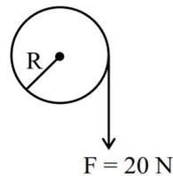

Diagram of a wheel with radius R. A cord is wound around its rim, and a force F = 20 N is applied downwards at the point where the cord leaves the wheel.

- (1) 20 rad/s                      (2) 30 rad/s  
 (3) 10 rad/s                      (4) 0 rad/s

**Ans. (1)**

**Sol.**  $W_F = 20 \times 1 = 20 \text{ J}$

$\therefore \Delta KE = 20 \text{ J} = \frac{1}{2}I\omega^2$

$I = MR^2 = 10 \times 0.1^2 = 0.1 \text{ kg m}^2$

$\therefore 20 = \frac{1}{2} \times 0.1 \times \omega^2$

$\Rightarrow \omega = 20 \text{ rad/sec}$

29. A slanted object AB is placed on one side of convex lens as shown in the diagram. The image is formed on the opposite side. Angle made by the image with principal axis is :

Diagram of a convex lens with focal length f = 20 cm. An object AB is placed on the left side. Point A is on the principal axis at a distance of 30 cm from the lens. Point B is 1 cm above A. The object AB makes an angle alpha with the principal axis. The image is formed on the right side of the lens.

- (1)  $-\frac{\alpha}{2}$                               (2)  $-45^\circ$   
 (3)  $+45^\circ$                           (4)  $-\alpha$

**Ans. (2)**

Sol.

Ray diagram showing an object A at a distance of 30 cm from a concave mirror with focal length f = 20 cm. The object has a height of 2 cm. The image A' is formed at a distance of 60 cm from the mirror and has a height of 1 cm. The angle of incidence alpha is shown at the object and the angle of reflection alpha is shown at the image.

Location of image of A :-

$$\frac{1}{v} - \frac{1}{u} = \frac{1}{f} \Rightarrow \frac{1}{v} - \frac{1}{-30} = \frac{1}{20} \Rightarrow \frac{1}{v} = \frac{1}{60} \Rightarrow v = 60 \text{ cm}$$

$$\therefore m = 2$$

Since size of object is small wrt the location hence

$$dv = m^2 du \Rightarrow dv = 4 \times 1 = 4 \text{ cm}$$

$$h_i = mh_o \Rightarrow h_i(dy) = 2 \times 2 = 4 \text{ cm}$$

$$\therefore \text{ Angle made with principle axis} = -45^\circ$$

30. Consider two infinitely large plane parallel conducting plates as shown below. The plates are uniformly charged with a surface charge density  $+\sigma$  and  $-2\sigma$ . The force experienced by a point charge  $+q$  placed at the mid point between two plates will be :

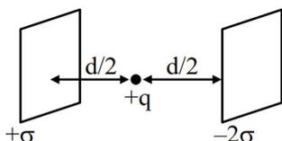

Diagram of two parallel conducting plates. The left plate has a surface charge density of +sigma and the right plate has -2sigma. A point charge +q is placed at the midpoint between them. The distance from each plate to the charge is labeled as d/2.

- (1)  $\frac{\sigma q}{4 \epsilon_0}$  (2)  $\frac{3\sigma q}{2 \epsilon_0}$   
(3)  $\frac{3\sigma q}{4 \epsilon_0}$  (4)  $\frac{\sigma q}{2 \epsilon_0}$

Ans. (2)

Sol.

Diagram of two parallel plates with surface charge densities sigma and -2sigma. A point charge q is placed at the midpoint between them, at a distance d/2 from each plate. A Cartesian coordinate system is shown with the x-axis pointing to the right and the y-axis pointing upwards.

Final charge distribution will be

Diagram showing the final charge distribution on two plates. Plate 1 (left) has surface charge densities of -sigma/2 on its left face and 3sigma/2 on its right face. Plate 2 (right) has surface charge densities of -3sigma/2 on its left face and -sigma/2 on its right face.

$$\therefore F_{\text{net}} = \frac{3\sigma}{2 \epsilon_0} q$$

31. A river is flowing from west to east direction with speed of  $9 \text{ km h}^{-1}$ . If a boat capable of moving at a maximum speed of  $27 \text{ km h}^{-1}$  in still water, crosses the river in half a minute, while moving with maximum speed at an angle of  $150^\circ$  to direction of river flow, then the width of the river is :

- (1) 300 m (2) 112.5 m  
(3) 75 m (4)  $112.5 \times \sqrt{3}$  m

Ans. (2)

Sol.

Vector diagram for river crossing. The river flow is represented by a horizontal vector to the right labeled 9 km/hr. The boat's velocity in still water is represented by a vector at an angle of 60 degrees to the vertical (or 150 degrees to the horizontal) labeled 27 km/hr. The resultant vector is shown crossing the river.

$$\therefore V_{\perp} = \text{river flow} = 27 \times \cos 60^\circ = \frac{27}{2} \text{ km/hr.}$$

Time taken = 30 sec.

$$\therefore S = Vt = \frac{27}{2} \times \frac{5}{18} \times 30 \text{ m} = 112.5 \text{ m}$$

32. A point charge  $+q$  is placed at the origin. A second point charge  $+9q$  is placed at  $(d, 0, 0)$  in Cartesian coordinate system. The point in between them where the electric field vanishes is :

- (1)  $(4d/3, 0, 0)$  (2)  $(d/4, 0, 0)$   
(3)  $(3d/4, 0, 0)$  (4)  $(d/3, 0, 0)$

Ans. (2)

**Sol.**

Diagram showing a point P on a line segment between two points. The left point is labeled 'q' with coordinates (0, 0, 0). The right point is labeled '9q' with coordinates (d, 0, 0). Point P is at a distance 'x' from the left point. The distance from P to the right point is labeled 'd-x'.

Let  $E_p = 0$

$$\therefore \frac{kq}{x^2} = \frac{k9q}{(d-x)^2}$$

$$\Rightarrow \frac{d-x}{x} = 3 \Rightarrow x = \frac{d}{4}$$

$$\therefore \text{ co-ordinate of P is } \left( \frac{d}{4}, 0, 0 \right)$$

33. The battery of a mobile phone is rated as 4.2 V, 5800 mAh. How much energy is stored in it when fully charged ?

(1) 43.8 kJ                                (2) 48.7 kJ  
(3) 87.7 kJ                                (4) 24.4 kJ

**Ans. (3)**

**Sol.** Given  $V = 4.2$  volt

$\therefore$  Energy supplied by battery

$$= vq = 4.2 \times 5800 \times 3600 \times 10^{-3} \text{ J} = 87.696 \text{ kJ}$$

$\therefore$  Energy stored in the battery when fully charged  
 $= 87.696 \text{ kJ} \approx 87.7 \text{ kJ}$

34. A particle is subjected two simple harmonic motions as :

$$x_1 = \sqrt{7} \sin 5t \text{ cm}$$

$$\text{and } x_2 = 2\sqrt{7} \sin \left( 5t + \frac{\pi}{3} \right) \text{ cm}$$

where  $x$  is displacement and  $t$  is time in seconds.

The maximum acceleration of the particle is

$x \times 10^{-2} \text{ ms}^{-2}$ . The value of  $x$  is :

(1) 175                                    (2)  $25\sqrt{7}$   
(3)  $5\sqrt{7}$                                     (4) 125

**Ans. (1)**

**Sol.**  $x_1 = \sqrt{7} \sin 5t$

$$x_2 = 2\sqrt{7} \sin \left( 5t + \frac{\pi}{3} \right)$$

From phasor,

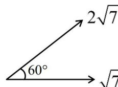

Phasor diagram showing two vectors. A horizontal vector is labeled sqrt(7). Another vector is at an angle of 60 degrees to the horizontal and is labeled 2\*sqrt(7).

$\therefore$  Amplitude of resultant SHM = 7

$$\phi = \tan^{-1} \frac{2\sqrt{7} \times \sqrt{3}/2}{\sqrt{7} + 2\sqrt{7} \times \frac{1}{2}} = \tan^{-1} \frac{\sqrt{21}}{2\sqrt{7}} = \tan^{-1} \frac{\sqrt{3}}{2}$$

$$\therefore X_R = 7 \sin (5t + \phi)$$

$$a_R = -7 \times 25 \sin (5t + \phi)$$

$$\therefore a_{\max} = 175 \text{ cm/sec} = 175 \times 10^{-2} \text{ m/sec}$$

35. The relationship between the magnetic susceptibility ( $\chi$ ) and the magnetic permeability ( $\mu$ ) is given by :
- ( $\mu_0$  is the permeability of free space and  $\mu_r$  is relative permeability)

(1)  $\chi = \frac{\mu}{\mu_0} - 1$                                 (2)  $\chi = \frac{\mu_r}{\mu_0} + 1$   
(3)  $\chi = \mu_r + 1$                                 (4)  $\chi = 1 - \frac{\mu}{\mu_0}$

**Ans. (1)**

**Sol.** We have

$$\mu_r = (1 + \chi) \Rightarrow \chi = (\mu_r - 1)$$

$$\mu = \mu_0 \mu_r \Rightarrow \mu_r = \frac{\mu}{\mu_0}$$

$$\therefore \chi = \left( \frac{\mu}{\mu_0} - 1 \right)$$

36. A zener diode with 5V zener voltage is used to regulate an unregulated dc voltage input of 25 V. For a 400  $\Omega$  resistor connected in series, the zener current is found to be 4 times load current. The load current ( $I_L$ ) and load resistance ( $R_L$ ) are :

- (1)  $I_L = 20 \text{ mA}; R_L = 250 \Omega$
- (2)  $I_L = 10 \text{ A}; R_L = 0.5 \Omega$
- (3)  $I_L = 0.02 \text{ mA}; R_L = 250 \Omega$
- (4)  $I_L = 10 \text{ mA}; R_L = 500 \Omega$

Ans. (4)

Circuit diagram for Question 36. A 25V DC source is connected in series with a 400 ohm resistor. This series combination is connected in parallel with a zener diode (cathode up) and a load resistor. The zener voltage is 5V. The current through the resistor is labeled 5i, and the current through the load resistor is labeled i.

From the circuit diagram,

$$5i = \frac{20}{400} = \frac{1}{20} \text{ A}$$

$$\therefore i = \frac{1}{100} \text{ A} = 10 \text{ mA} = \text{Load current}$$

Also,  $V_L = 5 \text{ V}$

$$\therefore R_L = \frac{5}{10 \times 10^{-3}} \Omega = 500 \Omega$$

37. In an adiabatic process, which of the following statements is true ?

- (1) The molar heat capacity is infinite
- (2) Work done by the gas equals the increase in internal energy
- (3) The molar heat capacity is zero
- (4) The internal energy of the gas decreases as the temperature increases

Ans. (3)

Sol. For adiabatic process,  $dQ = 0$

$\therefore$  Molar heat capacity = 0

$\because dQ = 0 \Rightarrow dU = -dW$

$$\text{Also } dU = \frac{f}{2} nRdT$$

$\therefore$  Only option (3) is correct.

38. A square Lamina OABC of length 10 cm is pivoted at 'O'. Forces act at Lamina as shown in figure. If Lamina remains stationary, then the magnitude of F is :

Diagram for Question 38. A square lamina OABC with side length 10 cm is pivoted at vertex O. Vertex A is at (10, 0), B is at (10, 10), and C is at (0, 10). Forces acting on the lamina are: 10N upwards at C, 10N upwards at B, 10N to the right at B, 10N to the right at A, and 10N downwards at A. A force F acts to the left at vertex C.

- (1) 20 N
- (2) 0 (zero)
- (3) 10 N
- (4)  $10\sqrt{2} \text{ N}$

Ans. (3)

Sol. Since the lamina is equilibrium.

$$\therefore F_{\text{net}} = 0 \text{ \& } \tau_{\text{net}} = 0$$

Diagram for Question 38 solution. A square lamina OABC with side length l is pivoted at vertex O. Vertex A is at (l, 0), B is at (l, l), and C is at (0, l). Forces acting on the lamina are: 10N upwards at C, 10N upwards at B, 10N to the right at B, 10N to the right at A, and 10N downwards at A. A force F acts to the left at vertex C.

$$T_O = 10l - Fl \Rightarrow F = 10 \text{ N}$$

39. Let  $B_1$  be the magnitude of magnetic field at center of a circular coil of radius R carrying current I. Let  $B_2$  be the magnitude of magnetic field at an axial distance 'x' from the center. For  $x : R = 3 : 4$ ,  $\frac{B_2}{B_1}$  is :

- (1) 4 : 5
- (2) 16 : 25
- (3) 64 : 125
- (4) 25 : 16

Ans. (3)

Diagram for Question 39. A circular coil of radius R is shown in a vertical plane. A point P is on the x-axis at a distance x from the center O. The distance from the center O to point P is labeled x. The radius of the coil is labeled R. A dashed line connects the center O to point P.

Sol.

$$B_1 = \frac{\mu_0 i}{2R}$$

$$B_2 = B_1 \sin^3 \theta$$

$$\therefore \frac{B_2}{B_1} = \sin^3 \theta = \left(\frac{4}{5}\right)^3 = \frac{64}{125}$$

40. Considering Bohr's atomic model for hydrogen atom :

- (A) the energy of H atom in ground state is same as energy of He+ ion in its first excited state.
- (B) the energy of H atom in ground state is same as that for Li++ ion in its second excited state.
- (C) the energy of H atom in its ground state is same as that of He+ ion for its ground state.
- (D) the energy of He+ ion in its first excited state is same as that for Li++ ion in its ground state

Choose the **correct** answer from the options given below :

- (1) (B), (D) only
- (2) (A), (B) only
- (3) (A), (D) only
- (4) (A), (C) only

Ans. (2)

Sol.  $E \propto \frac{Z}{n^2}$

$$Z_H = 1 \quad Z_{He^+} = 2 \quad Z_{Li^{++}} = 3$$

1st excited state  $\Rightarrow n = 2$

2nd excited state  $\Rightarrow n = 3$

From the given statements only A & B are correct.

41. Moment of inertia of a rod of mass 'M' and length 'L' about an axis passing through its center and normal to its length is ' $\alpha$ '. Now the rod is cut into two equal parts and these parts are joined symmetrically to form a cross shape. Moment of inertia of cross about an axis passing through its center and normal to plane containing cross is :

- (1)  $\alpha$
- (2)  $\alpha/4$
- (3)  $\alpha/8$
- (4)  $\alpha/2$

Ans. (2)

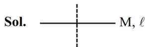

Sol.

Diagram of a cross shape formed by two rods of mass M and length l. The rods intersect at their centers. A dashed vertical line passes through the intersection point, representing the axis of rotation.

$$\alpha = \frac{Ml^2}{12} \quad \dots (i)$$

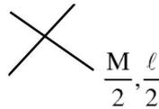

Diagram of a cross shape formed by two rods of mass M and length l. The rods intersect at their centers. A dashed vertical line passes through the intersection point, representing the axis of rotation.

$$\alpha' = 2 \left[ \frac{M \left( \frac{l}{2} \right)^2}{12} \right]$$

$$\alpha' = \frac{Ml^2}{48} = \frac{\alpha}{4}$$

Correct option is (2)

42.

Diagram of a spherical surface separating two media. Medium-1 (n1=1) is on the left, and Medium-2 (n1=1.5) is on the right. An object 'O' is placed 0.2 m to the left of the surface. The center of curvature 'C' is on the right side of the surface. The radius of curvature R is 0.4 m.

A spherical surface separates two media of refractive indices 1 and 1.5 as shown in figure. Distance of the image of an object 'O', is :

(C is the center of curvature of the spherical surface and R is the radius of curvature)

- (1) 0.24 m right to the spherical surface
- (2) 0.4 m left to the spherical surface
- (3) 0.24 m left to the spherical surface
- (4) 0.4 m right to the spherical surface

Ans. (2)

Sol.  $\frac{\mu_2}{v} - \frac{\mu_1}{u} = \frac{\mu_2 - \mu_1}{R}$

$$\frac{1.5}{v} - \frac{1}{-0.2} = \frac{1.5 - 1}{0.4}$$

$$\frac{1.5}{v} = \frac{0.5}{0.4} - \frac{1}{0.2}$$

$$\frac{1.5}{v} = -\frac{1.5}{0.4}$$

$$v = -0.4 \text{ m}$$

43. Match List-I with List-II.

List-I

List-II

- |                              |                        |
|------------------------------|------------------------|
| (A) Coefficient of viscosity | (I) $[ML^0T^{-3}]$     |
| (B) Intensity of wave        | (II) $[ML^{-2}T^{-2}]$ |
| (C) Pressure gradient        | (III) $[M^{-1}LT^2]$   |
| (D) Compressibility          | (IV) $[ML^{-1}T^{-1}]$ |

Choose the **correct** answer from the options given below :

- (1) (A)-(I), (B)-(IV), (C)-(III), (D)-(II)
- (2) (A)-(IV), (B)-(I), (C)-(II), (D)-(III)
- (3) (A)-(IV), (B)-(II), (C)-(I), (D)-(III)
- (4) (A)-(II), (B)-(III), (C)-(IV), (D)-(I)

Ans. (2)

Sol. (A) Coefficient of viscosity

$$[\eta] = [M^1L^{-1}T^{-1}]$$

- (B) Intensity  $[I] = [M^1L^0T^{-3}]$   
 (C) Pressure gradient  $= [ML^{-2}T^{-2}]$   
 (D) Compressibility  $[K] = [M^{-1}L^1T^2]$

44. A small bob of mass 100 mg and charge  $+10 \mu C$  is connected to an insulating string of length 1 m. It is brought near to an infinitely long non-conducting sheet of charge density ' $\sigma$ ' as shown in figure. If string subtends an angle of  $45^\circ$  with the sheet at equilibrium the charge density of sheet will be :

(Given,  $\epsilon_0 = 8.85 \times 10^{-12} \frac{F}{m}$  and acceleration due to gravity,  $g = 10 \text{ m/s}^2$ )

Diagram for Question 44: A vertical dashed line represents an infinitely long non-conducting sheet with a uniform positive charge density sigma. A small bob of mass 100 mg and charge +10 microCoulombs is suspended by an insulating string of length l = 1 m from a point A on the sheet. The string makes an angle of 45 degrees with the vertical sheet at equilibrium.

- (1)  $0.885 \text{ nC/m}^2$
- (2)  $17.7 \text{ nC/m}^2$
- (3)  $885 \text{ nC/m}^2$
- (4)  $1.77 \text{ nC/m}^2$

Ans. (4)

Sol.

Free-body diagram for Question 44: The bob is shown as a point. A vertical dashed line represents the sheet. A string of length l connects the bob to a point on the sheet, making a 45-degree angle with the vertical. Three force vectors originate from the bob: Tension (T) along the string towards the sheet, Gravitational force (mg) vertically downwards, and Electrostatic force (F\_e = qE) horizontally to the right, away from the sheet.

$$qE = mg$$

$$q \left[ \frac{\sigma}{2\epsilon_0} \right] = mg$$

$$\sigma = \frac{2\epsilon_0 mg}{q}$$

$$\sigma = \frac{2 \times 8.85 \times 10^{-12} \times 100 \times 10^{-6} \times 10}{10 \times 10^{-6}}$$

$$\sigma = 17.7 \times 10^{-10} \text{ C/m}^2$$

$$\sigma = 1.77 \text{ nC/m}^2$$

45. A monochromatic light is incident on a metallic plate having work function  $\phi$ . An electron, emitted normally to the plate from a point A with maximum kinetic energy, enters a constant magnetic field, perpendicular to the initial velocity of electron. The electron passes through a curve and hits back the plate at a point B. The distance between A and B is :

(Given : The magnitude of charge of an electron is  $e$  and mass is  $m$ ,  $h$  is Planck's constant and  $c$  is velocity of light. Take the magnetic field exists throughout the path of electron)

- (1)  $\sqrt{2m \left( \frac{hc}{\lambda} - \phi \right)} / eB$
- (2)  $\sqrt{m \left( \frac{hc}{\lambda} - \phi \right)} / eB$
- (3)  $\sqrt{8m \left( \frac{hc}{\lambda} - \phi \right)} / eB$
- (4)  $2 \sqrt{m \left( \frac{hc}{\lambda} - \phi \right)} / eB$

Ans. (3)

$$\text{Sol. } KE_{\max} = \frac{hc}{\lambda} - \phi$$

$$p = \sqrt{2mK_{\max}}$$

$$p = \sqrt{2m\left(\frac{hc}{\lambda} - \phi\right)}$$

$$d_{A-B} = 2R$$

$$= 2\left[\frac{p}{qB}\right]$$

$$d_{AB} = \frac{2\sqrt{2m\left(\frac{hc}{\lambda} - \phi\right)}}{eB} = \frac{\sqrt{8m\left(\frac{hc}{\lambda} - \phi\right)}}{eB}$$

# SECTION-B

46. A vessel with square cross-section and height of 6 m is vertically partitioned. A small window of 100 cm2 with hinged door is fitted at a depth of 3 m in the partition wall. One part of the vessel is filled completely with water and the other side is filled with the liquid having density  $1.5 \times 10^3$  kg/m3. What force one needs to apply on the hinged door so that it does not get opened?

(Acceleration due to gravity = 10 m/s2)

Ans. (150)

Sol.

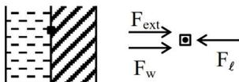

Diagram of a hinged door in a partition wall. The door is hatched on the right side. To the left of the door, there are two arrows pointing right: F\_ext (top) and F\_w (bottom). To the right of the door, there is one arrow pointing left: F\_l.

in equilibrium

$$F_{\text{ext}} + F_w = F_l$$

$$\Rightarrow F_{\text{ext}} = F_l - F_w$$

$$= (P_0 + \rho_l gh)A - (P_0 + \rho_w gh)A$$

$$= (\rho_l - \rho_w)ghA$$

$$= (1500 - 1000) \times 10 \times 3 \times (100 \times 10^{-4})$$

$$= 150 \text{ m}$$

47. A steel wire of length 2 m and Young's modulus  $2.0 \times 10^{11}$  Nm-2 is stretched by a force. If Poisson ratio and transverse strain for the wire are 0.2 and  $10^{-3}$  respectively, then the elastic potential energy density of the wire is \_\_\_\_  $\times 10^5$  (in SI units)

Ans. (25)

$$\text{Sol. } \ell = 2 \text{ m}; Y = 2 \times 10^{11} \frac{\text{N}}{\text{m}^2}$$

$$\mu = -\frac{\left(\frac{\Delta r}{r}\right)}{\left(\frac{\Delta \ell}{\ell}\right)} \Rightarrow \frac{\Delta \ell}{\ell} = \frac{1}{\mu} \times \left(\frac{\Delta r}{r}\right)$$

$$= \frac{1}{0.2} \times (10^{-3})$$

$$\Rightarrow \frac{\Delta \ell}{\ell} = 5 \times 10^{-3}$$

$$u = \frac{1}{2} Y \epsilon_\ell^2 = \frac{1}{2} \times 2 \times 10^{11} \times [5 \times 10^{-3}]^2$$

$$= 25$$

48. If the measured angular separation between the second minimum to the left of the central maximum and the third minimum to the right of the central maximum is 30° in a single slit diffraction pattern recorded using 628 nm light, then the width of the slit is \_\_\_\_ μm.

Ans. (6)

Diagram of a single slit diffraction pattern. A central maximum is shown as a vertical line. To the left, the second minimum is marked at an angle theta\_2. To the right, the third minimum is marked at an angle theta\_1. The total angular separation between them is 30 degrees.

Sol.

$$\theta_1 = \sin^{-1}\left(\frac{2\lambda}{a}\right)$$

$$\theta_2 = \sin^{-1}\left(\frac{3\lambda}{a}\right)$$

$$\therefore \theta_1 + \theta_2 = 30^\circ$$

$$\Rightarrow \sin^{-1}\left(\frac{2\lambda}{a}\right) + \sin^{-1}\left(\frac{3\lambda}{a}\right) = \frac{\pi}{6}$$

$$\Rightarrow \frac{2\lambda}{a} \sqrt{1 - \left(\frac{3\lambda}{a}\right)^2} + \frac{3\lambda}{a} \sqrt{1 - \left(\frac{2\lambda}{a}\right)^2} = \sin \frac{\pi}{6}$$

Here  $\lambda = 628 \text{ nm}$

After solving

$$A = 6.07 \mu\text{m}$$

**Approximate Method :**

$$\theta = \theta_1 + \theta_2$$

$$\Rightarrow \frac{\pi}{6} = \frac{2\lambda}{a} + \frac{3\lambda}{a}$$

$$\Rightarrow \frac{\pi}{6} = \frac{5}{a}(628 \text{ nm})$$

$$\Rightarrow a = 6 \mu\text{m}$$

49.  $\gamma_A$  is the specific heat ratio of monoatomic gas A having 3 translational degrees of freedom.  $\gamma_B$  is the specific heat ratio of polyatomic gas B having 3 translational, 3 rotational degrees of freedom and 1 vibrational mode. If  $\frac{\gamma_A}{\gamma_B} = \left(1 + \frac{1}{n}\right)$ , then the value of  $n$  is \_\_\_\_\_.

**Ans. (3)**

$$\text{Sol. } \frac{\gamma_A}{\gamma_B} = \frac{f_A + 2}{f_A} \times \frac{f_B}{f_B + 2}$$

$$= \frac{3+2}{3} \times \frac{(6+2)}{(6+2)+2}$$

$$= \frac{5}{3} \times \frac{8}{10} = \frac{40}{30}$$

$$\therefore \frac{40}{30} = 1 + \frac{1}{n}$$

$$\Rightarrow \frac{40}{30} - 1 = \frac{1}{n}$$

$$\Rightarrow n = 3$$

50. A person travelling on a straight line moves with a uniform velocity  $v_1$  for a distance  $x$  and with a uniform velocity  $v_2$  for the next  $\frac{3}{2}x$  distance. The average velocity in this motion is  $\frac{50}{7} \text{ m/s}$ . If  $v_1$  is 5 m/s then  $v_2 = \text{_____ m/s}$ .

**Ans. (10)**

$$\text{Sol. } v_{\text{avg}} = \frac{x_1 + x_2}{t_1 + t_2}$$

$$\Rightarrow \frac{50}{7} = \frac{x + \frac{3x}{2}}{\frac{x}{5} + \frac{3x}{2v_2}}$$

$$\Rightarrow \frac{50}{7} = \frac{5/2}{\frac{1}{5} + \frac{3}{2v_2}}$$

$$\Rightarrow \frac{1}{5} + \frac{3}{2v_2} = \frac{7}{20}$$

$$\Rightarrow \frac{3}{2v_2} = \frac{7}{20} - \frac{1}{5} = \frac{7-4}{20}$$

$$\Rightarrow \frac{3}{2v_2} = \frac{3}{20}$$

$$\Rightarrow v_2 = 10 \text{ m/s}$$

# SECTION-A

51. Designate whether each of the following compounds is aromatic or not aromatic.

Eight chemical structures labeled (a) through (h): (a) cyclopentadienyl anion, (b) cyclopentadienyl cation, (c) cyclobutadiene dication, (d) cyclobutadiene dianion, (e) cyclohexadienyl cation, (f) cyclooctatetraene, (g) cyclobutadiene, (h) cyclopropenyl cation.

- (1) e, g aromatic and a, b, c, d, f, h not aromatic  
 (2) b, e, f, g aromatic and a, c, d, h not aromatic  
 (3) a, b, c, d aromatic and e, f, g, h not aromatic  
 (4) a, c, d, e, h aromatic and b, f, g not aromatic

Ans. (4)

Sol. Aromatic compounds

a, c, d, e, h follow Huckel's rule

b, f, g, are not aromatic, these compounds do not follow Huckel's rule

Eight chemical structures labeled (a) through (h): (a) cyclopentadienyl anion, (b) cyclopentadienyl cation, (c) cyclobutadiene dication, (d) cyclobutadiene dianion, (e) cyclohexadienyl cation, (f) cyclooctatetraene, (g) cyclobutadiene, (h) cyclopropenyl cation. Structures (b), (f), and (g) with the label '(Not Aromatic)'.

52. An optically active alkyl halide  $C_4H_9Br$  [A] reacts with hot KOH dissolved in ethanol and forms alkene [B] as major product which reacts with bromine to give dibromide [C]. The compound [C] is converted into a gas [D] upon reacting with alcoholic  $NaNH_2$ . During hydration 18 gram of water is added to 1 mole of gas [D] on warming with mercuric sulphate and dilute acid at 333 K to form compound [E]. The IUPAC name of compound [E] is :

- (1) But-2-yne                      (2) Butan-2-ol  
 (3) Butan-2-one                  (4) Butan-1-al

Ans. (3)

Sol.

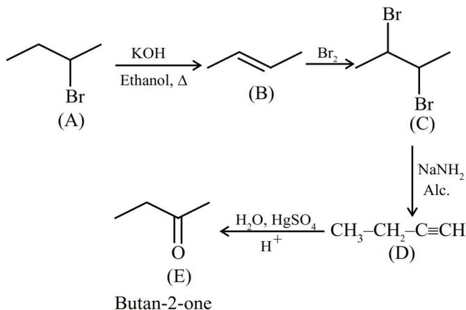

Butan-2-one

Reaction scheme: (A) 2-bromobutane reacts with KOH in ethanol, Δ to form (B) but-2-ene. (B) reacts with Br2 to form (C) 2,3-dibromobutane. (C) reacts with NaNH2 in alcohol to form (D) but-1-yne. (D) is hydrated with H2O, HgSO4, H+ to form (E) butan-2-one.

53. The property/properties that show irregularity in first four elements of group-17 is/are :

- (A) Covalent radius  
 (B) Electron affinity  
 (C) Ionic radius  
 (D) First ionization energy

Choose the **correct** answer from the options given below:

- (1) B and D only                  (2) A and C only  
 (3) B only                            (4) A, B, C and D

Ans. (3)

Sol. The order of first four elements of group-17 are as follows.

$F < Cl < Br < I$  (Covalent radius)

$Cl > F > Br > I$  (Electron affinity)

$F^- < Cl^- < Br^- < I^-$  (Ionic radius)

$F > Cl > Br > I$  (1st ionization energy)

Electron affinity order is irregular.

54. Which of the following graph correctly represents the plots of  $K_H$  at 1 bar gases in water versus temperature ?

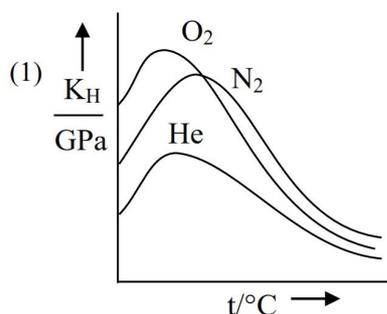

(1)

Graph (1) showing Henry's constant (K\_H) in GPa versus temperature (t/°C) for O2, N2, and He. All three curves show an initial increase with temperature, reach a peak, and then decrease. The peak for O2 is the highest, followed by N2, and then He.

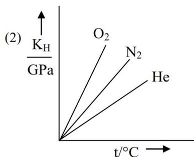

(2)

Graph (2) showing Henry's constant (K\_H) in GPa versus temperature (t/°C) for O2, N2, and He. All three curves are straight lines starting from the origin and increasing linearly with temperature. The slope is highest for O2, followed by N2, and then He.

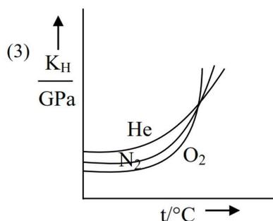

(3)

Graph (3) showing Henry's constant (K\_H) in GPa versus temperature (t/°C) for He, N2, and O2. All three curves are initially flat and then increase sharply with temperature. The curve for O2 is the highest, followed by N2, and then He.

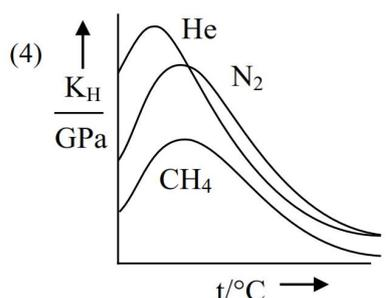

(4)

Graph (4) showing Henry's constant (K\_H) in GPa versus temperature (t/°C) for He, N2, and CH4. All three curves show an initial increase with temperature, reach a peak, and then decrease. The peak for He is the highest, followed by N2, and then CH4.

Ans. (4)

Sol. As temperature increases solubility first decrease then increase hence  $K_H$  first increase than decrease also at moderate temperature  $K_H$  value  $\text{He} > \text{N}_2 > \text{CH}_4$ .

55. According to Bohr's model of hydrogen atom, which of the following statement is **incorrect**?

- (1) Radius of  $3^{\text{rd}}$  orbit is nine times larger than that of  $1^{\text{st}}$  orbit.
- (2) Radius of  $8^{\text{th}}$  orbit is four times larger than that of  $4^{\text{th}}$  orbit.
- (3) Radius of  $6^{\text{th}}$  orbit is three time larger than that of  $4^{\text{th}}$  orbit.
- (4) Radius of  $4^{\text{th}}$  orbit is four times larger than that of  $2^{\text{nd}}$  orbit.

Ans. (3)

Sol.  $r \propto n^2$

- (1)  $\frac{r_3}{r_1} = \frac{9}{1}$
- (2)  $\frac{r_8}{r_4} = \frac{64}{16} = 4$
- (3)  $\frac{r_6}{r_4} = \left(\frac{6}{4}\right)^2 = \frac{9}{4}$
- (4)  $\frac{r_4}{r_2} = \left(\frac{4}{2}\right)^2 = 4$

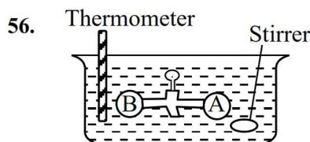

56.

Diagram of two vessels, A and B, connected by a stopcock. Vessel A is on the right and contains a gas. Vessel B is on the left and contains a thermometer. The entire assembly is immersed in a water bath with a stirrer. The stopcock is currently closed.

Two vessels A and B are connected via stopcock. The vessel A is filled with a gas at a certain pressure. The entire assembly is immersed in water and is allowed to come to thermal equilibrium with water. After opening the stopcock the gas from vessel A expands into vessel B and no change in temperature is observed in the thermometer. Which of the following statement is **true**?

- (1)  $dw \neq 0$
- (2)  $dq \neq 0$
- (3)  $dU \neq 0$
- (4) The pressure in the vessel B before opening the stopcock is zero.

Ans. (4)

Sol. It is free expansion of gas  $\Rightarrow P_{\text{ext}} = 0$

Where  $w = 0$ ,  $q = 0$  and  $\Delta U = 0$

57. A solution is made by mixing one mole of volatile liquid A with 3 moles of volatile liquid B. The vapour pressure of pure A is 200 mm Hg and that of the solution is 500 mm Hg. The vapour pressure of pure B and the least volatile component of the solution, respectively, are :
- (1) 1400 mm Hg, A      (2) 1400 mm Hg, B  
 (3) 600 mm Hg, B      (4) 600 mm Hg, A

Ans. (4)

Sol.  $P_S = P_A^0 \cdot X_A + P_B^0 \cdot X_B$

$$500 = 200 \times \frac{1}{4} + P_B^0 \cdot \frac{3}{4}$$

$$P_B^0 = 600 \text{ mm Hg}$$

As  $P_A^0 < P_B^0 \Rightarrow A$  is least volatile.

58.  $\text{CaCO}_3(\text{s}) + 2\text{HCl}(\text{aq}) \rightarrow \text{CaCl}_2(\text{aq}) + \text{CO}_2(\text{g}) + \text{H}_2\text{O}(\text{l})$
- Consider the above reaction, what mass of  $\text{CaCl}_2$  will be formed if 250 mL of 0.76 M HCl reacts with 1000 g of  $\text{CaCO}_3$  ?
- (Given : Molar mass of Ca, C, O, H and Cl are 40, 12, 16, 1 and 35.5 g mol-1, respectively)
- (1) 3.908 g  
 (2) 2.636 g  
 (3) 10.545 g  
 (4) 5.272 g

Ans. (3)

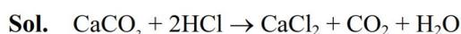

Sol.  $\text{CaCO}_3 + 2\text{HCl} \rightarrow \text{CaCl}_2 + \text{CO}_2 + \text{H}_2\text{O}$

$$\text{Moles of CaCO}_3 = \frac{1000}{100} = 10$$

$$\text{Moles of HCl} = 0.76 \times \frac{250}{1000} = 0.19 \text{ (L.R.)}$$

$$\text{Moles of CaCl}_2 \text{ formed} = \frac{0.19}{2}$$

$$\text{Mass of CaCl}_2 = \frac{0.19}{2} \times 111 = 10.545 \text{ gm}$$

59. If equal volumes of  $\text{AB}_2$  and  $\text{XY}$  (both are salts) aqueous solutions are mixed, which of the following combination will give a precipitate of  $\text{AY}_2$  at 300 K?

(Given  $K_{\text{sp}}$  (at 300 K) for  $\text{AY}_2 = 5.2 \times 10^{-7}$ )

- (1)  $3.6 \times 10^{-3} \text{ M AB}_2, 5.0 \times 10^{-4} \text{ M XY}$   
 (2)  $2.0 \times 10^{-4} \text{ M AB}_2, 0.8 \times 10^{-3} \text{ M XY}$   
 (3)  $2.0 \times 10^{-2} \text{ M AB}_2, 2.0 \times 10^{-2} \text{ M XY}$   
 (4)  $1.5 \times 10^{-4} \text{ M AB}_2, 1.5 \times 10^{-3} \text{ M XY}$

Ans. (3)

Sol. When equal volumes are mixed molarity reduce to half.

For precipitation  $Q_{\text{sp}} = [\text{A}^{+2}] [\text{Y}^{-1}]^2 > K_{\text{sp}}$

- (1)  $Q_{\text{sp}} = (1.8 \times 10^{-3}) \left( \frac{5}{2} \times 10^{-4} \right)^2 < K_{\text{sp}}$   
 (2)  $Q_{\text{sp}} = (10^{-4}) (0.4 \times 10^{-3})^2 < K_{\text{sp}}$   
 (3)  $Q_{\text{sp}} = (10^{-2}) (10^{-2})^2 > K_{\text{sp}}$   
 (4)  $Q_{\text{sp}} = \left( \frac{1.5}{2} \times 10^{-4} \right) \left( \frac{1.5}{2} \times 10^{-3} \right)^2 < K_{\text{sp}}$

60. Among  $\text{SO}_2, \text{NF}_3, \text{NH}_3, \text{XeF}_2, \text{ClF}_3$  and  $\text{SF}_4$ , the hybridization of the molecule with non-zero dipole moment and highest number of lone-pairs of electrons on the central atom is
- (1)  $\text{sp}^3$       (2)  $\text{dsp}^2$   
 (3)  $\text{sp}^3\text{d}^2$       (4)  $\text{sp}^3\text{d}$

Ans. (4)

Sol.

| Molecule       | Hybridisation         | Dipole Moment | Lone pair on the central atom |
|----------------|-----------------------|---------------|-------------------------------|
| $\text{SO}_2$  | $\text{sp}^2$         | Non-zero      | 1                             |
| $\text{NF}_3$  | $\text{sp}^3$         | Non-zero      | 1                             |
| $\text{NH}_3$  | $\text{sp}^3$         | Non-zero      | 1                             |
| $\text{XeF}_2$ | $\text{sp}^3\text{d}$ | zero          | 3                             |
| $\text{ClF}_3$ | $\text{sp}^3\text{d}$ | Non-zero      | 2                             |
| $\text{SF}_4$  | $\text{sp}^3\text{d}$ | Non-zero      | 1                             |

61. Given below are two statements :

**Statement (I) :** Vanillin

Chemical structure of Vanillin: A benzene ring with an aldehyde group (-CHO) at position 1, a methoxy group (-OCH3) at position 3, and a hydroxyl group (-OH) at position 4.

will react with NaOH and also with Tollen's reagent.

**Statement (II) :** Vanillin

Chemical structure of Vanillin: A benzene ring with an aldehyde group (-CHO) at position 1, a methoxy group (-OCH3) at position 3, and a hydroxyl group (-OH) at position 4.

will undergo self aldol condensation very easily.

In the light of the above statements, choose the **most appropriate answer** from the options given below :

- (1) **Statement I** is incorrect but **Statement II** is correct
- (2) **Statement I** is correct but **Statement II** is incorrect
- (3) Both **Statement I** and **Statement II** are incorrect
- (4) Both **Statement I** and **Statement II** are correct

**Ans. (2)**

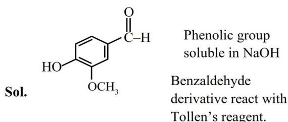

**Sol.** Phenolic group soluble in NaOH  
Benzaldehyde derivative react with Tollen's reagent.

Chemical structure of Vanillin: A benzene ring with an aldehyde group (-CHO) at position 1, a methoxy group (-OCH3) at position 3, and a hydroxyl group (-OH) at position 4.

Vanillin does not give self-aldol reaction due to lack of acidic H for condensation.

62. Identify the correct statement among the following:

- (1) All naturally occurring amino acids except glycine contain one chiral centre.
- (2) All naturally occurring amino acids are optically active.
- (3) Glutamic acid is the only amino acid that contains a  $\text{--COOH}$  group at the side chain.
- (4) Amino acid, cysteine easily undergo dimerization due to the presence of free SH group.

**Ans. (4)**

**Sol.** \* Isoleucine has 2 chiral centre

\* Glycine is optically inactive

\* Aspartic acid also contain  $\text{COOH}$  group at the side chain.

\* Cysteine easily dimerise due to free SH group

63. The correct order of basic nature on aqueous solution for the bases  $\text{NH}_3$ ,  $\text{H}_2\text{N--NH}_2$ ,  $\text{CH}_3\text{CH}_2\text{NH}_2$ ,  $(\text{CH}_3\text{CH}_2)_2\text{NH}$  and  $(\text{CH}_3\text{CH}_2)_3\text{N}$  is :

- (1)  $\text{NH}_3 < \text{H}_2\text{N--NH}_2 < (\text{CH}_3\text{CH}_2)_3\text{N} < \text{CH}_3\text{CH}_2\text{NH}_2 < (\text{CH}_3\text{CH}_2)_2\text{NH}$
- (2)  $\text{NH}_3 < \text{H}_2\text{N--NH}_2 < \text{CH}_3\text{CH}_2\text{NH}_2 < (\text{CH}_3\text{CH}_2)_2\text{NH} < (\text{CH}_3\text{CH}_2)_3\text{N}$
- (3)  $\text{H}_2\text{N--NH}_2 < \text{NH}_3 < (\text{CH}_3\text{CH}_2)_3\text{N} < \text{CH}_3\text{CH}_2\text{NH}_2 < (\text{CH}_3\text{CH}_2)_2\text{NH}$
- (4)  $\text{NH}_2\text{--NH}_2 < \text{NH}_3 < \text{CH}_3\text{CH}_2\text{NH}_2 < (\text{CH}_3\text{CH}_2)_3\text{N} < (\text{CH}_3\text{CH}_2)_2\text{NH}$

**Ans. (4)**

**Sol.** Basic strength of amine depends on hydrogen bonding and electronic inductive effect.

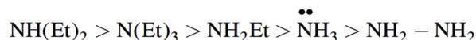

$$\text{NH(Et)}_2 > \text{N(Et)}_3 > \text{NH}_2\text{Et} > \ddot{\text{N}}\text{H}_3 > \text{NH}_2\text{--NH}_2$$

64. Given below are two statements :

**Statement (I) :** The metallic radius of Al is less than that of Ga.

**Statement (II) :** The ionic radius of  $Al^{3+}$  is less than that of  $Ga^{3+}$ .

In the light of the above statements, choose the **most appropriate answer** from the options given below :

- (1) Both **Statement I** and **Statement II** are incorrect
- (2) **Statement I** is incorrect but **Statement II** is correct
- (3) **Statement I** is correct but **Statement II** is incorrect
- (4) Both **Statement I** and **Statement II** are correct

**Ans. (2)**

**Sol.**  $\Rightarrow$  The metallic radius order of Al & Ga is

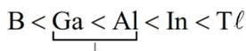

$$B < \underbrace{Ga < Al}_{\downarrow} < In < Tl$$

(due to poor shielding of d-subshell electrons)

$\Rightarrow$  The ionic radius order of  $Al^{+3}$  &  $Ga^{+3}$  is

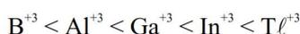

$$B^{+3} < Al^{+3} < Ga^{+3} < In^{+3} < Tl^{+3}$$

65. Given below are two statements :

**Statement (I) :** In octahedral complexes, when  $\Delta_o < P$  high spin complexes are formed. When  $\Delta_o > P$  low spin complexes are formed.

**Statement (II) :** In tetrahedral complexes because of  $\Delta_t < P$ , low spin complexes are rarely formed.

In the light of the above statements, choose the **most appropriate answer** from the options given below :

- (1) **Statement I** is correct but **Statement II** is incorrect.
- (2) Both **Statement I** and **Statement II** are incorrect
- (3) **Statement I** is incorrect but **Statement II** is correct
- (4) Both **Statement I** and **Statement II** are correct

**Ans. (4)**

**Sol.** In octahedral complex ( $CN = 6$ )

If  $\Delta_o < P.E.$  , then high spin complexes are formed

If  $\Delta_o > P.E.$  , then low spin complexes are formed

But in tetrahedral complex ( $CN = 4$ )

$\Delta_t < P.E.$  , then mainly high spin complexes are formed and rarely low spin complexes are formed.

66. Choose the correct tests with respective observations.

- (A)  $CuSO_4$  (acidified with acetic acid) +  $K_4[Fe(CN)_6] \rightarrow$  Chocolate brown precipitate.
- (B)  $FeCl_3 + K_4[Fe(CN)_6] \rightarrow$  Prussian blue precipitate.
- (C)  $ZnCl_2 + K_4[Fe(CN)_6]$ , neutralised with  $NH_4OH \rightarrow$  White or bluish white precipitate.
- (D)  $MgCl_2 + K_4[Fe(CN)_6] \rightarrow$  Blue precipitate.
- (E)  $BaCl_2 + K_4[Fe(CN)_6]$ , neutralised with  $NaOH \rightarrow$  White precipitate.

Choose the **correct** answer from the options given below :

- (1) A, D and E only
- (2) B, D and E only
- (3) A, B and C only
- (4) C, D and E only

**Ans. (3)**

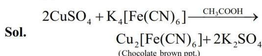

**Sol.**

$$2CuSO_4 + K_4[Fe(CN)_6] \xrightarrow{CH_3COOH} Cu_2[Fe(CN)_6] + 2K_2SO_4$$

(Chocolate brown ppt.)

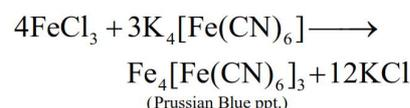

$$4FeCl_3 + 3K_4[Fe(CN)_6] \longrightarrow Fe_4[Fe(CN)_6]_3 + 12KCl$$

(Prussian Blue ppt.)

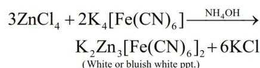

$$3ZnCl_2 + 2K_4[Fe(CN)_6] \xrightarrow{NH_4OH} K_2Zn_3[Fe(CN)_6]_2 + 6KCl$$

(White or bluish white ppt.)

67. On complete combustion 1.0 g of an organic compound (X) gave 1.46 g of  $CO_2$  and 0.567 g of  $H_2O$ . The empirical formula mass of compound (X) is \_\_\_\_\_ g.

(Given molar mass in  $g\ mol^{-1}$  C : 12, H : 1, O : 16)

- (1) 30
- (2) 45
- (3) 60
- (4) 15

**Ans. (1)**

**Sol.**

$$\text{Moles of 'C'} = n_{CO_2} = \frac{1.46}{44} = 0.033$$

$$\text{Moles of 'C'} = W_c = 0.033 \times 12$$

$$\text{Moles of 'H'} = 2 \times n_{H_2O} = 2 \times \frac{0.567}{18} = 0.063$$

$$\text{Mass of 'H'} = 0.0063$$

$$\text{Mass of Oxygen (O)} = 1 - (W_c + W_H)$$

$$= 1 - (0.033 \times 12 + 0.063 \times 1) = 0.541\ gm$$

$$\text{Moles of 'O'} = \frac{0.541}{16} = 0.033$$

Empirical formula =  $CH_2O$

Empirical formula mass = 30.

68. Consider the following compound (X)

$$\begin{array}{ccccccc} & \text{I} & & \text{II} & & \text{III} & \text{IV} \\ \text{H} & - & \text{C} \equiv & \text{C} & - & \text{CH}_2 & - & \text{CH} & - & \text{CH}_3 \\ & & & & & & & | & & \\ & & & & & & & \text{CH}_3 & & \end{array}$$

(X)

The most stable and least stable carbon radicals, respectively, produced by homolytic cleavage of corresponding C – H bond are :

- (1) II, IV                                        (2) III, II  
(3) I, IV                                        (4) II, I

**Ans. (4)**

**Sol.**

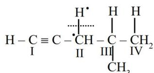

$$\begin{array}{ccccccc} & & \text{H} & & \text{H} & & \text{H} \\ & & | & & | & & | \\ \text{H} & - & \text{C} \equiv \text{C} & - & \text{CH} & - & \text{C} & - & \text{CH}_2 \\ & & \text{I} & & \text{II} & & \text{III} & & \text{IV} \\ & & & & & & | \\ & & & & & & \text{CH}_3 \end{array}$$

II most stable carbon radical due to resonance stabilise

I least stable carbon radical due to no stabilising factor.

69. Consider the following molecules :

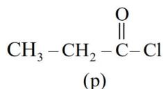

$$\text{CH}_3 - \text{CH}_2 - \overset{\text{O}}{\parallel}{\text{C}} - \text{Cl}$$

(p)

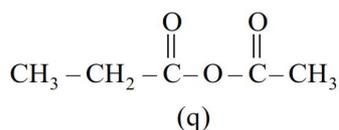

$$\text{CH}_3 - \text{CH}_2 - \overset{\text{O}}{\parallel}{\text{C}} - \text{O} - \overset{\text{O}}{\parallel}{\text{C}} - \text{CH}_3$$

(g)

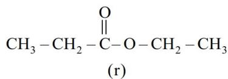

$$\text{CH}_3 - \text{CH}_2 - \overset{\text{O}}{\parallel}{\text{C}} - \text{O} - \text{CH}_2 - \text{CH}_3$$

(r)

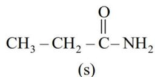

$$\text{CH}_3 - \text{CH}_2 - \overset{\text{O}}{\parallel}{\text{C}} - \text{NH}_2$$

(s)

The correct order of rate of hydrolysis is :

**Ans. (4)**

**Sol.** Rate of hydrolysis  $\propto$  Leaving group ability

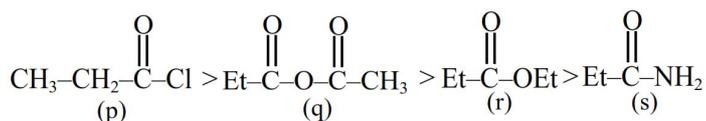

$$\text{CH}_3\text{-CH}_2\text{-}\overset{\text{O}}{\parallel}{\text{C}}\text{-Cl} > \text{Et-}\overset{\text{O}}{\parallel}{\text{C}}\text{-O-}\overset{\text{O}}{\parallel}{\text{C}}\text{-CH}_3 > \text{Et-}\overset{\text{O}}{\parallel}{\text{C}}\text{-OEt} > \text{Et-}\overset{\text{O}}{\parallel}{\text{C}}\text{-NH}_2$$

(p)                      (q)                      (r)                      (s)

70. A molecule with the formula  $AX_4Y$  has all its elements from p-block. Element A is rarest, monoatomic, non-radioactive from its group and has the lowest ionization enthalpy value among A, X and Y. Elements X and Y have first and second highest electronegativity values respectively among all the known elements. The shape of the molecule is :

- (1) Square pyramidal
  - (2) Octahedral
  - (3) Pentagonal planar
  - (4) Trigonal bipyramidal

**Ans. (1)**

**Sol.** Given A is rarest, monoatomic, non-radioactive p-block element and form  $AX_4Y$  type of molecule.

∴ It is concluded that it is Xe

It is given the electronegativity of A is less than X & Y

It is given the electronegativity of X & Y is highest and second highest respectively among all element.

$\therefore$  X & Y are F & O

∴ Compound is considered as  $\text{XeOF}_4$  with square pyramidal shape.

Lewis structure of xenon tetrafluoride (XeF4). The central xenon atom is bonded to four fluorine atoms in a square planar arrangement. Each Xe-F bond is shown as a single line. Above the xenon atom, there is a lone pair of electrons represented by two dots inside a lobe of a p-orbital shape.

# SECTION-B

71. A transition metal (M) among Mn, Cr, Co and Fe has the highest standard electrode potential ( $M^{3+}/M^{2+}$ ). It forms a metal complex of the type  $[M(CN)_6]^{4-}$ . The number of electrons present in the  $e_g$  orbital of the complex is \_\_\_\_\_.

Ans. (1)

Sol. Co has highest standard electrode potential ( $M^{3+}/M^{2+}$ ) among Mn, Cr, Co, Fe

∴ Complex is  $[Co(CN)_6]^{4-}$  and its splitting is as follows.

![Crystal field splitting diagram for [Co(CN)6]4-. The lower energy t2g orbitals are filled with 6 electrons (three pairs). The higher energy eg orbitals have one electron in one of the two orbitals.](2635d7d2c4c221814f499715c90ffcd6_img.jpg)

Crystal field splitting diagram for [Co(CN)6]4-. The lower energy t2g orbitals are filled with 6 electrons (three pairs). The higher energy eg orbitals have one electron in one of the two orbitals.

∴ electron in  $e_g$  orbital is one.

72. Consider the following electrochemical cell at standard condition.

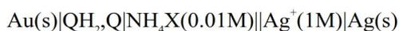

$$Au(s)|QH_2, Q|NH_4X(0.01M)||Ag^+(1M)|Ag(s)$$

$$E_{cell} = +0.4V$$

The couple  $QH_2/Q$  represents quinhydron electrode, the half cell reaction is given below

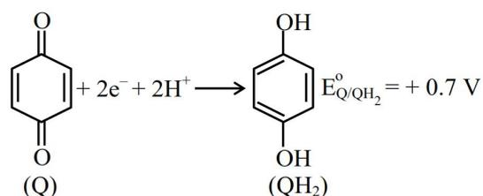

$$E_{Q/QH_2}^0 = +0.7 V$$

Half-cell reaction of quinone (Q) to quinhydrone (QH2). Quinone (a benzene ring with two double bonds and two carbonyl groups) is reduced to quinhydrone (a benzene ring with two hydroxyl groups).

$$\left[ \text{Given : } E_{Ag^+/Ag}^0 = +0.8V \text{ and } \frac{2.303RT}{F} = 0.06V \right]$$

The  $pK_b$  value of the ammonium halide salt ( $NH_4X$ ) used here is \_\_\_\_\_ . (nearest integer)

Ans. (6)

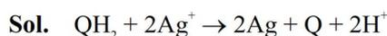

$$\text{Sol. } QH_2 + 2Ag^+ \rightarrow 2Ag + Q + 2H^+$$

$$E = E^0 - \frac{0.06}{2} \log [H^+]^2$$

$$E = E^0 - 0.06 \times \log [H^+]$$

$$pH = -\log (H^+) = \frac{E - E^0}{0.06} = \frac{0.4 - 0.1}{0.06}$$

$$= \frac{0.3}{0.06} = 5$$

$$pH + NH_4X = 7 - \frac{1}{2} pK_b - \frac{1}{2} \log C$$

$$5 = 7 - \frac{1}{2} \times pK_b - \frac{1}{2} \log (10^{-2})$$

$$pK_b = 6.$$

73. 0.1 mol of the following given antiviral compound (P) will weigh \_\_\_\_\_  $\times 10^{-1}$  g

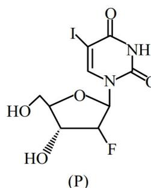

(P)

Chemical structure of compound (P), which is 1-β-D-ribofuranosyl-5-iodouracil. It consists of a uracil base attached to a ribose sugar, with an iodine atom at the 5-position of the uracil ring.

(Given : molar mass in g mol-1 H: 1, C : 12, N : 14, O : 16, F : 19, I : 127)

Ans. (372)

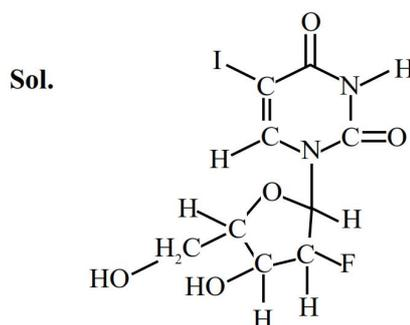

Sol.

Chemical structure of compound (P) with all atoms explicitly shown, including hydrogen atoms on the sugar and uracil ring.

Molar mass = 372 gm

$$\therefore 0.1 \text{ mole has } = 372 \times 10^{-1} \text{ gm}$$

74. Consider the following equilibrium,

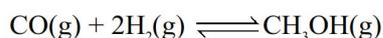

$$\text{CO(g)} + 2\text{H}_2\text{(g)} \rightleftharpoons \text{CH}_3\text{OH(g)}$$

0.1 mol of CO along with a catalyst is present in a 2 dm3 flask maintained at 500 K. Hydrogen is introduced into the flask until the pressure is 5 bar and 0.04 mol of CH3OH is formed. The Kp0 is \_\_\_\_\_ × 10-3 (nearest integer).

Given : R = 0.08 dm3 bar K-1 mol-1

Assume only methanol is formed as the product and the system follows ideal gas behaviour.

Ans. (74)

Sol.  $\text{CO(g)} + 2\text{H}_2\text{(g)} \rightleftharpoons \text{CH}_3\text{OH(g)}$

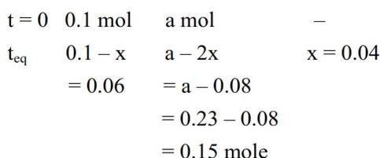

$$\begin{array}{ccccccc} t=0 & 0.1 \text{ mol} & a \text{ mol} & & - & & \\ t_{\text{eq}} & 0.1 - x & a - 2x & & x = 0.04 & & \\ & = 0.06 & = a - 0.08 & & & & \\ & & = 0.23 - 0.08 & & & & \\ & & = 0.15 \text{ mole} & & & & \end{array}$$

$$V = 2\text{L}$$

$$T = 500 \text{ K}$$

$$P_{\text{total}} = 5 \text{ bar}$$

$$n_{\text{Total}} = 0.25 = \frac{1}{4} \text{ mol.}$$

$$P_{\text{total}} = n_{\text{total}} \times \frac{RT}{V}$$

$$\Rightarrow 5 = (0.06 + a - 0.08 + 0.04) \times \frac{0.08 \times 500}{2}$$

$$\Rightarrow 10 = (0.02 + a) \times 0.08 \times 500$$

$$\Rightarrow a = 0.25 - 0.02 = 0.23 \text{ mol.}$$

$$K_p = \frac{X_{\text{CH}_3\text{OH}}}{X_{\text{CO}} \times X_{\text{H}_2}^2} \times \frac{1}{(P_T)^2} = \frac{0.04}{0.06 \times (0.15)^2} \times \left[ \frac{1/4}{5} \right]^2$$

$$= \frac{4}{6 \times (0.15)^2 \times 16} \times \frac{1}{25}$$

$$= \frac{100 \times 100}{24 \times 225 \times 25} = \frac{100 \times 100}{135000}$$

$$= 0.074 = 74 \times 10^{-3}$$

75. For the reaction A → products.

![A graph showing the relationship between the half-life (t1/2) and the initial concentration ([A]0) for a zero-order reaction. The y-axis is labeled t1/2/min and the x-axis is labeled [A]0/mol L-1. A straight line starts from the origin with a slope of 76.92 (appropriate units).](b23b8fe8ac95d9e78a7958d3e57ee39a_img.jpg)

A graph showing the relationship between the half-life (t1/2) and the initial concentration ([A]0) for a zero-order reaction. The y-axis is labeled t1/2/min and the x-axis is labeled [A]0/mol L-1. A straight line starts from the origin with a slope of 76.92 (appropriate units).

The concentration of A at 10 minutes is \_\_\_\_\_ × 10-3 mol L-1 (nearest integer).

The reaction was started with 2.5 mol L-1 of A.

Ans. (2435)

Sol.  $t_{1/2} \propto [A]_0 \Rightarrow \text{Order} = \text{zero}$

$$t_{1/2} = \frac{A_0}{2K} \Rightarrow \text{Slope} = \frac{1}{2K} = 76.92$$

$$K = \frac{1}{2 \times 76.92}$$

$$[A]_{10} = -Kt + A_0 = -\frac{1}{2 \times 76.92} \times 10 + 2.5 = 2.435$$

$$= 2435 \times 10^{-3} \text{ mol/L}$$