# **JEE (Main)-2026 Session-1** **Question Paper with Solutions** **(Mathematics, Physics, And Chemistry)** **21 January 2026 Shift – 1**

Time: 3 hrs.

M.M: 300

### **IMPORTANT INSTRUCTIONS:**

- (1) The test is of 3 hours duration.
- (2) This test paper consists of 75 questions. Each subject (PCM) has 25 questions. The maximum marks are 300.
- (3) This question paper contains Three Parts. Part-A is Physics, Part-B is Chemistry and Part-C is Mathematics. Each part has only two sections: Section-A and Section-B.
- (4) Section - A: Attempt all questions.
- (5) Section - B: Attempt all questions.
- (6) Section - A (01 - 20) contains 20 multiple choice questions which have only one correct answer. Each question carries +4 marks for correct answer and -1 mark for wrong answer.
- (7) Section - B (21 - 25) contains 5 Numerical value-based questions. The answer to each question should be rounded off to the nearest integer. Each question carries +4 marks for correct answer and -1 mark for wrong answer.

### MATHEMATICS

#### **SECTION-A**

1. If the domain of the function

$$f(x) = \cos^{-1}\left(\frac{2x-5}{11-3x}\right) + \sin^{-1}(2x^2 - 3x + 1) \text{ is the}$$

interval  $[\alpha, \beta]$ , then  $\alpha + 2\beta$  is equal to :

**Ans. (2)**

**Sol.**  $f(x) = \cos^{-1} \left( \frac{2x-5}{11-3x} \right) + \sin^{-1} (2x^2 - 3x + 1)$

$$-1 \leq \frac{2x-5}{11-3x} \leq 1$$

$$-1 \leq 2x^2 - 3x + 1 \leq 1$$

$$2x^2 - 3x + 2 \geq 0, 2x^2 - 3x \leq 0$$

$$x \in \left[ 0, \frac{3}{2} \right] \dots \dots (i)$$

$$\frac{2x-5}{11-3x} + 1 \geq 0 \qquad \frac{2x-5}{11-3x} - 1 \leq 0$$

$$\frac{2x-5+11-3x}{11-3x} \geq 0 \quad \frac{5x-16}{11-3x} \leq 0$$

Image: A number line diagram for the inequality 16/5 < x < 11/3. The line has tick marks at 16/5 and 11/3. The region between these two points is shaded and labeled with a '+'. The regions outside these points are labeled with '-'.

$$\frac{6-x}{11-3x} \geq 0$$

Image: A number line showing the intervals where the expression is positive or negative. The critical points 11/3 and 6 are marked. The regions to the left of 11/3 and to the right of 6 are marked with a '+', and the region between 11/3 and 6 is marked with a '-'.

$$x \in \left(-\infty, \frac{16}{5}\right] \cup \left(\frac{11}{3}, \infty\right)$$

$$x \in \left(-\infty, \frac{11}{3}\right) \cup [6, \infty)$$

intersection

$$x \in \left(-\infty, \frac{16}{5}\right] \cup [6, \infty) \dots(ii)$$

Intersection of (i) & (ii)  $x \in \left[0, \frac{3}{2}\right]$

$$\alpha = 0, \beta = \frac{3}{2} \Rightarrow \alpha + 2\beta = 3$$

2. The area of the region, inside the ellipse  $x^2 + 4y^2 = 4$  and outside the region bounded by the curves  $y = |x| - 1$  and  $y = 1 - |x|$ , is :

- (1)  $2(\pi - 1)$                       (2)  $2\pi - \frac{1}{2}$   
(3)  $3(\pi - 1)$                       (4)  $2\pi - 1$

**Ans. (1)**

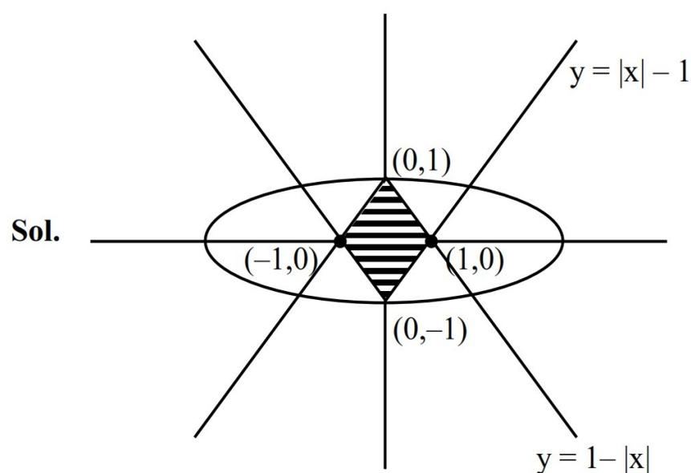

**Sol.**

A Cartesian coordinate system showing the solution set for the inequality  $|x| + |y| \leq 1$ . The boundary is a diamond-shaped rhombus with vertices at  $(0, 1)$ ,  $(1, 0)$ ,  $(0, -1)$ , and  $(-1, 0)$ . The interior of this rhombus is shaded with horizontal lines. An ellipse is also drawn, passing through the same four vertices. Two lines are shown:  $y = |x| - 1$  (the bottom-right V-shape) and  $y = 1 - |x|$  (the top V-shape). The region inside the rhombus is the solution set.

Graph of the inequality |x| + |y| ≤ 1.

$$\begin{aligned} \text{Required area} &= \text{area of ellipse} - \text{shaded area} \\ &= \pi \times 2 \times 1 - 4 \left( \frac{1}{2} \times 1 \times 1 \right) = 2\pi - 2 \end{aligned}$$

3. The number of relations, defined on the set  $\{a, b, c, d\}$ , which are both reflexive and symmetric, is equal to:

- (1) 256                                        (2) 16  
(3) 1024                                      (4) 64

**Ans. (4)**

**Sol.** Number of relation which are reply and sym. both  
 $= 1^4 \times 2^6 = 64$

- |        |        |        |        |
|--------|--------|--------|--------|
| (a, a) | (a, b) | (a, c) | (a, d) |
| (b, a) | (b, b) | (b, c) | (b, d) |
| (c, a) | (c, b) | (c, c) | (c, d) |
| (d, a) | (d, b) | (d, c) | (d, d) |

**Sol.**  $|\vec{c} + \vec{d}| = \sqrt{29}$

$$\vec{c} + \vec{d} = \lambda (2\hat{i} + 3\hat{j} + 4\hat{k})$$

$$\lambda = \pm 1$$

$$\lambda(-14 + 6 + 12) = 4\lambda, \lambda_1 = 4, \lambda_2 = -4$$

$$k^2x^2 + (k^2 - 5k + 4)xy + (3k - 2)y^2 - 8x + 12y - 4 = 0$$

is circle

$$k^2 - 5k + 4 = 0 \Rightarrow k = 1, 4$$

$$k^2 = 3k - 2 \Rightarrow k = 1, 2$$

$$k = 1$$

8. Let  $y = y(x)$  be the solution curve of the differential equation  $(1+x^2)dy + (y - \tan^{-1}x)dx = 0$ ,  $y(0) = 1$ . Then the value of  $y(1)$  is :

$$(1) \frac{2}{e^{\pi/4}} + \frac{\pi}{4} - 1 \quad (2) \frac{2}{e^{\pi/4}} - \frac{\pi}{4} - 1$$

$$(3) \frac{4}{e^{\pi/4}} + \frac{\pi}{2} - 1 \quad (4) \frac{4}{e^{\pi/4}} - \frac{\pi}{2} - 1$$

**Ans. (1)**

**Sol.**  $\frac{dy}{dx} + \frac{y}{x^2+1} = \frac{\tan^{-1}x}{x^2+1}$

$$\text{I.f.} = e^{\tan^{-1}x}$$

$$y \times e^{\tan^{-1}x} = \int e^{\tan^{-1}x} \cdot \frac{\tan^{-1}x}{1+x^2} dx$$

$$y \times e^{\tan^{-1}x} = \tan^{-1}x (e^{\tan^{-1}x}) - e^{\tan^{-1}x} + c$$

$$y(0) = 1 \Rightarrow c = 2$$

$$y(1) = \frac{2}{e^{\pi/4}} + \frac{\pi}{4} - 1$$

9. The number of strictly increasing functions  $f$  from the set  $\{1, 2, 3, 4, 5, 6\}$  to the set  $\{1, 2, 3, \dots, 9\}$  such that  $f(i) \neq i$  for  $1 \leq i \leq 6$ , is equal to :

$$(1) 21 \quad (2) 27 \quad (3) 22 \quad (4) 28$$

**Ans. (4)**

**Sol.**  $f(i) \neq i$ ,  $f(x)$  is strictly increasing function  
 $f: A \rightarrow B$ , where  $A = \{1, 2, 3, \dots, 6\}$   
 $B = \{1, 2, 3, \dots, 9\}$ , then number of function  $f: A \rightarrow B$  is equal to

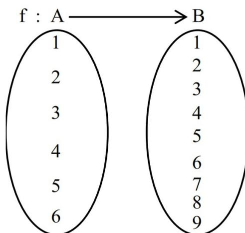

A mapping diagram showing two sets A and B. Set A contains elements {1, 2, 3, 4, 5, 6} and set B contains elements {1, 2, 3, 4, 5, 6, 7, 8, 9}. An arrow labeled f points from set A to set B.

$$f(i) \neq i \text{ Case - i } f(1) = 2 \Rightarrow {}^7C_5 = 21$$

$$\text{Case- ii } f(1) = 3 \Rightarrow {}^6C_5 = 6$$

$$\text{Case- iii } f(1) = 4 \Rightarrow {}^5C_5 = 1$$

$$\text{No of function A to B} = 21 + 6 + 1 = 28$$

10. Let  $f: \mathbb{R} \rightarrow (0, \infty)$  be a twice differentiable function such that  $f(3) = 18$ ,  $f'(3) = 0$  and  $f''(3) = 4$ .

Then  $\lim_{x \rightarrow 1} \left( \log_e \left( \frac{f(2+x)}{f(3)} \right)^{\frac{18}{(x-1)^2}} \right)$  is equal to :

$$(1) 1 \quad (2) 9 \quad (3) 2 \quad (4) 18$$

**Ans. (3)**

**Sol.** Let  $T = \lim_{x \rightarrow 1} \left( \frac{f(x+2)}{f(3)} \right)^{\frac{18}{(x-1)^2}}$ ;  $1^\infty$  form

$$\Rightarrow T = e^{\lim_{x \rightarrow 1} \frac{18}{(x-1)^2} \left( \frac{f(x+2)-f(3)}{f(3)} \right)}$$

$$\Rightarrow T = e^{\lim_{x \rightarrow 1} \frac{18}{(x-1)^2} \left( \frac{f(x+2)-f(3)}{18} \right)}$$

$$\Rightarrow T = e^{\lim_{x \rightarrow 1} \left( \frac{f(x+2)-f(3)}{(x-1)^2} \right) \frac{0}{0} \text{ form}} \quad \text{apply L' pital}$$

$$\Rightarrow T = e^{\lim_{x \rightarrow 1} \frac{f'(x+2)}{2(x-1)} \frac{0}{0} \text{ form}} \quad \text{apply L' pital}$$

$$\Rightarrow T = e^{\lim_{x \rightarrow 1} \frac{f''(x+2)}{2}} ; = e^{\frac{4}{2}} = e^2$$

$$\Rightarrow \log_e(T) = 2$$

11. Let the foci of hyperbola coincide with the foci of the ellipse  $\frac{x^2}{36} + \frac{y^2}{16} = 1$ . If the eccentricity of the hyperbola is 5, then the length of its latus rectum is:

- (1) 12 (2) 16  
(3)  $\frac{96}{\sqrt{5}}$  (4)  $24\sqrt{5}$

Ans. (3)

Sol. Let  $e_1$  be eccentricity of ellipse

$$\Rightarrow e_1 = \sqrt{1 - \frac{16}{36}} = \sqrt{1 - \frac{4}{9}} = \frac{\sqrt{5}}{3}$$

$$\text{So } ae_1 = 6 \cdot \frac{\sqrt{5}}{3} = 2\sqrt{5}$$

$$\text{Now H: } \frac{x^2}{p^2} - \frac{y^2}{q^2} = 1$$

$$p.e = ae_1$$

$$p \cdot 5 = 2\sqrt{5}$$

$$p = \frac{2}{\sqrt{5}} \Rightarrow e^2 = 1 + \frac{q^2}{p^2} \Rightarrow 25 = 1 + \frac{5q^2}{4} \Rightarrow q^2 = \frac{96}{5}$$

$$\text{So length of LR } \frac{2q^2}{p} = \frac{96}{\sqrt{5}}$$

12. The value of  $\int_{-\pi/6}^{\pi/6} \left( \frac{\pi + 4x^{11}}{1 - \sin(|x| + \pi/6)} \right) dx$  is equal to

- (1)  $2\pi$  (2)  $4\pi$   
(3)  $8\pi$  (4)  $6\pi$

Ans. (2)

$$\text{Sol. } = 2\pi \int_0^{\pi/6} \frac{1}{1 - \sin\left(x + \frac{\pi}{6}\right)} dx \text{ let } x + \frac{x}{6} = t \quad dx = dt$$

$$= 2\pi \int_{\pi/6}^{\pi/3} \frac{dt}{1 - \sin t} = 2\pi \int_{\pi/6}^{\pi/3} \frac{1 + \sin t}{\cos^2 t} dt$$

$$= 2\pi \left[ \int_{\pi/6}^{\pi/3} \sec^2 t dt + \int_{\pi/6}^{\pi/3} \sec t \tan t dt \right]$$

$$= 2\pi \left[ (\tan t)_{\pi/6}^{\pi/3} + (\sec t)_{\pi/6}^{\pi/3} \right]$$

$$= 2\pi \left[ \left( \sqrt{3} - \frac{1}{\sqrt{3}} \right) + \left( 2 - \frac{2}{\sqrt{3}} \right) \right]$$

$$= 2\pi \left[ \sqrt{3} + 2 - \sqrt{3} \right] = 4\pi$$

13. Let the mean and variance of 7 observations 2, 4, 10,  $x$ , 12, 14,  $y$ ,  $x > y$ , be 8 and 16 respectively. Two numbers are chosen from  $\{1, 2, 3, x-4, y, 5\}$  one after another without replacement, then the probability, that the smaller number among the two chosen numbers is less than 4, is:

- (1)  $\frac{3}{5}$  (2)  $\frac{4}{5}$   
(3)  $\frac{2}{5}$  (4)  $\frac{1}{3}$

Ans. (2)

Sol. Mean  $(\bar{x}) = 8$  (Given)

$$\Rightarrow \frac{2+4+10+x+12+14+y}{7} = 8$$

$$\Rightarrow x + y = 14 \dots(1)\dots$$

Variance  $(\sigma^2) = 16$  (Given)

$$\Rightarrow 16 = \frac{2^2 + 4^2 + 10^2 + x^2 + 12^2 + 14^2 + y^2}{7} - 8^2$$

$$\Rightarrow x^2 + y^2 = 100 \dots(2)\dots$$

$$\because (x + y)^2 = x^2 + y^2 + 2xy$$

$$\Rightarrow xy = 48 \text{ (sum is 14 product is 48)}$$

Since problem states  $x > y$

$$\therefore x = 8 \text{ and } y = 6$$

Now set  $X = \{1, 2, 3, 4, 6, 5\}$

Now we choose two numbers one after another without replacement total outcomes  $= 6 \times 5 = 30$

We want the prob. That the smaller number among the two is less than 4

$$P(\text{smaller} < 4) = 1 - P(\text{smaller} \geq 4)$$

$$= 1 - \frac{6}{30} = \frac{4}{5}$$

14. Let  $(\alpha, \beta, \gamma)$  be the co-ordinates of the foot of the perpendicular drawn from the point  $(5, 4, 2)$  on the line  $\vec{r} = (-\hat{i} + 3\hat{j} + \hat{k}) + \lambda(2\hat{i} + 3\hat{j} - \hat{k})$ .

Then the length of the projection of the vector  $\alpha\hat{i} + \beta\hat{j} + \gamma\hat{k}$  on the vector  $6\hat{i} + 2\hat{j} + 3\hat{k}$  is :

- (1)  $\frac{15}{7}$  (2) 4  
(3)  $\frac{18}{7}$  (4) 3

Ans. (3)

Sol.

Diagram for Question 14: A point A(5,4,2) is shown above a horizontal line. A vertical line segment connects A to the horizontal line, meeting it at a point labeled (\alpha, \beta, \gamma). A right-angle symbol is shown at the intersection point (\alpha, \beta, \gamma).

$$\vec{r} = (-\hat{i} + 3\hat{j} + \hat{k}) + \lambda(2\hat{i} + 3\hat{j} - \hat{k})$$

$$\frac{x+1}{2} = \frac{y-3}{3} = \frac{z-1}{-1} = \lambda$$

Any general point P on the line is

$$(2\lambda - 1, 3\lambda + 3, -\lambda + 1)$$

Let the given point is A (5,4,2)

$$\vec{AP} = (2\lambda - 6)\hat{i} + (3\lambda - 1)\hat{j} + (-\lambda - 1)\hat{k}$$

$$\because \vec{AP} \perp \text{Line (L)}$$

$$\therefore \vec{AP} \cdot (2\hat{i} + 3\hat{j} - \hat{k}) = 0$$

$$2(2\lambda - 6) + 3(3\lambda - 1) - 1(-\lambda - 1) = 0$$

$$\Rightarrow \lambda = 1$$

$$\therefore \alpha = 1$$

$$\beta = 6$$

$$\gamma = 0$$

$$\text{Let the vector } \vec{u} = \alpha\hat{i} + \beta\hat{j} + \gamma\hat{k}$$

$$\vec{u} = \hat{i} + 6\hat{j} + 0\hat{k}$$

$$\& \vec{w} = 6\hat{i} + 2\hat{j} + 3\hat{k}$$

$$\text{So projection} = \frac{|\vec{u} \cdot \vec{w}|}{|\vec{w}|} = \frac{18}{7}$$

15. Let PQ and MN be two straight lines touching the circle  $x^2 + y^2 - 4x - 6y - 3 = 0$  at the points A and B respectively. Let O be the centre of the circle and  $\angle AOB = \pi/3$ . Then the locus of the point of intersection of the lines PQ and MN is:

- (1)  $3(x^2 + y^2) - 18x - 12y + 25 = 0$   
(2)  $x^2 + y^2 - 12x - 18y - 25 = 0$   
(3)  $x^2 + y^2 - 18x - 12y - 25 = 0$   
(4)  $3(x^2 + y^2) - 12x - 18y - 25 = 0$

Ans. (4)

Sol. Given circle

Diagram for Question 15: A circle with center O(2,3) and radius r. Two tangent lines PQ and MN touch the circle at points A and B respectively. The lines intersect at point P(h,k). A dashed line connects O to P. The angle between the radii OA and OB is 60 degrees. The angle between the radius OA and the line OP is 30 degrees. The angle between the tangent line PQ and the line OP is also 30 degrees. Right-angle symbols are shown at points A and B where the radii meet the tangents.

$$x^2 + y^2 - 4x - 6y - 3 = 0$$

$$C(2,3) \& r = 4$$

$$\cos 30^\circ = \frac{r}{OR} = \frac{4}{OR}$$

$$\Rightarrow OR = \frac{8}{\sqrt{3}}$$

Now

$$OR^2 = (h - 2)^2 + (k - 3)^2$$

$$\Rightarrow 3(x^2 + y^2) - 12x - 18y - 25 = 0$$

16. If the coefficient of x in the expansion of  $(ax^2 + bx + c)(1 - 2x)^{26}$  is  $-56$  and the coefficients of  $x^2$  and  $x^3$  are both zero, then  $a + b + c$  is equal to

- (1) 1300 (2) 1500  
(3) 1403 (4) 1483

Ans. (3)

$$\text{Sol. } (ax^2 + bx + c) \sum_{r=0}^{26} {}^{26}C_r (-2x)^r$$

$$\text{Coeff. of } x^2 : a \cdot {}^{26}C_0 (-2)^0 + b \cdot {}^{26}C_1 (-2) + c \cdot {}^{26}C_2 (-2)^2 = 0$$

$$\Rightarrow a - 52b + 1300c = 0 \dots (1)$$

$$\text{Coeff. of } x^3 : a \cdot {}^{26}C_1 (-2) + b \cdot {}^{26}C_2 (-2)^2 + c \cdot {}^{26}C_3 (-2)^3 = 0$$

$$\Rightarrow -52a + 1300b - 20800c = 0 \dots (2)$$

$$\text{Coeff. of } x = -56$$

$$\Rightarrow b \cdot {}^{26}C_0 (-2)^0 + c \cdot {}^{26}C_1 (-2)^1 = -56$$

$$b - 52c = -56 \dots (3)$$

After solving (1), (2) & (3)

$$a = 1300, b = 100, c = 3$$

$$\Rightarrow a + b + c = 1403$$

17. If  $x^2 + x + 1 = 0$ , then the value of  $\left(x + \frac{1}{x}\right)^4 + \left(x^2 + \frac{1}{x^2}\right)^4 + \left(x^3 + \frac{1}{x^3}\right)^4 + \dots + \left(x^{25} + \frac{1}{x^{25}}\right)^4$  is :

- (1) 128 (2) 162  
(3) 175 (4) 145

Ans. (4)

$$\text{Sol. } x^2 + x + 1 = 0$$

$$\Rightarrow x = \omega \text{ or } \omega^2$$

$$\therefore \alpha = \omega \text{ \& } \beta = \omega^2$$

$$= (\omega + \omega^2)^4 + (\omega^2 + \omega^4)^4 + (\omega^3 + \omega^6)^4 + \dots + (\omega^{25} + \omega^{50})^4$$

$$= [(\omega + \omega^2)^4 + (\omega^2 + \omega^4)^4 + (\omega^4 + \omega^8)^4 + \dots + (\omega^{25} + \omega^{50})^4] + [(\omega^3 + \omega^6)^4 + (\omega^6 + \omega^{12})^4 + (\omega^9 + \omega^{18})^4 + \dots + (\omega^{24} + \omega^{48})^4]$$

$$= \underbrace{[1+1+1+\dots+1]}_{17 \text{ times}} + \underbrace{[(1+1)^4 + (1+1)^4 + \dots + (1+1)^4]}_{8 \text{ times}}$$

$$= 17 + 128$$

$$= 145$$

18. The value of  $\csc 10^\circ - \sqrt{3} \sec 10^\circ$  is equal to:

- (1) 4 (2) 2  
(3) 8 (4) 6

Ans. (1)

$$\text{Sol. } = \frac{1}{\sin 10^\circ} - \frac{\sqrt{3}}{\cos 10^\circ}$$

$$= \frac{\cos 10^\circ - \sqrt{3} \sin 10^\circ}{\sin 10^\circ \cos 10^\circ}$$

$$= 4 \left[ \frac{\frac{1}{2} \cos 10^\circ - \frac{\sqrt{3}}{2} \sin 10^\circ}{2 \sin 10^\circ \cos 10^\circ} \right]$$

$$= 4 \left[ \frac{\sin(30^\circ - 10^\circ)}{\sin 20^\circ} \right]$$

$$= 4$$

19. The sum of all the roots of the equation  $(x-1)^2 - 5|x-1| + 6 = 0$ , is:

- (1) 4 (2) 3  
(3) 1 (4) 5

Ans. (1)

$$\text{Sol. Let } |x-1| = t$$

$$t^2 - 5t + 6 = 0$$

$$t = 2 \text{ \& } t = 3$$

$$|x-1| = 2 \text{ \& } |x-1| = 3$$

$$x-1 = \pm 2 \text{ \& } x-1 = \pm 3$$

$$x = 1 \pm 2 \text{ \& } x = 1 \pm 3$$

$$\therefore \text{ root} = 3, -1, 4, -2$$

$$\therefore \text{ Sum of root} = 3 + (-1) + 4 + (-2) = 4.$$

20. Let O be the vertex of the parabola  $x^2 = 4y$  and Q be any point on it. Let the locus of the point P, which divides the line segment OQ internally in the ratio 2: 3 be the conic C. Then the equation of the chord of C, which is bisected at the point (1, 2), is:

- (1)  $5x-y-3=0$  (2)  $4x-5y+6=0$   
(3)  $x-2y+3=0$  (4)  $5x-4y+3=0$

Ans. (4)

Sol.  $h = \frac{4t}{5}$

A graph of a parabola y = x^2/5 in the first quadrant. The origin is labeled O. A point P(h, k) is on the parabola, and a point Q(2t, t^2) is also on the parabola. A tangent line is drawn at P(h, k), and a normal line is drawn at Q(2t, t^2). The tangent line has a slope of 2, and the normal line has a slope of 3. The x-axis and y-axis are shown.

$$k = \frac{2t^2}{5} = \frac{2}{5} \cdot \left(\frac{5h}{4}\right)^2$$

$$8k = 5h^2$$

$$\Rightarrow 5x^2 = 8y$$

$$T = S_1$$

$$5(xx_1) - 4(y + y_1) = 5x_1^2 - 8y_1$$

$$5(x) - 4(y + 2) = 5 - 8 \cdot 2$$

$$5x - 4y + 3 = 0$$

#### SECTION-B

21. Let  $f: \mathbb{R} \rightarrow \mathbb{R}$  be a twice differentiable function such that the quadratic equation  $f(x)m^2 - 2f'(x)m + f''(x) = 0$  in  $m$ , has two equal roots for every  $x \in \mathbb{R}$ . If  $f(0) = 1$ ,  $f'(0) = 2$  and  $(\alpha, \beta)$  is the largest interval in which the function  $f(\log_e x - x)$  is increasing, then  $\alpha + \beta$  is equal to

Ans. (1)

Sol. Given quadratic equation has equal roots, thus

$$D = 0 \Rightarrow (f'(x))^2 = f''(x) \cdot f(x)$$

$$\frac{f'(x)}{f(x)} = \frac{f''(x)}{f'(x)}$$

Integrate

$$\ln(f(x)) = \ln(f'(x)) + \ln C \Rightarrow f(x) = c \cdot f'(x)$$

$$\text{Put } x = 0$$

$$1 = c \cdot 2 \Rightarrow c = \frac{1}{2}$$

$$\text{Now } 2f(x) = f'(x)$$

$$\Rightarrow \frac{f'(x)}{f(x)} = 2$$

Integrate

$$\ln(f(x)) = 2x + d$$

$$\Rightarrow d = 0$$

$$\Rightarrow \ln(f(x)) = 2x \Rightarrow f(x) = e^{2x}$$

$$\text{Now let } g(x) = f(\ln x - x) = e^{2(\ln x - x)}$$

$$\therefore g'(x) = 2e^{2(\ln x - x)} \left(\frac{1}{x} - 1\right) \geq 3$$

$$\Rightarrow \frac{1-x}{x} \geq 0$$

$$\Rightarrow x \in (0, 1]$$

$$\Rightarrow \alpha = 0, \beta = 1$$

$$\alpha + \beta = 1.$$

22. Let  $a_1 = 1$  and for  $n \geq 1$ ,  $a_{n+1}$

$$= \frac{1}{2}a_n + \frac{n^2 - 2n - 1}{n^2(n+1)^2}. \text{ Then } \left| \sum_{n=1}^{\infty} \left( a_n - \frac{2}{n^2} \right) \right| \text{ is equal to _____.}$$

Ans. (2)

$$\text{Sol. } a_{n+1} - \frac{1}{2}a_n = \frac{n^2 - 2n - 1}{n^2(n+1)^2} = \frac{2n^2 - (n+1)^3}{n^2(n+1)^2}$$

$$\Rightarrow a_{n+1} - \frac{1}{2}a_n = \frac{2}{(n+1)^2} - \frac{1}{n^2}$$

$$n = 1 \quad a_2 - \frac{1}{2}a_1 = \frac{2}{2^2} - \frac{1}{1^2}$$

$$2 \left[ a_3 - \frac{1}{2}a_2 = \frac{2}{3^2} - \frac{1}{2^2} \right]$$

$$2^2 \left[ a_4 - \frac{1}{2}a_3 = \frac{2}{4^2} - \frac{1}{3^2} \right]$$

$\vdots$

$$2^{n-2} \left[ a_n - \frac{1}{2}a_{n-1} = \frac{2}{n^2} - \frac{1}{(n-1)^2} \right]$$

$$2^{n-1} \left[ a_{n+1} - \frac{1}{2}a_n = \frac{2}{(n+1)^2} - \frac{1}{n^2} \right]$$

Adding

$$a_{n+1} = \frac{2}{(n+1)^2} - \frac{1}{2^n} \Rightarrow a_n = \frac{2}{n^2} - \frac{1}{2^{n-1}}$$

$$\Rightarrow \left| \sum_{n=1}^{\infty} \left( a_n - \frac{2}{n^2} \right) \right| \Rightarrow \left| \sum_{n=1}^{\infty} -\frac{1}{2^{n-1}} \right| = 2$$

23. Let  $S = \{(m, n) : m, n \in \{1, 2, 3, \dots, 50\}\}$ . If the number of elements  $(m, n)$  in  $S$  such that  $6^m + 9^n$  is a multiple of 5 is  $p$  and the number of elements  $(m, n)$  in  $S$  such that  $m + n$  is a square of a prime number is  $q$ , then  $p + q$  is equal to.....

Ans. (1333)

Sol.  $S = \{1, 2, 3, \dots, 50\}$

$p = (6^m + 9^n)$  is divisible by 5

No. of ways

$$6^m = (5\lambda + 1)^m = 5k + 1$$

$$9^n = (10 - 1)^n = 10\mu - 1 \text{ if } n \text{ is odd}$$

$\Rightarrow n$  must be odd

$10\mu + 1$  if  $n$  is even

$$\Rightarrow \text{No. of ways} = 50 \times 25 = 1250$$

$q \Rightarrow (m + n)$  is square of a prime

|        | $m + n = 4$ | $m + n = 9$ | $m + n = 25$ | $m + n = 49$ |
|--------|-------------|-------------|--------------|--------------|
| No. of | ↓           | ↓           | ↓            | ↓            |
| ways   | 3           | 8           | 24           | 48           |

$$q = 3 + 8 + 24 + 48 = 83$$

$$= p + q = 1250 + 83 = 1333$$

24. For some  $\alpha, \beta \in \mathbb{R}$ , let  $A = \begin{bmatrix} \alpha & 2 \\ 1 & 2 \end{bmatrix}$  and  $B = \begin{bmatrix} 1 & 1 \\ 1 & \beta \end{bmatrix}$  be such that  $A^2 - 4A + 2I = B^2 - 3B + I = O$ . Then  $(\det(\text{adj}(A^3 - B^3)))^2$  is equal to .....

Ans. (225)

Sol.  $\text{Tr}(A) = 4 \Rightarrow \alpha + 2 = 4 \Rightarrow \alpha = 2$

$\text{Tr}(B) = 3 \Rightarrow \beta + 1 = 3 \Rightarrow \beta = 2$

$$A^2 - 4A + 2I = O$$

$$A^3 = 4A^2 - 2A = 16A - 8I - 2A$$

$$14A - 8I$$

$$= \begin{bmatrix} 28 & 28 \\ 14 & 28 \end{bmatrix} + \begin{bmatrix} -8 & 0 \\ 0 & -8 \end{bmatrix}$$

$$= A^3 = \begin{bmatrix} 20 & 28 \\ 14 & 20 \end{bmatrix}$$

$$B^2 - 3B + I = O$$

$$B^2 = 3B - I$$

$$\Rightarrow B^3 = 3B^2 - B = 3(3B - I) - B = 8B - 3I$$

$$B^3 = \begin{bmatrix} 8 & 8 \\ 8 & 16 \end{bmatrix} + \begin{bmatrix} -3 & 0 \\ 0 & -3 \end{bmatrix} = \begin{bmatrix} 5 & 8 \\ 8 & 13 \end{bmatrix}$$

$$A^3 - B^3 = \begin{bmatrix} 20 & 28 \\ 14 & 20 \end{bmatrix} - \begin{bmatrix} 5 & 8 \\ 8 & 13 \end{bmatrix} = \begin{bmatrix} 15 & 20 \\ 6 & 7 \end{bmatrix}$$

$$\Rightarrow |A^3 - B^3| = 105 - 120 = -15$$

$$\Rightarrow |\text{adj}(A^3 - B^3)| = |A^3 - B^3| = -15$$

$$\Rightarrow |\text{adj}(A^3 - B^3)|^2 = 225$$

25.  $6 \int_0^\pi |(\sin 3x + \sin 2x + \sin x)| dx$  is equal to.....

Ans. (17)

$$\text{Sol. } 6 \int_0^\pi |2 \sin 2x \cos x + \sin 2x| dx$$

$$6 \int_0^\pi |4 \sin x \cos^2 x + 2 \sin x \cos x| dx$$

$$I = 12 \int_0^\pi \sin x |2 \cos^2 x + \cos x| dx$$

Put  $\cos x = t, -\sin x dx = dt$

$$I = -12 \int_1^{-1} |2t^2 + t| dt$$

$$I =$$

$$12 \left( \int_{-1}^{-1/2} (2t^2 + t) dt + \int_{-1/2}^0 -(2t^2 + t) dt + \int_0^1 (2t^2 + t) dt \right)$$

$$I = 17$$

### PHYSICS

#### SECTION-A

26. Potential energy ( $V$ ) versus distance ( $x$ ) is given by the graph, Rank various regions as per the magnitudes of the force ( $F$ ) acting on a particle from high to low.

A graph of Potential Energy (V) versus Distance (x). The x-axis ranges from 0 to 7, and the y-axis ranges from 0 to 7. The graph consists of four segments: AB (from (0,0) to (1,1)), BC (from (1,1) to (2,4)), CD (from (2,4) to (4,4)), and DE (from (4,4) to (6,3)). The slope of each segment represents the negative of the force in that region.

- (1)  $F_{BC} > F_{CD} > F_{DE} > F_{AB}$   
 (2)  $F_{CD} > F_{AB} > F_{BC} > F_{DE}$   
 (3)  $F_{CD} > F_{DE} > F_{AB} > F_{BC}$   
 (4)  $F_{BC} > F_{AB} > F_{DE} > F_{CD}$

**Ans. (4)**

**Sol.** Slope of potential energy v/s position curve gives negative of force.

$$\therefore F_{BC} > F_{AB} > F_{DE} > F_{CD}$$

**Correct option (4)**

27. A gas based geyser heats water flowing at the rate of 5.0 litres per minute from  $27^{\circ}\text{C}$  to  $87^{\circ}\text{C}$ .  
 The rate of consumption of the gas is \_\_\_\_\_ g/s.  
 (Take heat of combustion of gas  $= 5.0 \times 10^4 \text{ J/g}$ )  
 specific heat capacity of water  $= 4200 \text{ J/kg. } ^{\circ}\text{C}$
- (1) 2.1 (2) 4.2  
 (3) 0.42 (4) 0.21

**Ans. (3)**

**Sol.** Water flow rate  $= 5 \text{ l/min} = \frac{5}{60} \text{ kg/s}$

$$\therefore \text{ Power of heater} = \frac{dm}{dt} S \Delta T = \frac{1}{12} \times 4200 \times 60 \text{ W}$$

$\therefore$  Let rate of consumption of gas be  $x \text{ g/s}$ .

$$\therefore x \times 5.0 \times 10^4 = \frac{1}{12} \times 4200 \times 60$$

$$\Rightarrow x = 4200 \times 10^{-4} = 0.42 \text{ g/s}$$

**Correct option (3)**

28. A conducting circular loop of area  $1.0 \text{ m}^2$  is placed perpendicular to a magnetic field which varies as  $B = \sin(100 t)$  Tesla. If the resistance of the loop is  $100 \Omega$ , then the average thermal energy dissipated in the loop in one period is \_\_\_\_\_ J.

- (1)  $\frac{\pi}{2}$  (2)  $2\pi$   
 (3)  $\pi$  (4)  $\pi^2$

**Ans. (3)**

**Sol.** Area of the loop  $= 1 \text{ m}^2$

$$B = \sin(100 t)$$

$$\therefore \phi = BA = \sin(100t)$$

$$\therefore \frac{d\phi}{dt} = 100 \cos(100t)$$

$$\therefore P = \frac{V^2}{R} = \frac{10^4 \cos^2(100t)}{100}$$

$\therefore$  Thermal energy dissipated in 1 time period

$$= \int_0^T P dt = \int_0^T 100 \cos^2(100t) dt$$

$$T = \frac{2\pi}{100} = \frac{\pi}{50} \text{ sec}$$

$$\begin{aligned} \therefore Q &= 100 \int_0^{\pi/50} \cos^2(100t) dt \\ &= 100 \int_0^{\pi/50} \frac{1 + \cos 200t}{2} dt \\ &= 100 \left[ \frac{\pi}{100} \right] = \pi \end{aligned}$$

**Correct option (3)**

29. Water flows through a horizontal tube as shown in the figure. The difference in height between the water columns in vertical tubes is  $5 \text{ cm}$  and the area of cross-sections at  $A$  and  $B$  are  $6 \text{ cm}^2$  and  $3 \text{ cm}^2$  respectively.

The rate of flow will be \_\_\_\_\_  $\text{cm}^3/\text{s}$ . (take  $g = 10 \text{ m/s}^2$ )

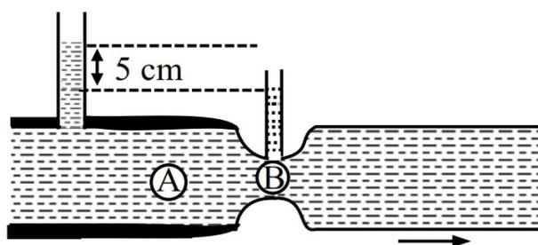

Diagram of a horizontal pipe with a constriction. The wider part has a point A and a vertical manometer tube showing a liquid level difference of 5 cm. The narrower part has a point B and a horizontal arrow indicating flow to the right.

- (1)  $\frac{200}{\sqrt{3}}$  (2)  $200\sqrt{6}$   
 (3)  $200\sqrt{3}$  (4)  $100\sqrt{3}$

Ans. (3)

Sol. From continuity equation

$$A_A V_A = A_B V_B \Rightarrow 6V_A = 3V_B \Rightarrow V_B = 2V_A$$

Applying Bernoulli's equation between A & B,

$$\begin{aligned} P_A + \frac{1}{2}\rho V_A^2 &= P_B + \frac{1}{2}\rho V_B^2 \\ \Rightarrow \rho g \times 0.05 &= \frac{1}{2}\rho [V_B^2 - V_A^2] = \frac{1}{2}\rho (3V_A^2) \\ \Rightarrow V_A &= \sqrt{\frac{2g \times 0.05}{3}} \text{ m/s} = \frac{1}{\sqrt{3}} \text{ m/s} = \frac{100}{\sqrt{3}} \text{ cm/s} \\ \Rightarrow \text{Volume flow rate} &= A_A V_A = \frac{6 \times 100}{\sqrt{3}} \text{ cm}^3/\text{sec} \\ &= 200\sqrt{3} \text{ cm}^3/\text{sec} \end{aligned}$$

Correct option (3)

30. In an experiment the values of two spring constants were measured as  $k_1 = (10 \pm 0.2)$  N/m and  $k_2 = (20 \pm 0.3)$  N/m. If these springs are connected in parallel, then the percentage error in equivalent spring constant is :

- (1) 2.67% (2) 2.33%  
 (3) 1.33% (4) 1.67%

Ans. (4)

Sol. For parallel combination of spring,

$$K_{eq} = K_1 + K_2 = 30 \text{ N/m}$$

$$\Delta K_{eq} = \Delta K_1 + \Delta K_2 = 0.2 + 0.3 = 0.5 \text{ N/m}$$

$$\therefore \text{ \%Error in } K = \frac{0.5}{30} \times 100 = 1.67\%$$

Correct option (4)

31. A 4 kg mass moves under the influence of a force  $\vec{F} = (4t^3\hat{i} - 3t\hat{j})$  N where  $t$  is the time in second. If mass starts from origin at  $t = 0$ , the velocity and position after  $t = 2$  s will be :

- (1)  $\vec{v} = 3\hat{i} + \frac{3}{2}\hat{j}$   $\vec{r} = \frac{6}{5}\hat{i} + \hat{j}$   
 (2)  $\vec{v} = 4\hat{i} - \frac{3}{2}\hat{j}$   $\vec{r} = \frac{8}{5}\hat{i} - \hat{j}$   
 (3)  $\vec{v} = 4\hat{i} + \frac{5}{2}\hat{j}$   $\vec{r} = \frac{8}{5}\hat{i} + 2\hat{j}$   
 (4)  $\vec{v} = 4\hat{i} - \frac{3}{2}\hat{j}$   $\vec{r} = \frac{6}{5}\hat{i} - \hat{j}$

Ans. (2)

Sol.  $\vec{F} = 4t^3\hat{i} - 3t\hat{j}$

$$\vec{a} = \frac{\vec{F}}{m} = t^3\hat{i} - \frac{3}{4}t\hat{j}$$

$$a_x = t^3$$

$$\frac{dv_x}{dt} = t^3$$

$$\int_{v_x=0}^{v_{x2}} dv_x = \int_{t=0}^{t=2} t^3 dt$$

$$v_{x2} - 0 = \left[ \frac{t^4}{4} \right]_0^2$$

$$v_{x2} = 4$$

$$a_y = \frac{-3}{4}t$$

$$\frac{dv_y}{dt} = -\frac{3}{4}t$$

$$\int_0^{v_{y2}} dv_y = \int_0^2 \frac{-3}{4}t dt$$

$$v_{y2} = \frac{-3}{4} \left[ \frac{t^2}{2} \right]_0^2$$

$$v_{y2} = \frac{-3}{2}$$

$$\vec{v}_2 = 4\hat{i} - \frac{3}{2}\hat{j}$$

$$v_x = \frac{t^4}{4}$$

$$\int_0^{x_2} dx = \int_0^2 \frac{t^4}{4} dt$$

$$x_2 - 0 = \left[ \frac{t^5}{20} \right]_0^2$$

$$x_2 = \frac{8}{5}$$

$$v_y = \frac{-3}{8}t^2$$

$$\int_0^{y_2} dy = \int_0^2 \frac{-3}{8}t^2 dt$$

$$y_2 - 0 = \frac{-3}{8} \left[ \frac{t^3}{3} \right]_0^2$$

$$y_2 = -1$$

$$\vec{r} = \frac{8}{5}\hat{i} - \hat{j}$$

Correct option (2)

32. Consider a modified Bernoulli equation.

$$\left(P + \frac{A}{Bt^2}\right) + \rho g(h + Bt) + \frac{1}{2}\rho V^2 = \text{constant}$$

If  $t$  has the dimension of time then the dimensions of  $A$  and  $B$  are \_\_\_\_\_, \_\_\_\_\_ respectively.

- (1)  $[ML^0T^{-1}]$  and  $[M^0LT]$
- (2)  $[ML^0T^{-1}]$  and  $[M^0LT^{-1}]$
- (3)  $[ML^0T^{-2}]$  and  $[M^0LT^{-2}]$
- (4)  $[ML^0T^{-2}]$  and  $[M^0LT^{-1}]$

Ans. (2)

$$\text{Sol.} \Rightarrow [P] = \left[\frac{A}{Bt^2}\right] \dots\dots(1)$$

$$\Rightarrow [h] = [Bt] \dots\dots(2)$$

$$\Rightarrow [B] = \left[\frac{h}{t}\right] = \left[\frac{L}{T}\right] = [LT^{-1}]$$

Putting  $B$  in equation (1)

$$[ML^{-1}T^{-2}] = \left[\frac{A}{LT^{-1} \times T^2}\right]$$

$$[A] = [ML^0T^{-1}]$$

Correct option (2)

33. A current carrying is placed vertically and a particle of mass  $m$  with charge  $Q$  is released from rest. The particle moves along the axis of solenoid. If  $g$  is acceleration due to gravity then the acceleration ( $a$ ) of the charged particle will satisfy :

- (1)  $a = g$
- (2)  $a > g$
- (3)  $a = 0$
- (4)  $0 < a < g$

Ans. (1)

Sol. Since the solenoid is placed vertically, the magnetic field inside the solenoid will be either along  $-y$  or  $+y$  axis.

$\Rightarrow$  Particle will gain velocity along  $-y$  axis.

$$\Rightarrow \vec{F}_B = q(\vec{v} \times \vec{B})$$

$$\Rightarrow \vec{F}_B = 0$$

$$\Rightarrow \vec{F}_{\text{net}} = m\vec{g}$$

$$\Rightarrow a_{\text{net}} = g$$

Correct option (1)

Diagram of a solenoid with current flowing through it. A particle of mass m and charge Q is shown falling along the central axis. A downward arrow is labeled mg, representing the gravitational force. The magnetic field direction is indicated by a downward arrow labeled B.

34. A parallel plate capacitor has capacitance  $C$ , when there is vacuum within the parallel plates.

A sheet having thickness  $\left(\frac{1}{3}\right)^{\text{rd}}$  of the separation between the plates and relative permittivity  $K$  is introduced between the plates. The new capacitance of the system is :

- (1)  $\frac{3KC}{2K+1}$
- (2)  $\frac{CK}{2+K}$
- (3)  $\frac{3CK^2}{(2K+1)^2}$
- (4)  $\frac{4KC}{3K-1}$

Ans. (1)

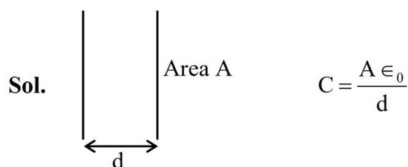

Diagram of a parallel plate capacitor with area A and separation distance d. The formula C = (A \* epsilon\_0) / d is shown next to it.

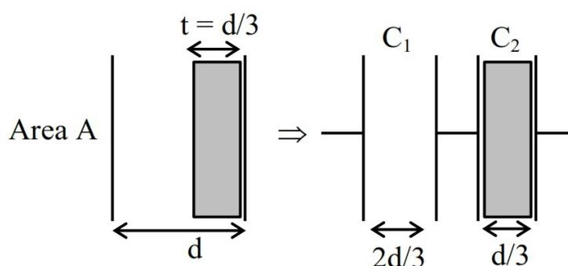

Diagram showing the insertion of a dielectric sheet of thickness t = d/3 into the capacitor. The capacitor is then shown as two capacitors in series: C1 with separation 2d/3 and C2 with separation d/3.

$$C_1 = \frac{3A\epsilon_0}{2d}$$

$$C_2 = \frac{3A\epsilon_0 \times K}{d}$$

$$C_1 = \frac{3}{2}C$$

$$C_2 = 3KC$$

$$C_{\text{eq}} = \frac{C_1 C_2}{C_1 + C_2} = \frac{\frac{3}{2}C \times 3KC}{\frac{3}{2}C + 3KC}$$

$$C_{\text{eq}} = \frac{\frac{9}{2}KC^2}{\frac{3}{2}C(2K+1)} = \frac{3KC}{2K+1}$$

Correct option (1)

35. The electric field a plane electromagnetic wave is given by :

$$E_y = 69 \sin[0.6 \times 10^3 x - 1.8 \times 10^{11} t] \text{ V/m.}$$

The expression for magnetic field associated with this electromagnetic wave is \_\_\_\_\_ T.

(1)  $B_z = 2.3 \times 10^{-7} \sin[0.6 \times 10^3 x - 1.8 \times 10^{11} t]$

(2)  $B_z = 2.3 \times 10^{-7} \sin[0.6 \times 10^3 x + 1.8 \times 10^{11} t]$

(3)  $B_y = 69 \sin[0.6 \times 10^3 x + 1.8 \times 10^{11} t]$

(4)  $B_y = 2.3 \times 10^{-7} \sin[0.6 \times 10^3 x - 1.8 \times 10^{11} t]$

Ans. (1)

Sol.  $\hat{B} = \hat{c} \times \hat{E}$

$\Rightarrow \hat{c} = \hat{i}$  because phase of electric field is function of x.

$\Rightarrow \hat{E} = \hat{j}$  (given)

$\Rightarrow \hat{B} = \hat{i} \times \hat{j} = \hat{k}$

$$|B| = \frac{|E|}{c} = \frac{69 \times 0.6 \times 10^3}{1.8 \times 10^{11}} = \frac{69}{3 \times 10^8}$$

$$|B| = 2.9 \times 10^{-7}$$

$$\bar{B}_z = 2.9 \times 10^{-7} \sin(0.6 \times 10^3 x - 1.8 \times 10^{11} t)$$

(phase is same as that of electric field)

Correct option (1)

36. In a double slit experiment the distance between the slits is 0.1 cm and the screen is placed at 50 cm from the slits plane. When one slit is covered with a transparent sheet having thickness t and refractive index  $n(= 1.5)$ , the central fringe shifts by 0.2 cm. The value of t is \_\_\_\_\_ cm.

(1)  $8 \times 10^{-4}$  (2)  $6.0 \times 10^{-3}$

(3)  $5.6 \times 10^{-4}$  (4)  $5.0 \times 10^{-3}$

Ans. (1)

Sol.  $d \sin \theta = (\mu - 1)t$

$$d \left[ \frac{x}{D} \right] = (\mu - 1)t$$

$$t = \frac{x d}{D(\mu - 1)}$$

$$= \frac{(0.2)(0.1)}{50(1.5 - 1)}$$

$$t = 8 \times 10^{-4} \text{ cm}$$

Correct option (1)

37. A light wave described by  $E = 60 \sin(3 \times 10^{15})t + \sin(12 \times 10^{15})t$  (in SI units) falls on a metal surface of work function 2.8 eV. The maximum kinetic energy of ejected photoelectron is (approximately) \_\_\_\_\_ eV. ( $h = 6.6 \times 10^{-34}$  J-s. and  $e = 1.6 \times 10^{-19}$  C)

(1) 5.1 (2) 3.8

(3) 6.0 (4) 7.8

Ans. (1)

Sol.  $\omega_1 = 3 \times 10^{15}$  rad/sec

$\omega_2 = 12 \times 10^{15}$  rad/sec

$$\therefore \nu = \frac{\omega}{2\pi}$$

$$E_{\text{photon}} = h\nu = 6.6 \times 10^{-34} \times 1.91 \times 10^{15} \\ = 1.26 \times 10^{-18} \text{ J}$$

$$E_{\text{max}} = \frac{1.26 \times 10^{-18}}{1.6 \times 10^{-19}} \approx 7.9 \text{ eV}$$

$$K_{\text{max}} = E_{\text{max}} - \phi_0 \\ = 7.9 - 2.8$$

$$K_{\text{max}} = 5.1 \text{ eV}$$

Correct option (1)

38. If an alpha particle with energy 7.7 MeV is bombarded on a thin gold foil, the closest distance from nucleus it can reach is \_\_\_\_\_ m.

(Atomic number of gold = 79 and  $\frac{1}{4\pi\epsilon_0} = 9 \times 10^9$

in SI units)

(1)  $2.95 \times 10^{-14}$  (2)  $2.95 \times 10^{-16}$

(3)  $3.85 \times 10^{-16}$  (4)  $3.85 \times 10^{-14}$

Ans. (1)

Sol. Energy conservation

$$K_i + U_i = K_f + U_f$$

$$7.7 \times 10^6 \times 1.6 \times 10^{-19} + 0$$

$$= 0 + \frac{9 \times 10^9 (1.6 \times 10^{-19}) (79 \times 1.6 \times 10^{-19})}{r}$$

$$r = 2.95 \times 10^{-14}$$

Correct option (1).

39. A uniform rod of mass  $m$  and length  $l$  suspended by means of two identical inextensible light strings as shown in figure. Tension in one string immediately after the other string is cut, is \_\_\_\_\_. (g acceleration due to gravity)

Diagram of a uniform rod of length l suspended by two vertical strings from a horizontal ceiling. The strings are attached at points A and B at the ends of the rod.

- (1)  $mg/2$  (2)  $mg/4$   
(3)  $mg/3$  (4)  $mg$

Ans. (2)

Sol.

Diagram of a rod of length l suspended by a single string at point A. The center of mass is at l/2, and the force of gravity mg acts downwards from there. The tension T acts upwards at point A.

$$mg \frac{l}{2} = \frac{ml^2}{3} \alpha$$

$$\alpha = \frac{3g}{2l} \dots(1)$$

$$mg - T = ma_c$$

$$T = mg - ma_c$$

$$= mg - m \left( \frac{l}{2} \alpha \right)$$

$$= mg - m \left( \frac{l}{2} \cdot \frac{3g}{2l} \right)$$

$$T = \frac{mg}{4}$$

Correct option (2)

40. An aluminium and steel rods having same lengths and cross-sections are joined to make total length of 120 cm at  $30^\circ\text{C}$ . The coefficient of linear expansion of aluminium and steel are  $24 \times 10^{-6}/^\circ\text{C}$  and  $1.2 \times 10^{-5}/^\circ\text{C}$ , respectively. The length of this composite rod when its temperature is raised to  $100^\circ\text{C}$ , is \_\_\_\_\_ cm.

- (1) 120.20 (2) 120.15  
(3) 120.03 (4) 120.06

Ans. (2)

$$\begin{aligned} \text{Sol. } l_{\text{final}} &= l_0(1 + \alpha_A \Delta T) + l_0(1 + \alpha_B \Delta T) \\ &= l_0 [2 + (\alpha_A + \alpha_B) \Delta T] \\ &= 60 [2 + (36 \times 10^{-6}) \times 70] \\ &= 60 [2 + 0.0025] \\ &= 120.15 \text{ cm} \end{aligned}$$

Correct option (2)

41. A 1 m long metal rod AB completes the circuit as shown in figure. The area of circuit is perpendicular to the magnetic field of 0.10 T. If the resistance of the total circuit is  $2\Omega$  then the force needed to move the rod towards right with constant speed (v) of 1.5 m/s is \_\_\_\_\_ N.

Diagram of a metal rod AB of length 1 m moving with velocity v to the right on two parallel rails. The rails are connected by a resistor of 2 ohms. A uniform magnetic field B is directed into the page (indicated by crosses).

- (1)  $7.5 \times 10^{-2}$  (2)  $5.7 \times 10^{-3}$   
(3)  $5.7 \times 10^{-2}$  (4)  $7.5 \times 10^{-3}$

Ans. (4)

Sol. To maintain constant speed

$$F_{\text{ext}} = F_B$$

$$\Rightarrow F_{\text{ext}} = iBl$$

$$= \left( \frac{vBl}{R} \right) lB$$

$$= \frac{B^2 l^2 v}{R}$$

$$= \frac{(0.1)^2 \times (1)^2 \times 1.5}{2}$$

$$= 7.5 \times 10^{-3} \text{ N}$$

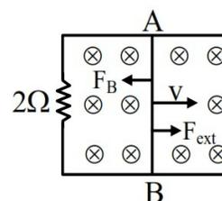

Diagram showing the forces acting on the rod AB. The magnetic force F\_B acts to the left, and the external force F\_ext acts to the right. The rod is moving with velocity v to the right.

Correct option (4)

42. The given circuit works as :

Logic circuit diagram with two inputs A and B. Input A is connected to the top input of an OR gate. Input B is connected to the bottom input of an OR gate. The output of the OR gate is connected to the input of a NAND gate. The output of the NAND gate is connected to the input of another OR gate. The output of this final OR gate is the circuit's output.

- (1) AND gate (2) NOR gate  
(3) NAND gate (4) OR gate

Ans. (3)

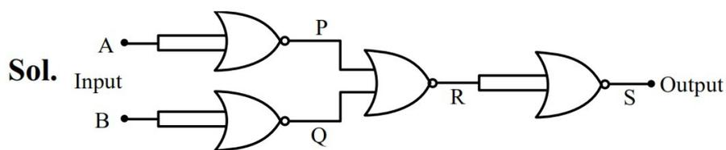

**Sol.**

Logic gate diagram showing two NOT gates (A to P, B to Q) connected to an OR gate (P, Q to R), which is then connected to a NOT gate (R to S).

$$P = \bar{A}$$

$$Q = \bar{B}$$

$$R = \bar{A} + \bar{B} = \overline{AB} = AB$$

$$S = \overline{AB} \Rightarrow \text{NAND Gate}$$

**Correct option (3)**

- 43.** Two strings (A, B) having linear densities  $\mu_A = 2 \times 10^{-4}$  kg/m and  $\mu_B = 4 \times 10^{-4}$  kg/m and lengths  $L_A = 2.5$  m and  $L_B = 1.5$  m respectively are joined. Free ends of A and B are tied to two rigid supports C and D, respectively creating a tension of 500 N in the wire. Two identical pulses, sent from C and D ends, take time  $t_1$  and  $t_2$ , respectively, to reach the joint. The ratio  $t_1/t_2$  is :

- (1) 1.08 (2) 1.90  
(3) 1.67 (4) 1.18

**Ans. (4)**

**Sol.** Given  $L_A = 2.5$  m,

$$L_B = 1.5$$
 m,

$$T = 500$$
 N

$$v_A = \sqrt{\frac{T}{\mu_A}} = \sqrt{\frac{500}{2 \times 10^{-4}}} = 5\sqrt{10} \times 10^2 \text{ m/s}$$

$$v_B = \sqrt{\frac{T}{\mu_B}} = \sqrt{\frac{500}{4 \times 10^{-4}}} = 5\sqrt{5} \times 10^2 \text{ m/s}$$

$$t_1 = \frac{L_A}{v_A} = \frac{2.5}{5\sqrt{10}} \times 10^{-2} \text{ s}$$

$$t_2 = \frac{L_B}{v_B} = \frac{1.5}{5\sqrt{5}} \times 10^{-2} \text{ s}$$

$$\therefore \frac{t_1}{t_2} = \frac{2.5}{5\sqrt{10}} \times \frac{5\sqrt{5}}{1.5} = \frac{5}{3} \times \frac{1}{\sqrt{2}} = \frac{1.66}{1.41} = 1.18$$

**Correct Option (4)**

- 44.** Initially a satellite of 100 kg is in a circular orbit of radius  $1.5R_E$ . This satellite can be moved to a circular orbit of radius  $3R_E$  by supplying  $\alpha \times 10^6$  J of energy. The value of  $\alpha$  is \_\_\_\_\_.

(Take Radius of Earth  $R_E = 6 \times 10^6$  m and  $g = 10$  m/s2)

- (1) 150 (2) 500  
(3) 100 (4) 1000

**Ans. (4)**

**Sol.** Energy of a satellite in a circular orbit is given as

$$E = \frac{-GM_E m}{2r}; r = \text{radius of circular orbit}$$

Required energy to be supplied  $= \Delta E = E_f - E_i$

$$\begin{aligned} \Delta E &= \left( \frac{-GM_E m}{2(3R_E)} \right) - \left( \frac{-GM_E m}{2(1.5R_E)} \right) \\ &= \frac{GM_E m}{6R_E} \end{aligned}$$

$$\text{Now, } g = \frac{GM_E}{R_E^2} \Rightarrow \frac{GM_E}{R_E} = gR_E$$

$$\begin{aligned} \therefore \Delta E &= \frac{1}{6} gmR_E \\ &= \frac{1}{6} \times 10 \times 100 \times 6 \times 10^6 \\ &= 1000 \times 10^6 \end{aligned}$$

$$\alpha = 1000$$

**Correct option (4)**

- 45.** A point charge of  $10^{-8}$  C is placed at origin. The work done in moving a point charge  $2 \mu\text{C}$  from point A(4, 4, 2) m to B(2, 2, 1) m is \_\_\_\_\_ J.

$$\left( \frac{1}{4\pi\epsilon_0} = 9 \times 10^9 \text{ in SI units} \right)$$

- (1)  $45 \times 10^{-6}$   
(2) 0  
(3)  $30 \times 10^{-6}$   
(4)  $15 \times 10^{-6}$

**Ans. (3)**

**Sol.** Work done by external agent :

$$W_{\text{ext}} = \Delta U;$$

$\Delta U \rightarrow$  Change in potential energy in taking the charge from initial to final configuration

$$\Rightarrow W_{\text{ext}} = \frac{1}{4\pi\epsilon_0} \frac{q_1 q_2}{r_f} - \frac{1}{4\pi\epsilon_0} \frac{q_1 q_2}{r_i}$$

$$\text{Now, } r_f = \sqrt{(2-0)^2 + (2-0)^2 + (1-0)^2} = 3 \text{ m}$$

$$r_i = \sqrt{(4-0)^2 + (4-0)^2 + (2-0)^2} = 6 \text{ m}$$

$$\begin{aligned} \therefore W_{\text{ext}} &= (9 \times 10^9) \times (10^{-8} \times 2 \times 10^{-6}) \left[ \frac{1}{3} - \frac{1}{6} \right] \\ &= 3 \times 10^{-5} \\ &= 30 \times 10^{-6} \text{ J} \end{aligned}$$

**Correct Option (3)**

#### SECTION - B

46. A collimated beam of light of diameter 2 mm is propagating along x-axis. The beam is required to be expanded in a collimated beam of diameter 14 mm using a system of two convex lenses. If first lens has focal length 40 mm, then the focal length of second lens is \_\_\_\_\_ mm.

**Ans. (280)**

**Sol.**

Diagram of a beam expander system. A collimated beam of diameter 2 mm enters a convex lens with focal length 40 mm. The beam converges to a point and then diverges before entering a second convex lens with focal length f. The output is a collimated beam of diameter 14 mm. The distance between the two lenses is the sum of their focal lengths (40 mm + f).

$$\frac{40}{2} = \frac{f}{14}$$

$$\Rightarrow f = 280 \text{ mm}$$

**Correct Answer : 280**

47. The heat generated in 1 minute between points A and B in the given circuit, when a battery of 9V with internal resistance of 1  $\Omega$  is connected across these points is \_\_\_\_\_ J.

Circuit diagram for Question 47. A 9V battery with 1 ohm internal resistance is connected across points A and B. Between A and B, there are two parallel branches. The top branch has a 1 ohm resistor in series with a 2 ohm resistor. The bottom branch has a 2 ohm resistor in series with a 4 ohm resistor. A 1 ohm resistor is connected in parallel between the junction of the 1 ohm and 2 ohm resistors in the top branch and the junction of the 2 ohm and 4 ohm resistors in the bottom branch.

**Ans. (1080)**

**Sol.**

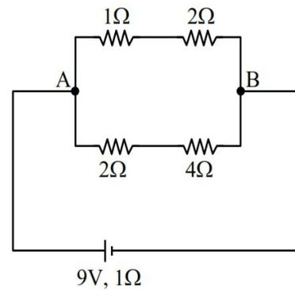

Circuit diagram for Question 48. A Wheatstone bridge is shown with resistors 1 ohm, 2 ohm, 2 ohm, and 4 ohm. The bridge is balanced. A 9V battery with 1 ohm internal resistance is connected across points A and B.

Balanced Wheatstone bridge

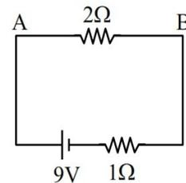

Simplified circuit diagram for Question 48. It shows a single loop with a 9V battery, a 1 ohm internal resistance, and a 2 ohm resistor connected between points A and B.

$$i = \frac{9}{3} = 3 \text{ A}$$

$$\begin{aligned} \therefore H_{AB} &= i^2 R_{AB} t \\ &= (3)^2 \times 2 \times 60 = 1080 \text{ J} \end{aligned}$$

**Correct Answer : 1080**

48. Two identical thin rods of mass M kg and length L m are connected as shown in figure. Moment of inertia of the combined rod system about an axis passing through point P and perpendicular to the plane of the rods is  $\frac{x}{2} ML^2 \text{ kg m}^2$ . The value of x is \_\_\_\_\_.

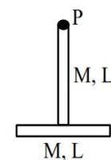

Diagram of two identical thin rods, each of mass M and length L, connected end-to-end. Point P is at the top end of the vertical rod.

**Ans. (17)**

$$\begin{aligned} \text{Sol. } I &= \frac{ML^2}{3} + \left( \frac{ML^2}{12} + ML^2 \right) \\ &= \frac{4ML^2 + ML^2 + 12ML^2}{12} \end{aligned}$$

$$I = \frac{17}{12} ML^2$$

$$\therefore x = 17$$

**Correct Answer : 17**

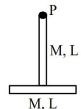

Diagram of two identical thin rods, each of mass M and length L, connected end-to-end. Point P is at the top end of the vertical rod.

49. 10 mole of oxygen is heated at constant volume from  $30^{\circ}\text{C}$  to  $40^{\circ}\text{C}$ . The change in the internal energy of the gas is \_\_\_\_\_ cal. (The molecular specific heat of oxygen at constant pressure,  $C_p = 7 \text{ cal./mol } ^{\circ}\text{C}$  and  $R = 2 \text{ cal./mol } ^{\circ}\text{C}$ .)

**Ans. (500)**

$$\begin{aligned}\text{Sol. } \Delta U &= nC_v\Delta T \\ &= n(C_p - R)\Delta T \\ &= 10(7 - 2)(40 - 30) \\ \Delta U &= 500\end{aligned}$$

**Correct Answer : 500**

50. In a microscope the objective is having focal length  $f_o = 2 \text{ cm}$  and eye-piece is having focal length  $f_e = 4 \text{ cm}$ . The tube length is  $32 \text{ cm}$ . The magnification produced by this microscope for normal adjustment is \_\_\_\_\_.

**Ans. (100)**

$$\begin{aligned}\text{Sol. } m &\approx \frac{LD}{f_o f_e} \\ &= \frac{32}{2} \times \frac{25}{4} \\ m &= 100\end{aligned}$$

**Correct Answer : 100**

### CHEMISTRY

#### SECTION-A

51. Consider the following reactions.

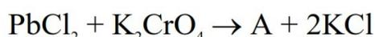

$$\text{PbCl}_2 + \text{K}_2\text{CrO}_4 \rightarrow \text{A} + 2\text{KCl}$$

(Hot solution)

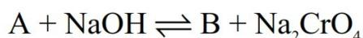

$$\text{A} + \text{NaOH} \rightleftharpoons \text{B} + \text{Na}_2\text{CrO}_4$$

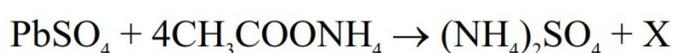

$$\text{PbSO}_4 + 4\text{CH}_3\text{COONH}_4 \rightarrow (\text{NH}_4)_2\text{SO}_4 + \text{X}$$

In the above reactions, A, B and X are respectively.

- (1)  $\text{Na}_2[\text{Pb}(\text{OH})_2], \text{PbCrO}_4$  and  $(\text{NH}_4)_2[\text{Pb}(\text{CH}_3\text{COO})_4]$
- (2)  $\text{PbCrO}_4, \text{Na}_2[\text{Pb}(\text{OH})_4]$  and  $[\text{Pb}(\text{NH}_3)_4]\text{SO}_4$
- (3)  $\text{Na}_2[\text{Pb}(\text{OH})_2], \text{PbCrO}_4$  and  $[\text{Pb}(\text{NH}_3)_4]\text{SO}_4$
- (4)  $\text{PbCrO}_4, \text{Na}_2[\text{Pb}(\text{OH})_4]$  and  $(\text{NH}_4)_2[\text{Pb}(\text{CH}_3\text{COO})_4]$

Ans. (4)

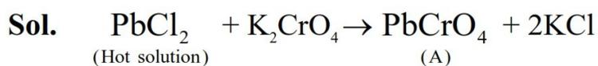

**Sol.**  $\text{PbCl}_2 + \text{K}_2\text{CrO}_4 \rightarrow \text{PbCrO}_4 + 2\text{KCl}$   
(Hot solution) (A)

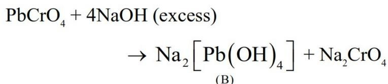

$$\text{PbCrO}_4 + 4\text{NaOH} (\text{excess}) \rightarrow \text{Na}_2[\text{Pb}(\text{OH})_4] + \text{Na}_2\text{CrO}_4$$

(B)

$$\text{PbSO}_4 + 4\text{CH}_3\text{COONH}_4 \rightarrow (\text{NH}_4)_2[\text{Pb}(\text{CH}_3\text{COO})_4] + (\text{NH}_4)_2\text{SO}_4$$

(X)

52. Which of the following represents the correct trend for the mentioned property ?

- A.  $\text{F} > \text{P} > \text{S} > \text{B}$  – First Ionization Energy
  - B.  $\text{Cl} > \text{F} > \text{S} > \text{P}$  – Electron Affinity
  - C.  $\text{K} > \text{Al} > \text{Mg} > \text{B}$  – Metallic character
  - D.  $\text{K}_2\text{O} > \text{Na}_2\text{O} > \text{MgO} > \text{Al}_2\text{O}_3$  – Basic character
- Choose the correct answer from the option given below.

- (1) A, B and D only
- (2) A, B, C and D
- (3) A and B only
- (4) B and C only

Ans. (1)

**Sol.**  $\Rightarrow$  On moving left to right in a period IE increases and from top to bottom in a group IE decreases.

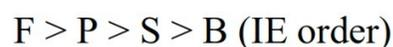

$$\text{F} > \text{P} > \text{S} > \text{B} \text{ (IE order)}$$

$\Rightarrow$  On moving left to right in a period metallic and basic character decreases.

$$\text{K} > \text{Mg} > \text{Al} > \text{B} \text{ (Metallic character order)}$$

$\Rightarrow$  On moving top to bottom in a group metallic and basic character increases.

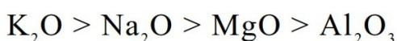

$$\text{K}_2\text{O} > \text{Na}_2\text{O} > \text{MgO} > \text{Al}_2\text{O}_3$$

$\Rightarrow$  EA : Group 17 > Group 16 > Group 15

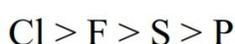

$$\text{Cl} > \text{F} > \text{S} > \text{P}$$

53. Identify A in the following reaction.

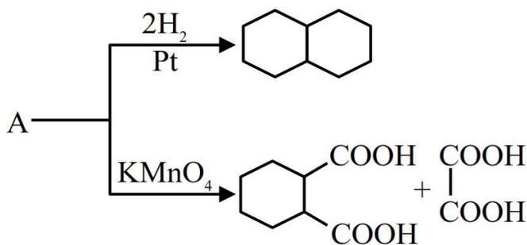

A  $\xrightarrow[Pt]{2\text{H}_2}$

A  $\xrightarrow{\text{KMnO}_4}$

Decalin structure cis-1,2-cyclohexanedicarboxylic acid and oxalic acid structures

- (1) 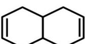
- (2) 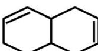
- (3) 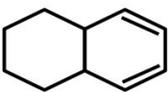
- (4) 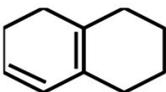

Ans. (3)

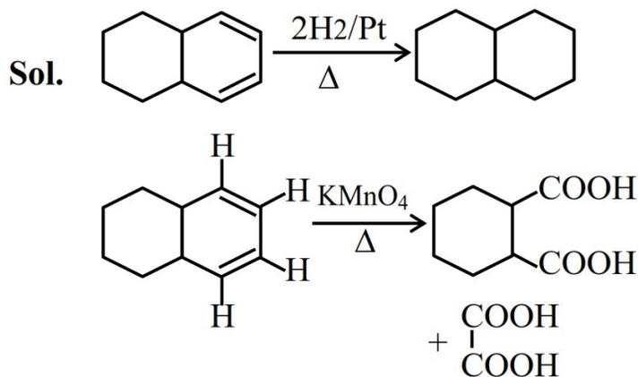

**Sol.**  $\xrightarrow[\Delta]{2\text{H}_2/\text{Pt}}$

$\xrightarrow[\Delta]{\text{KMnO}_4}$

Octalin structure Decalin structure Octalin structure with bridgehead hydrogens cis-1,2-cyclohexanedicarboxylic acid and oxalic acid structures

54. A hydrocarbon 'P' ( $C_4H_8$ ) on reaction with HCl gives an optically active compound 'Q' ( $C_4H_9Cl$ ) which on reaction with one mole of ammonia gives compound 'R' ( $C_4H_{11}N$ ). 'R' on diazotization followed by hydrolysis gives 'S'. Identify P, Q, R and S.

(1)  $P = \text{CH}_3 - \text{CH}_2 - \text{CH} = \text{CH}_2$ ,  $Q = \text{CH}_3 - \text{CH}_2 - \text{CH}_2 - \underset{\text{Cl}}{\text{CH}_2}$

$$R = \text{CH}_3\text{CH}_2\text{CH}_2\text{NH}, S = \text{CH}_3\text{CH}_2\text{CH(OH)CH}_3$$

(2) P=CH3—, Q=Cl—CH2—,  
 R=H2N—CH2—, S=

cyclopropyl group cyclopropyl group cyclopropyl group cyclopropyl group with OH substituent

(3)  $P = \text{CH}_3 - \text{CH} = \text{CH} - \text{CH}_3$ ,  $Q = \text{CH}_3 - \text{CH}_2 - \underset{\text{Cl}}{\underset{|}{\text{CH}}} - \text{CH}_3$ ,  
 $R = \text{CH}_3 - \text{CH}_2 - \underset{\text{NH}_2}{\underset{|}{\text{CH}}} - \text{CH}_3$ ,  $S = \text{CH}_3 - \text{CH}_2 - \underset{\text{OH}}{\underset{|}{\text{CH}}} - \text{CH}_3$

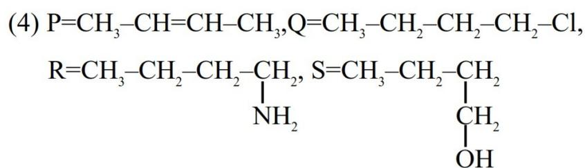

(4) P= $\text{CH}_3\text{CH}=\text{CHCH}_3$ , Q= $\text{CH}_3\text{CH}_2\text{CH}_2\text{CH}_2\text{Cl}$ ,  
 R= $\text{CH}_3\text{CH}_2\text{CH}_2\underset{\text{NH}_2}{\underset{|}{\text{CH}}}_2$ , S= $\text{CH}_3\text{CH}_2\text{CH}_2\underset{\text{CH}_2\text{OH}}{\underset{|}{\text{CH}}}_2$

**Ans. (3)**

**Sol.**

55. Given below are two statements :

**Statement I :** The number of pairs among  $[\text{SiO}_2, \text{CO}_2]$ ,  $[\text{SnO}, \text{SnO}_2]$ ,  $[\text{PbO}, \text{PbO}_2]$  and  $[\text{GeO}, \text{GeO}_2]$ , which contain oxides that are both amphoteric is 2.

**Statement II :**  $\text{BF}_3$  is an electron deficient molecule can act as a lewis acid, forms adduct with  $\text{NH}_3$  and has a trigonal planar geometry.

In the light of the above statement, choose the correct answer from the option given below.

- (1) Both **Statement I** and **Statement II** are true.
  - (2) Both **Statement I** and **Statement II** are false.
  - (3) **Statement I** is true but **Statement II** is false.
  - (4) **Statement I** is false **Statement II** is true.

**Ans. (1)**

**Sol.**  $\Rightarrow$   $\text{SiO}_2$ ,  $\text{CO}_2$ ,  $\text{GeO}$ ,  $\text{GeO}_2$  are acidic in nature.  
 $\text{SnO}$ ,  $\text{SnO}_2$ ,  $\text{PbO}$ ,  $\text{PbO}_2$  are amphoteric in nature.

⇒  $\text{BF}_3$  is Lewis acid according to Lewis octet theory and has  $\text{sp}^2$  hybridization with trigonal planar geometry and it can accept lone pair from ammonia to form adduct.

56. 80 mL of a hydrocarbon on mixing with 264 mL of oxygen in a closed U-tube undergoes complete combustion. The residual gases after cooling to 273 K occupy 224 mL. When the system is treated with KOH solution, the volume decreases to 64 mL. The formula of the hydrocarbon is :

- (1)  $C_2H_4$       (2)  $C_4H_{10}$       (3)  $C_2H_2$       (4)  $C_2H_6$

**Ans. (3)**

**Sol.**  $C_xH_{y(g)} + \left(x + \frac{y}{4}\right) O_{2(g)} \longrightarrow xCO_{2(g)} + \frac{y}{2} H_2O_{(l)}$

|                      |    |                                        |       |   |
|----------------------|----|----------------------------------------|-------|---|
| $t=0$                | 80 | 264                                    | 0     | - |
| $t=t_{\text{final}}$ | -  | $264 - 80\left(x + \frac{y}{4}\right)$ | $80x$ | - |

$$264 - 80\left(x + \frac{y}{4}\right) + 80x = 224$$

$$264 - \frac{80y}{4} = 224$$

$$40 = \frac{80y}{4} \Rightarrow y = 2$$

$$264 - 80\left(x + \frac{y}{4}\right) = 64$$

$$264 - 80\left(x + \frac{1}{2}\right) = 64$$

$$264 - 80x - 40 = 64$$

$$x = 2$$

57. 14.0 g of calcium metal is allowed to react with excess HCl at 1.0 atm pressure and 273 K.

Which of the following statements is **incorrect** ?

[Given : Molar mass in g mol-1 of Ca-40, Cl-35.5, H-1]

- (1) 0.35 mol of H2 gas is evolved.
- (2) 7.84 L of H2 gas is evolved.
- (3) 33.3 g of CaCl2 is produced.
- (4) The limiting reagent is calcium metal.

Ans. (3)

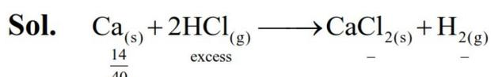

Sol.  $\underset{\substack{| \\ 14 \\ 40}}{\text{Ca}_{(s)}} + \underset{\text{excess}}{2\text{HCl}_{(g)}} \longrightarrow \underset{-}{\text{CaCl}_{2(s)}} + \underset{-}{\text{H}_{2(g)}}$

= 0.35 mole                      0.35 mole    0.35 mole

Volume of H2(g) evolved = 0.35 × 22.4 = 7.84 L

(3) is wrong because weight of CaCl2 = 0.35 × 111 = 38.85 gm

58. In Carius method, 0.75 g of an organic compound gave 1.2 g of barium sulphate, find percentage of sulphur (molar mass 32 g mol-1). Molar mass of barium sulphate is 233 g mol-1.

- (1) 4.55%
- (2) 10.30%
- (3) 21.97%
- (4) 16.48%

Ans. (3)

Sol.  $\frac{n_{\text{BaSO}_4} \times 32}{W_{(\text{unknown comp.})}} \times 100$

$$= \frac{1.2 \times 32}{233} \times \frac{100}{0.75} = 21.97\%$$

59. Elements P and Q form two types of non-volatile, non-ionizable compounds PQ and PQ2. When 1 g of PQ is dissolved in 50 g of solvent 'A'. ΔTb was 1.176 K while when 1 g of PQ2 is dissolved in 50 g of solvent 'A', ΔTb was 0.689 K. (Kb of 'A' = 5 K kg mol-1). The molar masses of elements P and Q (in g mol-1) respectively, are :

- (1) 70, 110
- (2) 65, 145
- (3) 60, 25
- (4) 25, 60

Ans. (4)

Sol.  $(\Delta T_b)_{PQ} = K_b m$

$$1.176 = 5 \times \frac{1}{M_1} \times \frac{1000}{50}$$

$$M_1 = 85.03$$

$$(\Delta T_b)_{PQ_2} = 5 \times \frac{1}{M_2} \times \frac{1000}{50} = 0.689$$

$$M_2 = 145.13$$

Let molar mass of P & Q are Mp and MQ respectively

$$M_p + M_Q = 85.03$$

$$M_p + 2M_Q = 145.13$$

$$M_p = 24.93 \approx 25$$

$$M_Q = 60.1 \approx 60$$

60. An organic compound (P) on treatment with aqueous ammonia under hot condition forms compound (Q) which on heating with Br2 and KOH forms compound (R) having molecular formula C6H7N. Names of P, Q and R respectively are.

- (1) Benzoic acid, benzamide, aniline
- (2) Toluic acid, methylbenzamide, 2-methylaniline
- (3) Benzoic acid, 4-methylbenzamide, 4-methylaniline.
- (4) Phenylethanoic acid, phenylethanamide, benzamine

Ans. (1)

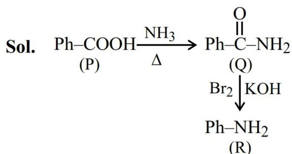

Sol.  $\underset{(P)}{\text{Ph}-\text{COOH}} \xrightarrow[\Delta]{\text{NH}_3} \underset{(Q)}{\text{Ph}-\overset{\text{O}}{\parallel}{\text{C}}-\text{NH}_2} \xrightarrow{\text{Br}_2 \mid \text{KOH}} \underset{(R)}{\text{Ph}-\text{NH}_2}$

61. An organic compound "P" of molecular formula  $C_6H_{12}O_3$  gives positive iodoform test but negative Tollen's test. When "P" is treated with dilute acid, it produces "Q". "Q" gives positive Tollen's test and also iodoform test. The structure of "P" is :

(1)  $\begin{array}{ccccccc} & & \text{O} & & & & \text{CH}_2 \\ & & || & & & & | \\ \text{CH}_3 & - & \text{C} & - & \text{CH} & - & \text{CH}_2 \\ & & & & & & | \\ & & & & & & \text{OCH}_3 \end{array}$

(2)  $\begin{array}{ccccccc} & & \text{O} & & & & \text{CH}_2 \\ & & || & & & & | \\ \text{CH}_3 & - & \text{C} & - & \text{CH}_2 & - & \text{CH} & - & \text{OCH}_3 \\ & & & & & & & & | \\ & & & & & & & & \text{OCH}_3 \end{array}$

(3)  $\begin{array}{ccccccc} & & \text{O} & & & & & & \text{CH}_2 \\ & & || & & & & & & | \\ \text{H} & - & \text{C} & - & \text{CH}_2 & - & \text{CH}_2 & - & \text{CH} & - & \text{OCH}_3 \\ & & & & & & & & & & | \\ & & & & & & & & & & \text{OCH}_3 \end{array}$

(4)  $\begin{array}{ccccccc} & & \text{O} & & \text{OCH}_3 & & \\ & & || & & | & & \\ \text{CH}_3 & - & \text{C} & - & \text{C} & - & \text{CH}_3 \\ & & & & & & | \\ & & & & & & \text{OCH}_3 \end{array}$

Ans. (2)

Sol.

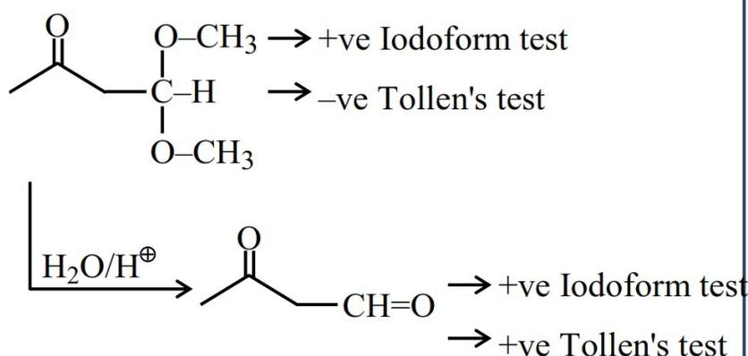

$\begin{array}{c} \text{CH}_3 - \text{C}(=\text{O}) - \text{CH}_2 - \text{CH}(\text{OCH}_3)_2 \xrightarrow{\text{I}_2/\text{NaOH}} \text{CH}_3 - \text{C}(=\text{O}) - \text{CH}_2 - \text{CH}(\text{OCH}_3)_2 \rightarrow \text{+ve Iodoform test} \\ \xrightarrow{\text{Tollen's}} \text{CH}_3 - \text{C}(=\text{O}) - \text{CH}_2 - \text{CH}(\text{OCH}_3)_2 \rightarrow \text{-ve Tollen's test} \\ \xrightarrow{\text{H}_2\text{O}/\text{H}^+} \text{CH}_3 - \text{C}(=\text{O}) - \text{CH}_2 - \text{CH}_2 - \text{CH}_2 - \text{CHO} \xrightarrow{\text{I}_2/\text{NaOH}} \text{CH}_3 - \text{C}(=\text{O}) - \text{CH}_2 - \text{CH}_2 - \text{CH}_2 - \text{CHO} \rightarrow \text{+ve Iodoform test} \\ \xrightarrow{\text{Tollen's}} \text{CH}_3 - \text{C}(=\text{O}) - \text{CH}_2 - \text{CH}_2 - \text{CH}_2 - \text{CHO} \rightarrow \text{+ve Tollen's test} \end{array}$

62. From the following, the least stable structure is :

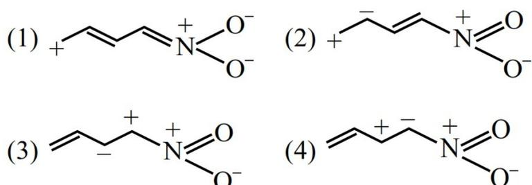

(1)  $\text{CH}_2=\text{CH}-\text{CH}=\text{CH}-\text{CH}_2-\text{CH}=\text{CH}-\text{CH}_2-\text{CH}=\text{CH}-\text{N}^+(\text{O}^-)_2$

(2)  $\text{CH}_2=\text{CH}-\text{CH}=\text{CH}-\text{CH}_2-\text{CH}=\text{CH}-\text{CH}_2-\text{CH}=\text{CH}-\text{N}^+(\text{O}^-)_2$

(3)  $\text{CH}_2=\text{CH}-\text{CH}=\text{CH}-\text{CH}_2-\text{CH}=\text{CH}-\text{CH}_2-\text{CH}=\text{CH}-\text{N}^+(\text{O}^-)_2$

(4)  $\text{CH}_2=\text{CH}-\text{CH}=\text{CH}-\text{CH}_2-\text{CH}=\text{CH}-\text{CH}_2-\text{CH}=\text{CH}-\text{N}^+(\text{O}^-)_2$

Ans. (3)

Sol.  $\text{CH}_2=\text{CH}-\text{CH}=\text{CH}-\text{CH}_2-\text{CH}=\text{CH}-\text{CH}_2-\text{CH}=\text{CH}-\text{N}^+(\text{O}^-)_2$

This resonating structure having +ve charge on adjacent atoms so it is least stable.

63.  $\text{MnO}_4^{2-}$ , in acidic medium, disproportionates to :

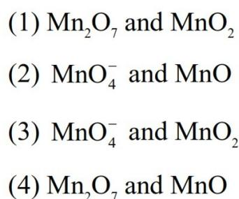

(1)  $\text{Mn}_2\text{O}_7$  and  $\text{MnO}_2$   
(2)  $\text{MnO}_4^-$  and  $\text{MnO}$   
(3)  $\text{MnO}_4^-$  and  $\text{MnO}_2$   
(4)  $\text{Mn}_2\text{O}_7$  and  $\text{MnO}$

Ans. (3)

Sol.  $3\text{MnO}_4^{2-} + 4\text{H}^+ \rightarrow 2\text{MnO}_4^- + \text{MnO}_2 + 2\text{H}_2\text{O}$

64. Given below are two statements:

**Statement I:** The number of species among  $\text{SF}_4$ ,  $\text{NH}_4^+$ ,  $[\text{NiCl}_4]$ ,  $\text{XeF}_4$ ,  $[\text{PtCl}_4]^{2-}$ ,  $\text{SeF}_4$  and  $[\text{Ni}(\text{CN})_4]^{2-}$ , that have tetrahedral geometry is 3.

**Statement II:** In the set  $[\text{NO}_2, \text{BeH}_2, \text{BF}_3, \text{AlCl}_3]$ , all the molecules have incomplete octet around central atom. In the light of the above statements, choose the correct answer from the options given below:

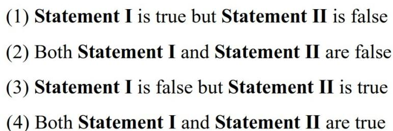

(1) **Statement I** is true but **Statement II** is false  
(2) Both **Statement I** and **Statement II** are false  
(3) **Statement I** is false but **Statement II** is true  
(4) Both **Statement I** and **Statement II** are true

Ans. (3)

Sol. Statement-I

$\text{SF}_4$  (See-saw)

$\text{XeF}_4$  (square planar),

$[\text{PtCl}_4]^{2-}$  (square planar),

$[\text{NiCl}_4]^{2-}$  (Tetrahedral),

$[\text{Ni}(\text{CN})_4]^{2-}$  (square planar),

$\text{SeF}_4$  (See-saw)

$\text{NH}_4^+$  (Tetrahedral)

Statement-II

$\text{NO}_2$  (seven electrons on N)

$\text{BeH}_2$  (four electrons on Be)

$\text{BF}_3$  (six electrons on B)

$\text{AlCl}_3$  (six electrons on Al)

65. Given below are two statements:

**Statement I:** Among  $[\text{Cu}(\text{NH}_3)_4]^{2+}$ ,  $[\text{Ni}(\text{en})_3]^{2+}$ ,  $[\text{Ni}(\text{NH}_3)_6]^{2+}$  and  $[\text{Mn}(\text{H}_2\text{O})_6]^{2+}$ ,  $[\text{Mn}(\text{H}_2\text{O})_6]^{2+}$ , has the maximum number of unpaired electrons.

**Statement II:** The number of pairs among  $\{[\text{NiCl}_4]^{2-}$ ,  $[\text{Ni}(\text{CO})_4]\}$ ,  $\{[\text{NiCl}_4]^{2-}$ ,  $[\text{Ni}(\text{CN})_4]^{2-}\}$  and  $\{[\text{Ni}(\text{CO})_4]$ ,  $[\text{Ni}(\text{CN})_4]^{2-}\}$  that contain only diamagnetic species is two.

In the light of the above statements, choose the **correct** answer from the options given below:

- (1) **Statement I** is false but **Statement II** is true
- (2) Both **Statement I** and **Statement II** are true
- (3) Both **Statement I** and **Statement II** are false
- (4) **Statement I** is true but **Statement II** is false

**Ans. (4)**

**Sol.**  $[\text{Cu}(\text{NH}_3)_4]^{2+} \Rightarrow d^9$ ,  $\text{dsp}^2$  one unpaired electron  
 $[\text{Ni}(\text{en})_3]^{2+} \Rightarrow d^8$ ,  $\text{sp}^3\text{d}^2$  two unpaired electrons  
 $[\text{Ni}(\text{NH}_3)_6]^{2+} \Rightarrow d^8$ ,  $\text{sp}^3\text{d}^2$  two unpaired electrons  
 $[\text{Mn}(\text{H}_2\text{O})_6]^{2+} \Rightarrow d^5$ ,  $\text{sp}^3\text{d}^2$  five unpaired electrons  
 $[\text{Ni}(\text{CO})_4]$  (diamagnetic)  
 $[\text{NiCl}_4]^{2-}$  (paramagnetic)  
 $[\text{Ni}(\text{CN})_4]^{2-}$  (diamagnetic)

66. Identify correct statement from the following :

- A. Propanal and propanone are functional isomers.
- B. Ethoxyethane and methoxypropane are metamers.
- C. But-2-ene shows optical isomerism.
- D. But-1-ene and but-2-ene are functional isomers.
- E. Pentane and 2, 2-dimethyl propane are chain isomers.

Choose the **correct** answer from the options given below :

- (1) B, C and D only
- (2) A, B and C only
- (3) A, B and E only
- (4) C, D and E only

**Ans. (3)**

**Sol.** 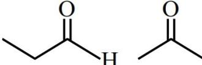 are Functional isomer

$\text{CH}_3-\text{CH}=\text{CH}-\text{CH}_3$  &  $\text{CH}_3-\text{CH}_2-\text{CH}=\text{CH}_2$

Are Positional isomer

$\text{CH}_3-\text{CH}_2-\text{O}-\text{CH}_2-\text{CH}_3$  &  $\text{CH}_3-\text{CH}_2-\text{CH}_2-\text{O}-\text{CH}_3$

are Metamer

$\text{CH}_3-\text{CH}=\text{CH}-\text{CH}_3$  does not have optical isomer

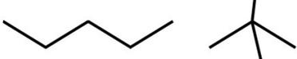 Chain isomer

67. Identify the correct statements.

- A. Arginine and Tryptophan are essential amino acids.
- B. Histidine does not contain heterocyclic ring in its structure.
- C. Proline is a six membered cyclic ring amino acid.
- D. Glycine does not have chiral centre.
- E. Cysteine has characteristic feature of side chain as  $\text{MeS}-\text{CH}_2-\text{CH}_2-$ .

Choose the **correct** answer from the options given below:

Option

- (1) C and E Only
- (2) B and E Only
- (3) C and D Only
- (4) A and D Only

**Ans. (4)**

**Sol.** • Histidine does contain heterocyclic ring.

• Proline is a five membered cyclic ring amino acid.

• Cysteine has characteristic feature of side chain as  $\text{CH}_2-\text{SMe}$

68. Which of the following graphs between pressure 'P' versus volume 'V' represent the maximum work done ?

(1)

Graph (1): Pressure (p) in bar vs Volume (V) in L. The y-axis has values 1.0 and 2.0. The x-axis has values 0, 22.4, and 44.8. A vertical line at V=22.4 L goes from p=0 to p=2.0 bar. A horizontal line at p=1.0 bar goes from V=22.4 L to V=44.8 L. A curve starts at (22.4, 2.0) and goes down to (44.8, 1.0). Arrows indicate a clockwise cycle: (0,0) to (22.4, 2.0) to (44.8, 1.0) to (22.4, 0) to (0,0).

(2)

Graph (2): Pressure (p) in bar vs Volume (V) in L. The y-axis has a value of 2.0. The x-axis has values 0 and 22.4. A vertical line at V=22.4 L goes from p=0 to p=2.0 bar. A horizontal line at p=2.0 bar goes from V=0 to V=22.4 L. Arrows indicate a clockwise cycle: (0,0) to (22.4, 2.0) to (0,0).

(3)

Graph (3): Pressure (p) in bar vs Volume (V) in L. The y-axis has values 1.0 and 2.0. The x-axis has values 0, 22.4, and 44.8. A vertical line at V=22.4 L goes from p=0 to p=2.0 bar. A horizontal line at p=1.0 bar goes from V=22.4 L to V=44.8 L. A curve starts at (22.4, 2.0) and goes down to (44.8, 1.0). Arrows indicate a clockwise cycle: (0,0) to (22.4, 2.0) to (44.8, 1.0) to (22.4, 0) to (0,0).

(4)

Graph (4): Pressure (p) in bar vs Volume (V) in L. The y-axis has values 1.0 and 2.0. The x-axis has values 0, 22.4, and 44.8. A vertical line at V=22.4 L goes from p=0 to p=2.0 bar. A horizontal line at p=1.0 bar goes from V=22.4 L to V=44.8 L. A curve starts at (22.4, 2.0) and goes down to (44.8, 1.0). Arrows indicate a clockwise cycle: (0,0) to (22.4, 2.0) to (44.8, 1.0) to (22.4, 0) to (0,0).

Ans. (4)

Sol. Area under the P v/s V curve, is equal to magnitude of work.

In option (2) work done is zero while in remaining options net work done is negative due to expansion. NTA has given the answer without considering the negative sign that is considered only magnitude.

69. For the reaction,  $\text{N}_2\text{O}_4 \rightleftharpoons 2\text{NO}_2$ , graph is plotted as shown below. Identify correct statements.

- A. Standard free energy change for the reaction is  $-5.40 \text{ kJ mol}^{-1}$ .
- B. As  $\Delta G^\ominus$  in graph is positive,  $\text{N}_2\text{O}_4$  will not dissociate into  $\text{NO}_2$  at all.
- C. Reverse reaction will go to completion.
- D. When 1 mole of  $\text{N}_2\text{O}_4$  changes into equilibrium mixture, value of  $\Delta G^\ominus = -0.84 \text{ kJ mol}^{-1}$
- E. When 2 mole of  $\text{NO}_2$ , changes into equilibrium mixture,  $\Delta G^\ominus$  for equilibrium mixture is  $-6.24 \text{ kJ mol}^{-1}$ .
- E. When 2 mole of  $\text{NO}_2$ , changes into equilibrium mixture,  $\Delta G^\ominus$  for equilibrium mixture is  $-6.24 \text{ kJ mol}^{-1}$ .

Graph of Gibbs free energy (G) in kJ mol⁻¹ vs Fraction of N₂O₄ dissociated. The y-axis has points A, E, and B. The x-axis has values 0.2, 0.4, 0.6, and 0.8. Point A is at x=0, E is at the minimum (x ≈ 0.3), and B is at x=0.6. A horizontal line labeled 'Constant p, T' is shown. The vertical distance from A to B is 5.40. The vertical distance from E to B is 0.84.

Choose the **correct** answer from the options given below :

- (1) D and E only
- (2) C and E only
- (3) A and D only
- (4) B and C only

Ans. (1)

Sol.

Graph of Gibbs free energy (G) in kJ mol⁻¹ vs Fraction of N₂O₄ dissociated. The y-axis has points A, E, and B. The x-axis has values 0.2, 0.4, 0.6, and 0.8. Point A is at x=0, E is at the minimum (x ≈ 0.3), and B is at x=0.6. A horizontal line labeled 'Constant p,' is shown. The vertical distance from A to B is 5.40. The vertical distance from E to B is 0.84.

- (A)  $\Delta_r G^\circ = G^\circ_B - G^\circ_A = +ve$
- (B)  $\Delta_r G^\circ = +ve$ ,  $\text{N}_2\text{O}_4$  will partially dissociates into  $\text{NO}_2$ .
- (C) For reverse reaction  
It is partially completed as there is equilibrium at E.
- (D) For 1 mole  $\text{N}_2\text{O}_4$ ;  $\Delta_r G^\circ = -0.84 \text{ kJ mol}^{-1}$
- (E) For 2 mole  $\text{NO}_2$ ;  $\Delta G^\circ = -5.4 - 0.84$   
 $= -6.24 \text{ kJ mol}^{-1}$

70. Given below are two statements:

**Statement I:** When an electric discharge is passed through gaseous hydrogen, the hydrogen molecules dissociate and the energetically excited hydrogen atoms produce electromagnetic radiation of discrete frequencies.

**Statement II:** The frequency of second line of Balmer series obtained from  $\text{He}^+$  is equal to that of first line of Lyman series obtained from hydrogen atom.

In the light of the above statements, choose the correct answer from the options given below:

- (1) Both **Statement I** and **Statement II** are true
- (2) Both **Statement I** and **Statement II** are false
- (3) **Statement I** is false but **Statement II** is true
- (4) **Statement I** is true but **Statement II** is false

Ans. (1)

$$\text{Sol. } \frac{1}{\lambda} = RZ^2 \left( \frac{1}{n_1^2} - \frac{1}{n_2^2} \right)$$

For Ist line of lyman series in H-atom

$$\frac{1}{\lambda} = R(1)^2 \left( \frac{1}{1^2} - \frac{1}{2^2} \right)$$

$$\frac{1}{\lambda} = \frac{3R}{4}$$

for 2nd line of Balmer series of  $\text{He}^+$

$$\frac{1}{\lambda'} = R(2)^2 \left( \frac{1}{2^2} - \frac{1}{4^2} \right)$$

$$\frac{1}{\lambda'} = \frac{3R}{4}$$

As  $\lambda$  and  $\lambda'$  is equal so frequency of these lines will be also equal.

#### SECTION-B

71. Pre-exponential factors of two different reactions of same order are identical. Let activation energy of first reaction exceeds the activation energy of second reaction by  $20 \text{ kJ mol}^{-1}$ . If  $k_1$  and  $k_2$  are the rate constants of first and second reaction respectively at  $300 \text{ K}$ , then  $\ln \frac{k_2}{k_1}$  will be ..... .  
(nearest integer) [ $R=8.3 \text{ J K}^{-1} \text{ mol}^{-1}$ ]

Ans. (8)

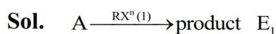

$$\text{Sol. } A \xrightarrow{RX^{n(1)}} \text{product } E_1$$

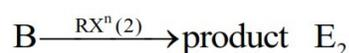

$$B \xrightarrow{RX^{n(2)}} \text{product } E_2$$

Assuming 'A' same for both reaction.

$$\ln k_1 = \ln A - \frac{E_1}{300R}$$

$$\ln k_2 = \ln A - \frac{E_2}{300R}$$

$$\ln \left( \frac{k_2}{k_1} \right) = \frac{E_1 - E_2}{300R} = \frac{20 \times 1000}{300R}$$

$$= 8.032$$

72. The pH and conductance of a weak acid (HX) was found to be 5 and  $4 \times 10^{-5} \text{ S}$ , respectively. The conductance was measured under standard condition using a cell where the electrode plates having a surface area of  $1 \text{ cm}^2$  were at a distance of  $15 \text{ cm}$  apart. The value of the limiting molar conductivity is .....  $\text{S m}^2 \text{ mol}^{-1}$ . (nearest integer)  
(Given: degree of dissociation of the weak acid ( $\alpha \ll 1$ ))

Ans. (6)

$$\text{Sol. } \text{pH} = 5$$

$$[\text{H}^+] = 10^{-5} = [\text{HX}] \cdot \alpha$$

$$= [\text{HX}] \cdot \frac{\Lambda_m}{\Lambda_m^\infty}$$

$$\Lambda_m = \frac{k \times 1000}{[\text{HX}]}$$

$$K = G \cdot G^* = 4 \times 10^{-5} \times \frac{15}{1} = 6 \times 10^{-4} \text{ S.cm}^{-1}$$

$$[\text{H}^+] = 10^{-5} = [\text{HX}] \times \frac{6 \times 10^{-4} \times 1000}{\Lambda_m^\infty \times [\text{HX}]}$$

$$\Lambda_m^\infty = 60000 \text{ S.cm}^2 \text{ mol}^{-1}$$

$$\Lambda_m^\infty = 6 \text{ S.m}^2 \text{ mol}^{-1}$$

73. Use the following data :

| Substance          | $\Delta_f H^\ominus (500K)$ $\text{kJ mol}^{-1}$ | $S^\ominus (500K)$ $\text{JK}^{-1} \text{mol}^{-1}$ |
|--------------------|-----------------------------------------------------|--------------------------------------------------------|
| AB(g)              | 32                                                  | 222                                                    |
| A 2 (g) | 6                                                   | 146                                                    |
| B 2 (g) | X                                                   | 280                                                    |

One mole each of A2(g) and B2(g) are taken in a 1L closed flask and allowed to establish the equilibrium at 500K.

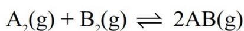

$$\text{A}_2(\text{g}) + \text{B}_2(\text{g}) \rightleftharpoons 2\text{AB}(\text{g})$$

The value of x (in kJ mol-1) is ..... (Nearest integer)

(Given:  $\log K = 2.2$   $R = 8.3 \text{ JK}^{-1} \text{mol}^{-1}$ )

Ans. (70)

Sol.  $\text{A}_2 + \text{B}_2 \xrightarrow{500K} 2\text{AB}$   $\log K = 2.2$

$$\Delta H^\circ = (2 \times 32) - (6 + x) = (58 - x) \text{ kJ}$$

$$\Delta S^\circ = (2 \times 222) - (146 + 280) = 18 \text{ Joule}$$

$$\Delta G^\circ = -RT \ln K$$

$$\Delta G^\circ = -\frac{8.314 \times 500 \times 2.2 \times 2.303}{1000}$$

$$\Delta G^\circ = -21.06$$

$$\Delta H^\circ - T\Delta S^\circ = -21.06$$

$$58 - x - 500 \left( \frac{18}{1000} \right) = -21.06$$

$$x = 70.06 \text{ KJ/mol}$$

74. Consider the following reaction sequence

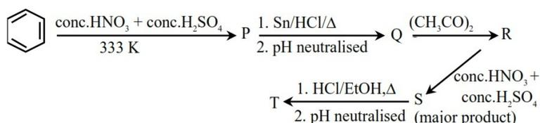

c1ccccc1  $\xrightarrow[333 K]{\text{conc.HNO}_3 + \text{conc.H}_2\text{SO}_4}$  P  $\xrightarrow[2. \text{ pH neutralised}]{1. \text{ Sn/HCl}/\Delta}$  Q  $\xrightarrow{(\text{CH}_3\text{CO})_2}$  R  
 R  $\xrightarrow[\text{conc.HNO}_3 + \text{conc.H}_2\text{SO}_4]{}$  S (major product)  $\xrightarrow[2. \text{ pH neutralised}]{1. \text{ HCl/EtOH}, \Delta}$  T

The percentage of nitrogen in product 'T' formed is .....%. (Nearest integer)

(Given molar mass in g mol-1 H:1, C:12, N:14, O:16)

Ans. (20)

Sol.

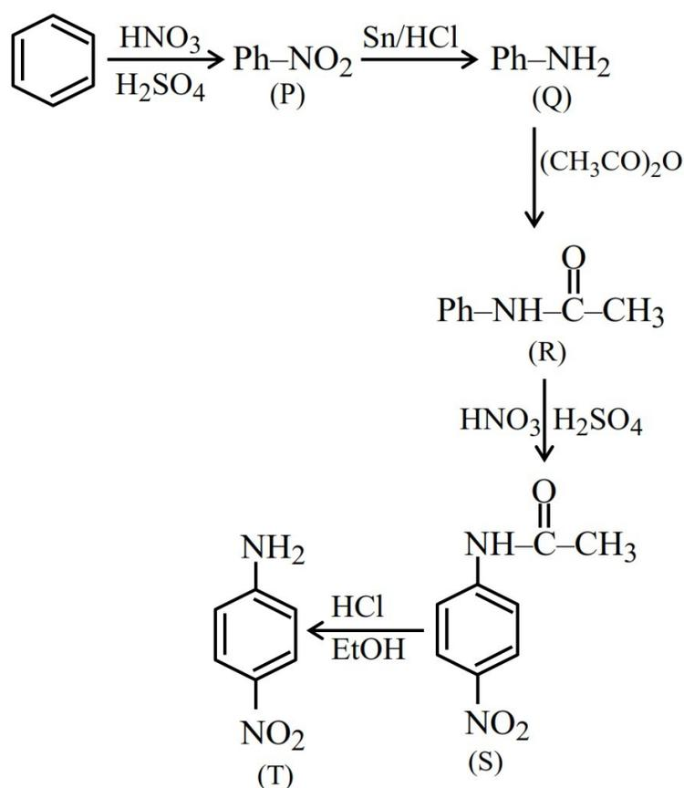

c1ccccc1  $\xrightarrow[\text{H}_2\text{SO}_4]{\text{HNO}_3}$  Ph-NO2 (P)  $\xrightarrow{\text{Sn/HCl}}$  Ph-NH2 (Q)  $\xrightarrow{(\text{CH}_3\text{CO})_2\text{O}}$  Ph-NH-C(=O)-CH3 (R)  
 R  $\xrightarrow[\text{H}_2\text{SO}_4]{\text{HNO}_3}$  H2N-C6H4-NO2 (S)  $\xrightarrow[\text{EtOH}]{\text{HCl}}$  H2N-C6H4-NO2 (T)

$$\text{Mol. wt} = 6 \times 12 + (6 \times 1) + (2 \times 14) + (2 \times 16) = 138$$

$$\% \text{N} = \frac{28}{138} \times 100 = 20.29\%$$

75. Consider the following reactions:

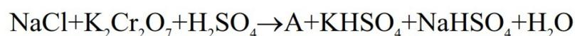

$$\text{NaCl} + \text{K}_2\text{Cr}_2\text{O}_7 + \text{H}_2\text{SO}_4 \rightarrow \text{A} + \text{KHSO}_4 + \text{NaHSO}_4 + \text{H}_2\text{O}$$

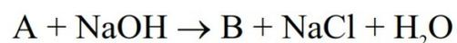

$$\text{A} + \text{NaOH} \rightarrow \text{B} + \text{NaCl} + \text{H}_2\text{O}$$

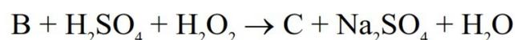

$$\text{B} + \text{H}_2\text{SO}_4 + \text{H}_2\text{O}_2 \rightarrow \text{C} + \text{Na}_2\text{SO}_4 + \text{H}_2\text{O}$$

In the product 'C', 'X' is the number of O22- units, 'Y' is the total number oxygen atoms present and 'Z' is the oxidation state of Cr. The value of X + Y + Z is ..... .

Ans. (13)

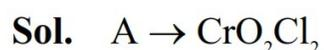

Sol. A  $\rightarrow$  CrO2Cl2

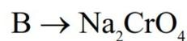

B  $\rightarrow$  Na2CrO4

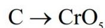

C  $\rightarrow$  CrO5

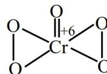

O=[Cr]1(O)OOO1  
 Structure of CrO5 showing a central Cr atom with a +6 oxidation state, bonded to two terminal oxygens and two bridging peroxide groups.

$$X = 2, Y = 5 \text{ and } Z = 6$$