SECTION-A

**1.** Let  $f : R \rightarrow R$  be a function defined by  $f(x) = ||x + 2| - 2|x||$ . If m is the number of points of local minima and n is the number of points of local maxima of f, then m + n is

(1) 5 (2) 3

(3) 2 (4) 4

**Ans. (2)**

**Sol.**  $f(x) = ||x + 2| - 2|x||$

Critical points,  $0, -2, 2, -\frac{2}{3}$

No. of maxima = 1

No. of minima = 2

option (2)

**2.** Each of the angles  $\beta$  and  $\gamma$  that a given line makes with the positive y- and z-axes, respectively, is half of the angle that this line makes with the positive x-axes. Then the sum of all possible values of the angle  $\beta$  is

(1)  $\frac{3\pi}{4}$  (2)  $\pi$

(3)  $\frac{\pi}{2}$  (4)  $\frac{3\pi}{2}$

**Ans. (1)**

**Sol.**  $\beta = \frac{\alpha}{2}, \gamma = \frac{\alpha}{2}$

$\cos^2 \alpha + \cos^2 \beta + \cos^2 \gamma = 1$

$\cos^2 \alpha + 2 \cos^2 \frac{\alpha}{2} = 1$

$\cos^2 \alpha + \cos \alpha = 0$

$\cos \alpha (\cos \alpha + 1) = 0$

$\cos \alpha = 0, -1$

$\alpha = \frac{\pi}{2}, \pi$

Now  $\beta = \frac{\alpha}{2} \Rightarrow \frac{\pi}{4}, \frac{\pi}{2}$

so sum is  $\frac{3\pi}{4}$

**3.** If the four distinct points (4, 6), (-1, 5), (0, 0) and (k, 3k) lie on a circle of radius r, then  $10k + r^2$  is equal to

(1) 32 (2) 33

(3) 34 (4) 35

**Ans. (4)**

**Sol.**

$m_1 m_2 = -1$  so right angle equation circle is

$(x - 4)(x - 0) + (y - 6)(y - 0) = 0$

$x^2 + y^2 - 4x - 6y = 0$

(k, 3k) lies on it so

$k^2 + 9k^2 - 4k - 18k = 0$

$10k^2 - 22k = 0$

$k = 0, \frac{11}{5}$

k = 0 is not possible so  $k = \frac{11}{5}$

also  $r = \sqrt{4 + 9} = \sqrt{13}$

so  $10k + r^2 = 10 \cdot \frac{11}{5} + (\sqrt{13})^2 = 35$

4. Let the Mean and Variance of five observations  $x_1 = 1, x_2 = 3, x_3 = a, x_4 = 7$  and  $x_5 = b, a > b$ , be 5 and 10 respectively. Then the Variance of the observations  $n + x_n, n = 1, 2, \dots, 5$  is

(1) 17 (2) 16.4  
(3) 17.4 (4) 16

Ans. (4)

$$\text{Sol. } \bar{x} = \frac{\sum x_i}{n} = \frac{1+3+a+7+b}{5} = 5$$

$$a + b = 14$$

$$\sigma^2 = \frac{\sum x_i^2}{n} - (\bar{x})^2$$

$$\Rightarrow \frac{1^2 + 3^2 + a^2 + 7^2 + b^2}{5} - 25 = 10$$

$$a^2 + b^2 = 116$$

$$a > b \quad a = 10 \quad b = 4$$

$$n + x_n : 2, 5, 13, 11, 9$$

$$\sigma^2 = \frac{2^2 + 5^2 + 13^2 + 11^2 + 9^2}{5} - \left( \frac{2+5+13+11+9}{5} \right)^2$$

$$= 80 - 64 = 16$$

option 4

5. Consider the lines  $x(3\lambda + 1) + y(7\lambda + 2) = 17\lambda + 5$ ,  $\lambda$  being a parameter, all passing through a point P. One of these lines (say L) is farthest from the origin. If the distance of L from the point (3, 6) is d, then the value of  $d^2$  is

(1) 20 (2) 30  
(3) 10 (4) 15

Ans. (1)

$$\text{Sol. } x(3\lambda + 1) + y(7\lambda + 2) = 17\lambda + 5$$

$$(x + 2y - 5) + \lambda(3x + 7y - 17) = 0$$

intersection of family of lines

$$P(1, 2)$$

$$\text{Let } Q(3, 6)$$

$$d = PQ = \sqrt{2^2 + 4^2} = \sqrt{20}$$

$$d^2 = 20$$

option (1)

6. Let  $A = \{-2, -1, 0, 1, 2, 3\}$ . let R be a relation on A defined by  $xRy$  if and only if  $y = \max\{x, 1\}$ . Let  $l$  be the number of elements in R. Let m and n be the minimum number of elements required to be added in R to make it reflexive and symmetric relations, respectively. Then  $l + m + n$  is equal to

(1) 12 (2) 11  
(3) 13 (4) 14

Ans. (1)

$$\text{Sol. } A = \{-2, -1, 0, 1, 2, 3\}$$

$$R = \{(-2, 1), (-1, 1), (0, 1), (1, 1), (2, 2), (3, 3)\}$$

$$l = 6$$

$$m = 3$$

$$n = 3$$

$$l + m + n = 12$$

7. let the equation  $x(x + 2)(12 - k) = 2$  have equal roots. Then the distance of the point  $\left(k, \frac{k}{2}\right)$  from the line  $3x + 4y + 5 = 0$  is

(1) 15 (2)  $5\sqrt{3}$   
(3)  $15\sqrt{5}$  (4) 12

Ans. (1)

$$\text{Sol. } (x^2 + 2x)(12 - k) = 2$$

$$\lambda x^2 + 2\lambda x - 2 = 0 \quad k \neq 12 \quad \text{Let } 12 - k = \lambda$$

$$D = 0$$

$$4\lambda^2 + 8\lambda = 0$$

$$\lambda = 0 \text{ or } \lambda = -2$$

$$\Rightarrow 12 - k = -2$$

$$k = 14$$

$$\text{So } P\left(k, \frac{k}{2}\right) = (14, 7)$$

$$d = \left| \frac{3 \times 14 + 4 \times 7 + 5}{5} \right| = 15$$

option (1)

8. Line  $L_1$  of slope 2 and line  $L_2$  of slope  $\frac{1}{2}$  intersect at the origin O. In the first quadrant,  $P_1, P_2, \dots, P_{12}$  are 12 points on line  $L_1$  and  $Q_1, Q_2, \dots, Q_9$  are 9 points on line  $L_2$ . Then the total number of triangles, that can be formed having vertices at three of the 22 points O,  $P_1, P_2, \dots, P_{12}, Q_1, Q_2, \dots, Q_9$ , is:
- (1) 1080 (2) 1134  
(3) 1026 (4) 1188

Ans. (2)

Sol. Total number of  $\Delta$  are

$$\begin{aligned} &= {}^9C_1 {}^{12}C_2 + {}^9C_2 {}^{12}C_1 + {}^1C_1 {}^9C_1 {}^{12}C_1 \\ &= 594 + 432 + 108 \\ &= 1134 \end{aligned}$$

9. The integral  $\int_0^\pi \frac{8x dx}{4 \cos^2 x + \sin^2 x}$  is equal to
- (1)  $2\pi^2$  (2)  $4\pi^2$   
(3)  $\pi^2$  (4)  $\frac{3\pi^2}{2}$

Ans. (1)

Sol.  $I = \int_0^\pi \frac{8x dx}{4 \cos^2 x + \sin^2 x}$

$$I = \int_0^\pi \frac{8(\pi - x) dx}{4 \cos^2 x + \sin^2 x}$$

$$2I = 8\pi \int_0^\pi \frac{dx}{4 \cos^2 x + \sin^2 x}$$

$$2I = 8\pi \times 2 \int_0^{\pi/2} \frac{\sec^2 x}{4 + \tan^2 x} dx$$

$$I = 8\pi \int_0^\infty \frac{dt}{4 + t^2} = 8\pi \times \frac{1}{2} \left( \tan^{-1} \frac{t}{2} \right)_0^\infty$$

$$= 4\pi \times \frac{\pi}{2} = 2\pi^2$$

option (1)

10. Let  $f$  be a function such that  $f(x) + 3f\left(\frac{24}{x}\right) = 4x, x \neq 0$ . Then  $f(3) + f(8)$  is equal to
- (1) 11 (2) 10  
(3) 12 (4) 13

Ans. (1)

Sol.  $f(x) + 3f\left(\frac{24}{x}\right) = 4x$

$$\text{Put } x = 3 \quad f(3) + 3f(8) = 12$$

$$\text{Put } x = 8 \quad f(8) + 3f(3) = 32$$

---

$$\text{Add both} \quad 4(f(3) + f(8)) = 44$$

$$f(3) + f(8) = 11$$

11. The area of the region  $\{(x, y) : |x - y| \leq y \leq 4\sqrt{x}\}$  is
- (1) 512 (2)  $\frac{1024}{3}$   
(3)  $\frac{512}{3}$  (4)  $\frac{2048}{3}$

Ans. (2)

Sol.

Graph showing the region bounded by the line y = x/2 and the curve y = 4√x in the first quadrant. The region is shaded and bounded by the y-axis, the line y = x/2, and the curve y = 4√x. The intersection point is labeled (64, 32). The origin is labeled (0, 0). The x-axis has a tick mark at 2.

$$|x - y| \leq y \leq 4\sqrt{x}$$

$$\text{Now } y = |x - y|$$

$$y^2 = (x - y)^2$$

$$\Rightarrow y = \frac{x}{2} \text{ and } x = 0$$

$$\text{Now area} = \int_0^{64} \left( 4\sqrt{x} - \frac{x}{2} \right) dx$$

$$= \left[ \frac{4x^{3/2}}{3/2} - \frac{x^2}{4} \right]_0^{64} = \frac{8}{3} \cdot 8^3 - \frac{64^2}{4} = 64^2 \left( \frac{1}{12} \right)$$

$$= \frac{1024}{3}$$

12. If the domain of the function  $f(x) = \log_7(1 - \log_4(x^2 - 9x + 18))$  is  $(\alpha, \beta) \cup (\gamma, \delta)$ , then  $\alpha + \beta + \gamma + \delta$  is equal to
- (1) 18 (2) 16  
(3) 15 (4) 17

Ans. (1)

Sol. Domain  $1 - \log_4(x^2 - 9x + 18) > 0$

$$\text{Also } x^2 - 9x + 18 > 0$$

$$(x - 3)(x - 6) > 0$$

$$x \in (-\infty, 3) \cup (6, \infty) \quad \dots(1)$$

$$\text{also } x^2 - 9x + 18 < 1$$

$$x^2 - 9x + 17 < 0$$

$$x \in (2, 7) \quad \dots(2)$$

$$(1) \cap (2) \quad (2, 3) \cup (6, 7) = (\alpha, \beta) \cup (\gamma, \delta)$$

$$\Rightarrow \alpha + \beta + \gamma + \delta = 18$$

13. If the probability that the random variable X takes the value x is given by  $P(X = x) = k(x + 1)3^{-x}$ ,  $x = 0, 1, 2, 3, \dots$ , where k is a constant, then  $P(X \geq 3)$  is equal to

$$(1) \frac{7}{27} \quad (2) \frac{4}{9}$$

$$(3) \frac{8}{27} \quad (4) \frac{1}{9}$$

Ans. (4)

$$\text{Sol. } \sum_{x=0}^{\infty} k(x+1)3^{-x} = 1$$

$$\Rightarrow \frac{1}{k} = 1 + \frac{2}{3} + \frac{3}{3^2} + \frac{4}{3^3} + \dots \quad (i)$$

$$\frac{1}{3k} = \frac{1}{3} + \frac{2}{3^2} + \frac{3}{3^3} + \dots \quad \dots(ii)$$

$$(i) - (ii) \Rightarrow \frac{1}{k} - \frac{1}{3k} = 1 + \frac{1}{3} + \frac{1}{3^2} + \dots$$

$$\Rightarrow k = \frac{4}{9}$$

$$P(X \geq 3) = 1 - P(X = 0) - P(X = 1) - P(X = 2)$$

$$= 1 - k \left( 1 + \frac{2}{3} + \frac{3}{9} \right) = \frac{1}{9}$$

14. Let  $y = y(x)$  be the solution of the differential

$$\text{equation } \frac{dy}{dx} + 3(\tan^2 x)y + 3y = \sec^2 x,$$

$$y(0) = \frac{1}{3} + e^3. \text{ Then } y\left(\frac{\pi}{4}\right) \text{ is equal to}$$

$$(1) \frac{2}{3} \quad (2) \frac{4}{3}$$

$$(3) \frac{4}{3} + e^3 \quad (4) \frac{2}{3} + e^3$$

Ans. (2)

$$\text{Sol. } \frac{dy}{dx} + 3(\sec^2 x)y = \sec^2 x, y(0) = \frac{1}{3} + e^3$$

$$\text{If } I = e^{3 \int \sec^2 x dx} = e^{3 \tan x}$$

$\therefore$  Solution is

$$e^{3 \tan x} y = \int e^{3 \tan x} \sec^2 x dx$$

$$e^{3 \tan x} y = \frac{e^{3 \tan x}}{3} + c$$

$$\because y(0) = \frac{1}{3} + e^3 \Rightarrow c = e^3$$

$$\therefore y\left(\frac{\pi}{4}\right) = \frac{\frac{e^3}{3} + e^3}{e^3} = \frac{4}{3}$$

15. If  $z_1, z_2, z_3 \in \mathbb{C}$  are the vertices of an equilateral triangle, whose centroid is  $z_0$ , then  $\sum_{k=1}^3 (z_k - z_0)^2$  is

equal to

$$(1) 0 \quad (2)$$

$$(3) i \quad (4) -i$$

Ans. (1)

$$\text{Sol. } z_1 + z_2 + z_3 = 3z_0$$

$$(z_1 + z_2 + z_3)^2 = 9z_0^2$$

$$\Rightarrow z_1^2 + z_2^2 + z_3^2 + 2(z_1 z_2 + z_2 z_3 + z_3 z_1) = 9z_0^2$$

$$\Rightarrow z_1^2 + z_2^2 + z_3^2 = 3z_0^2$$

$$\sum_{k=1}^3 (z_k - z_0)^2 = (z_1 - z_0)^2 + (z_2 - z_0)^2 + (z_3 - z_0)^2$$

$$= z_1^2 + z_2^2 + z_3^2 + 3z_0^2 - 2(z_1 + z_2 + z_3)z_0$$

$$= 6z_0^2 - 6z_0^2$$

$$= 0$$

16. The number of solutions of equation  $4 - \sqrt{3} \sin x$

$$- 2\sqrt{3} \cos^2 x = -\frac{4}{1+\sqrt{3}}, x \in \left[-2\pi, \frac{5\pi}{2}\right] \text{ is}$$

- (1) 4 (2) 3  
(3) 6 (4) 5

Ans. (4)

$$\text{Sol. } (4 - \sqrt{3}) \sin x - 2\sqrt{3} \cos^2 x = \frac{-4}{1+\sqrt{3}}, x \in \left[-2\pi, \frac{5\pi}{2}\right]$$

$$\Rightarrow (4 - \sqrt{3}) \sin x - 2\sqrt{3} (1 - \sin^2 x) = 2(1 - \sqrt{3})$$

$$\Rightarrow 2\sqrt{3} \sin^2 x + 4 \sin x - \sqrt{3} \sin x - 2 = 0$$

$$\Rightarrow (2 \sin x - 1)(\sqrt{3} \sin x + 2) = 0$$

$$\Rightarrow \sin x = \frac{1}{2}$$

$\therefore$  Number of solution = 5

17. Let C be the circle of minimum area enclosing the ellipse  $E : \frac{x^2}{a^2} + \frac{y^2}{b^2} = 1$  with eccentricity  $\frac{1}{2}$  and foci  $(\pm 2, 0)$ . Let PQR be a variable triangle, whose vertex P is on the circle C and the side QR of length 29 is parallel to the major axis of E and contains the point of intersection of E with the negative y-axis. Then the maximum area of the triangle PQR is :

- (1)  $6(3 + \sqrt{2})$  (2)  $8(3 + \sqrt{2})$   
(3)  $6(2 + \sqrt{3})$  (4)  $8(2 + \sqrt{3})$

Ans. (4)

Sol.

Diagram showing an ellipse E centered at the origin (0,0) with vertices at (-a,0) and (a,0) on the x-axis, and (0,b) on the y-axis. A circle C is tangent to the ellipse at (0,b) and passes through (-a,0) and (a,0). A triangle PQR is inscribed in the circle, with vertex P on the circle, and side QR parallel to the x-axis. The side QR contains the point (0,b).

Area of  $\triangle PQR$

$$= \frac{1}{2}(2a)(a \sin \theta + b)$$

$\therefore$  maximum area =  $a(a + b)$

$$= 4(4 + 2\sqrt{3}) = 8(2 + \sqrt{3})$$

18. The shortest distance between the curves  $y^2 = 8x$  and  $x^2 + y^2 + 12y + 35 = 0$  is :

- (1)  $2\sqrt{3} - 1$  (2)  $\sqrt{2}$   
(3)  $3\sqrt{2} - 1$  (4)  $2\sqrt{2} - 1$

Ans. (4)

Sol.

Diagram showing a parabola y^2 = 8x opening to the right and a circle x^2 + y^2 + 12y + 35 = 0 centered at (0, -6) with radius 1. A normal line is drawn from the parabola to the circle, passing through the center of the circle. The point of tangency on the parabola is labeled P, and the point of tangency on the circle is labeled Q.

Equation of normal to parabola

$$y^2 = 8x \text{ is } y = mx - 4m - 2m^3$$

passes through  $(0, -6)$  we get

$$-6 = -4m - 2m^3$$

$$\Rightarrow m^3 + 2m - 3 = 0$$

$$\Rightarrow (m - 1)(m^2 + m + 3) = 0 \Rightarrow m = 1$$

$$P = (am^2, -2am) = (2, -4)$$

$\therefore$  Shortest distance =  $PC - r$

$$= (2\sqrt{2} - 1)$$

19. The distance of the point  $(7, 10, 11)$  from the line

$$\frac{x-4}{1} = \frac{y-4}{0} = \frac{z-2}{3} \text{ along the line}$$

$$\frac{x-9}{2} = \frac{y-13}{3} = \frac{z-17}{6} \text{ is}$$

- (1) 18 (2) 14  
(3) 12 (4) 16

Ans. (2)

Sol.

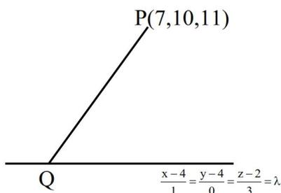

A diagram showing a line segment PQ. Point P is at (7, 10, 11) and point Q is at (3, 4, -1). The line segment is parallel to a line with direction ratios (x-4)/1 = (y-4)/0 = (z-2)/3 = lambda.

$$(\lambda + 4, 4, 3\lambda + 2)$$

$$\therefore \text{ line PQ is parallel to line } \frac{x-4}{1} = \frac{y-4}{0} = \frac{z-2}{3} = \lambda$$

$$\therefore \frac{\lambda-3}{2} = \frac{-6}{3} = \frac{3\lambda-9}{6} \Rightarrow \lambda = -1$$

$$Q = (3, 4, -1)$$

$$\therefore PQ = \sqrt{16 + 36 + 144} = 14$$

20. The sum  $1 + \frac{1+3}{2!} + \frac{1+3+5}{3!} + \frac{1+3+5+7}{4!} + \dots$  upto  $\infty$  terms, is equal to

- (1)  $6e$  (2)  $4e$   
(3)  $3e$  (4)  $2e$

Ans. (4)

$$\text{Sol. } S = 1 + \frac{1+3}{2!} + \frac{1+3+5}{3!} + \dots$$

$$= \sum_{r=1}^{\infty} \frac{r^2}{r!}$$

$$= \sum_{r=1}^{\infty} \frac{(r-1+1)}{(r-1)!} = \sum_{r=2}^{\infty} \frac{1}{(r-2)!} + \sum_{r=1}^{\infty} \frac{1}{(r-1)!}$$

$$= 2e$$

# SECTION-B

21. Let  $I$  be the identity matrix of order  $3 \times 3$  and for

$$\text{the matrix } A = \begin{bmatrix} \lambda & 2 & 3 \\ 4 & 5 & 6 \\ 7 & -1 & 2 \end{bmatrix}, |A| = -1. \text{ Let } B \text{ be the}$$

inverse of the matrix  $\text{adj}(A \cdot \text{adj}(A^2))$ . Then  $|(\lambda B + I)|$  is equal to \_\_\_\_\_

Ans. (38)

$$\text{Sol. } |A| = \begin{vmatrix} \lambda & 2 & 3 \\ 4 & 5 & 6 \\ 7 & -1 & 2 \end{vmatrix} = -1$$

$$\lambda(16) - 2(-34) + 3(-39) = -1$$

$$16\lambda = 48 \Rightarrow \lambda = 3$$

$$B^{-1} = \text{adj}(A \cdot \text{adj}(A^2))$$

$$\text{Let } C = A \cdot \text{adj}(A^2)$$

$$AC = A^2 \cdot \text{adj}(A^2) = |A|^2 \cdot I = I \Rightarrow C = A^{-1}$$

$$\text{Now } B^{-1} = \text{adj}(A^{-1}) = B = \text{adj}(A)$$

$$\text{Now } \lambda B + I \Rightarrow 3B + I$$

$$\text{Let } P = 3B + I$$

$$P = 3 \cdot \text{adj}(A) + I$$

$$AP = 3A \cdot \text{adj}(A) + A$$

$$AP = 3|A| \cdot I + A$$

$$AP = A - 3I$$

$$|AP| = |A - 3I|$$

$$|A| \cdot |P| = \begin{vmatrix} 0 & 2 & 3 \\ 4 & 2 & 6 \\ 7 & -1 & -1 \end{vmatrix} = 38$$

$$|P| = -38$$

22. Let  $(1+x+x^2)^{10} = a_0 + a_1x + a_2x^2 + \dots + a_{20}x^{20}$ . If  $(a_1 + a_3 + a_5 + \dots + a_{19}) - 11a_2 = 121k$ , then  $k$  is equal to \_\_\_\_\_.

Ans. (239)

$$\text{Sol. } (1+x+x^2)^{10} = a_0 + a_1x + a_2x^2 + \dots + a_{20}x^{20}$$

$$\therefore 3^{10} = a_0 + a_1 + a_2 + \dots + a_{20} \dots (i)$$

$$1 = a_0 - a_1 + a_2 - \dots + a_{20} \dots (ii)$$

$$(i) - (ii) \Rightarrow a_1 + a_3 + \dots + a_{19} = \frac{3^{10} - 1}{2} = 29524$$

$$\text{Also } \{1+x(1+x)\}^{10} = 1$$

$$+ {}^{10}C_1x(1+x) + {}^{10}C_2x^2(1+x)^2 + \dots$$

$$\therefore a_2 = {}^{10}C_1 + {}^{10}C_2 = 55$$

$$\therefore \frac{(a_1 + a_3 + \dots + a_{19}) - 11a_2}{121} = 239$$

23. If  $L \lim_{x \rightarrow 0} \left( \frac{\tan x}{x} \right)^{\frac{1}{x^2}} = p$ , then  $96 \log_e p$  is equal to \_\_\_\_\_

Ans. (32)

$$\text{Sol. } P = \lim_{x \rightarrow 0} \left( \frac{\tan x}{x} \right)^{\frac{1}{x^2}}$$

$$\Rightarrow P = e^{\lim_{x \rightarrow 0} \left( \frac{\tan x - x}{x^3} \right)}$$

$$= e^{\lim_{x \rightarrow 0} \frac{\left( x + \frac{x^3}{3} + \frac{2x^5}{15} + \dots - x \right)}{x^3}}$$

$$= e^{1/3}$$

$$\therefore 96 \log_e P = 96 \times \frac{1}{3} = 32$$

24. Let  $\vec{a} = \hat{i} + 2\hat{j} + \hat{k}$ ,  $\vec{b} = 3\hat{i} - 3\hat{j} + 3\hat{k}$ ,  $\vec{c} = 2\hat{i} - \hat{j} + 2\hat{k}$  and  $\vec{d}$  be a vector such that  $\vec{b} \times \vec{d} = \vec{c} \times \vec{d}$  and  $\vec{a} \cdot \vec{d} = 4$ . Then  $|(\vec{a} \times \vec{d})|^2$  is equal to \_\_\_\_\_.

Ans. (128)

$$\text{Sol. } \vec{b} \times \vec{d} = \vec{c} \times \vec{d} \text{ and } \vec{a} \cdot \vec{d} = 4$$

$$\Rightarrow \vec{d} = \lambda(\vec{b} - \vec{c}) = \lambda(\hat{i} - 2\hat{j} + \hat{k})$$

$$\because \vec{a} \cdot \vec{d} = 4 \Rightarrow \lambda = -2$$

$$\text{Also, } |\vec{a} \times \vec{d}|^2 + |\vec{a} \cdot \vec{d}|^2 = |\vec{a}|^2 |\vec{d}|^2$$

$$\Rightarrow |\vec{a} \times \vec{d}|^2 = 6 \times 4 \times 6 - 16 = 128$$

25. If the equation of the hyperbola with foci  $(4, 2)$  and  $(8, 2)$  is  $3x^2 - y^2 - \alpha x + \beta y + \gamma = 0$ , then  $\alpha + \beta + \gamma$  is equal to \_\_\_\_\_.

Ans. (141)

Sol.

A diagram of a hyperbola opening horizontally. The center is labeled C(6,2). The vertices are labeled S'(4,2) and S(8,2). A point Q is marked on the lower branch of the hyperbola. The coordinate axes are shown, with the x-axis passing through the center and vertices.

Equation of hyperbola is

$$\frac{(x-6)^2}{a^2} - \frac{(y-2)^2}{4-a^2} = 1$$

$$\Rightarrow (4-a^2)(x-6)^2 - a^2(y-2)^2 = a^2(4-a^2)$$

comparing with  $3x^2 - y^2 - \alpha x + \beta y + \gamma = 0$ , we get

$$a^2 = 1 \text{ and } \alpha = 36, \beta = 4 \text{ and } \gamma = 101$$

$$\therefore \alpha + \beta + \gamma = 141$$

**26.** A magnetic dipole experiences a torque of  $80\sqrt{3}$  N m when placed in uniform magnetic field in such a way that dipole moment makes angle of  $60^\circ$  with magnetic field. The potential energy of the dipole is :

(1) 80 J

(2)  $-40\sqrt{3}$  J

(3)  $-60$  J

(4)  $-80$  J

**Ans. (4)**

**Sol.**  $\tau = M \times B = MB \sin 60 = \frac{\sqrt{3}}{2} MB = 80\sqrt{3}$

$MB = 160$

$U = -M \cdot B = -MB \cos 60$

$U = -160 \times 1/2 = -80$  J

**27.** In the resonance experiment, two air columns (closed at one end) of 100 cm and 120 cm long, give 15 beats per second when each one is sounding in the respective fundamental modes. The velocity of sound in the air column is :

(1) 335 m/s

(2) 370 m/s

(3) 340 m/s

(4) 360 m/s

**Ans. (4)**

**Sol.** Fundamental frequency in close/organ pipe

$f = \frac{v}{4l}$

$f_1 = \frac{v}{4l_1}$  &  $f_2 = \frac{v}{4l_2}$

$\text{Beat} = (f_1 - f_2) = \frac{v}{4} \left( \frac{1}{l_1} - \frac{1}{l_2} \right)$

$15 = \frac{v}{4} \left( \frac{1}{1.2} - \frac{1}{1} \right)$

$v = \left( \frac{15 \times 4 \times 1.2}{0.2} \right) = 60 \times 6 = 360$  m/s

**28.** Two cylindrical vessels of equal cross sectional area of  $2\text{m}^2$  contain water upto height 10m and 6m, respectively. If the vessels are connected at their bottom then the work done by the force of gravity is : (Density of water is  $10^3$  kg/ $\text{m}^3$  and  $g = 10$  m/ $\text{s}^2$ )

(1)  $1 \times 10^5$  J

(2)  $4 \times 10^4$  J

(3)  $6 \times 10^4$  J

(4)  $8 \times 10^4$  J

**Ans. (4)**

**Sol.**

$U_i = (\rho A \times 10)g \times 5 + (\rho A 6)g \times 3$

$U_i = \rho A g (50 + 18)$

$U_i = 68 \rho A g$

$U_f = (\rho A \times 16)g \times 4$

$= (\rho A g) \times 64$

$\omega = \Delta U = 4 \times \rho A g$

$= 4 \times 1000 \times 2 \times 10 = 8 \times 10^4$  J

**29.** Width of one of the two slits in a Young's double slit interference experiment is half of the other slit. The ratio of the maximum to the minimum intensity in the interference pattern is :

(1)  $(2\sqrt{2} + 1) : (2\sqrt{2} - 1)$  (2)  $(3 + 2\sqrt{2}) : (3 - 2\sqrt{2})$

(3) 9 : 1

(4) 3 : 1

**Ans. (2)**

**Sol.**  $I \propto \text{width}$

$I_{\max} = (\sqrt{I_1} + \sqrt{I_2})^2$

$\therefore I_1 = I_0, I_2 = 2I_0$

$I_{\min} = (\sqrt{I_1} - \sqrt{I_2})^2$

$\frac{I_{\max}}{I_{\min}} = \frac{(\sqrt{2} + 1)^2}{(\sqrt{2} - 1)^2} \Rightarrow \frac{3 + 2\sqrt{2}}{3 - 2\sqrt{2}}$

30. An ideal gas exists in a state with pressure  $P_0$ , volume  $V_0$ . It is isothermally expanded to 4 times of its initial volume ( $V_0$ ), then isobarically compressed to its original volume. Finally the system is heated isochorically to bring it to its initial state. The amount of heat exchanged in this process is :

- (1)  $P_0 V_0 (2 \ln 2 - 0.75)$  (2)  $P_0 V_0 (\ln 2 - 0.75)$   
 (3)  $P_0 V_0 (\ln 2 - 0.25)$  (4)  $P_0 V_0 (2 \ln 2 - 0.25)$

Ans. (1)

Sol.

A P-V diagram showing a cyclic process. The vertical axis is Pressure (P) and the horizontal axis is Volume (V). The cycle consists of three states: State 1 at (V0, P0), State 2 at (4V0, P0/4), and State 3 at (V0, P0/4). Process ω1 is an isothermal expansion from State 1 to State 2. Process ω2 is an isobaric compression from State 2 to State 3. Process ω3 is an isochoric heating from State 3 to State 1.

$$\omega_1 = P_0 V_0 \ln 4$$

$$\omega_2 = \frac{P_0}{4} (-3V_0) = -\frac{3P_0 V_0}{4}$$

$$\omega_3 = 0$$

$$Q_T = \Delta U_{\text{cyclic}} + \omega$$

$$Q_T = \omega \quad (\Delta U_{\text{cyclic}} = 0)$$

$$Q_T = P_0 V_0 \left( \ln 4 - \frac{3}{4} \right)$$

$$= P_0 V_0 (2 \ln 2 - 0.75)$$

31. Two monochromatic light beams have intensities in the ratio 1:9. An interference pattern is obtained by these beams. The ratio of the intensities of maximum to minimum is

- (1) 8 : 1 (2) 9 : 1  
 (3) 3 : 1 (4) 4 : 1

Ans. (4)

$$\text{Sol. } \frac{I_{\max}}{I_{\min}} = \frac{(\sqrt{I_1} + \sqrt{I_2})^2}{(\sqrt{I_1} - \sqrt{I_2})^2} \Rightarrow \frac{(4)^2}{(2)^2} \Rightarrow \frac{16}{4} = 4$$

32. Given below are two statements : one is labelled as **Assertion A** and the other is labelled as **Reason R**.

**Assertion A :** The Bohr model is applicable to hydrogen and hydrogen-like atoms only.

**Reason R :** The formulation of Bohr model does not include repulsive force between electrons.

In the light of the above statements, choose the **correct** answer from the options given below :

- (1) Both **A** and **R** are true but **R** is **NOT** the correct explanation of **A**.  
 (2) **A** is false but **R** is true.  
 (3) Both **A** and **R** are true and **R** is the correct explanation of **A**.  
 (4) **A** is true but **R** is false.

Ans. (3)

Sol. Conceptual

33. Using a battery, a  $100 \text{ pF}$  capacitor is charged to  $60 \text{ V}$  and then the battery is removed. After that, a second uncharged capacitor is connected to the first capacitor in parallel. If the final voltage across the second capacitor is  $20 \text{ V}$ , its capacitance is : (in pF)

- (1) 600 (2) 200  
 (3) 400 (4) 100

Ans. (2)

Sol.

A circuit diagram showing two capacitors, C0 and C, connected in parallel. C0 is initially charged with charge +C0V0 on its top plate and -C0V0 on its bottom plate. C is initially uncharged. A switch is shown in the left branch of the parallel combination. The battery is not shown in this part of the diagram, as it has been removed.

$$\text{New potential} = \frac{C_0 V_0}{C_0 + C} = \frac{V_0}{3}$$

$$3C_0 V_0 = C_0 V_0 + C V_0$$

$$2C_0 V_0 = C V_0$$

$$C \Rightarrow 2C_0$$

34. A monochromatic light of frequency  $5 \times 10^{14}$  Hz travelling through air, is incident on a medium of refractive index '2'. Wavelength of the refracted light will be :
- (1) 300 nm                      (2) 600 nm  
(3) 400 nm                      (4) 500 nm

Ans. (1)

Sol.  $f\lambda = v \quad \lambda_{\text{medium}} = \frac{\lambda_{\text{vacuum}}}{\mu}$

$$\lambda_{\text{medium}} \Rightarrow \frac{3 \times 10^8}{2 \times 5 \times 10^{14}} \Rightarrow 0.3 \times 10^{-6} \Rightarrow 300 \text{ nm}$$

35.

Diagram showing two blocks, A and B, on a frictionless surface. Block A has mass m1 = 10 kg and is moving towards block B with a constant speed v. Block B has mass m2 = 5 kg and is initially at rest. A spring with spring constant k = 3000 N/m is attached to block B. The blocks are on a horizontal surface with hatching below it.

Consider two blocks A and B of masses  $m_1 = 10 \text{ kg}$  and  $m_2 = 5 \text{ kg}$  that are placed on a frictionless table. The block A moves with a constant speed  $v = 3 \text{ m/s}$  towards the block B kept at rest. A spring with spring constant  $k = 3000 \text{ N/m}$  is attached with the block B as shown in the figure. After the collision, suppose that the blocks A and B, along with the spring in constant compression state, move together, then the compression in the spring is, (Neglect the mass of the spring)

- (1) 0.2 m                      (2) 0.4 m  
(3) 0.1 m                      (4) 0.3 m

Ans. (3)

Sol.  $m_1 v_1 + m_2 v_2 = (m_1 + m_2) v_{\text{cm}}$

$$v_{\text{cm}} \Rightarrow \frac{10 \times 3}{10 + 5} \Rightarrow \frac{30}{15} = 2 \text{ m/s}$$

$$\frac{1}{2} k x^2 = \frac{1}{2} (10) (3)^2 - \left[ \frac{1}{2} (15) (2)^2 \right]$$

$$\Rightarrow 90 - 60 = 30 = 3000 x^2$$

$$x^2 \Rightarrow \frac{30}{3000} = \frac{1}{100}$$

$$x \Rightarrow \frac{1}{10} \text{ m.}$$

36. A particle is projected with velocity  $u$  so that its horizontal range is three times the maximum height attained by it. The horizontal range of the projectile is given as  $\frac{nu^2}{25g}$ , where value of  $n$  is :

(Given 'g' is the acceleration due to gravity).

- (1) 6                                      (2) 18  
(3) 12                                    (4) 24

Ans. (4)

Sol. Range =  $3H_{\text{max}}$

$$\frac{u^2 \sin 2\theta}{g} = \frac{3u^2 \sin^2 \theta}{2g}$$

$$2 \sin \theta \cos \theta = \frac{3}{2} \sin^2 \theta$$

$$\tan \theta = \frac{4}{3} \Rightarrow \theta = 53^\circ$$

$$R = \frac{u^2 \left( 2 \times \frac{3}{5} \times \frac{4}{5} \right)}{g} \Rightarrow \frac{24u^2}{25g}$$

37. A solid steel ball of diameter 3.6 mm acquired terminal velocity  $2.45 \times 10^{-2} \text{ m/s}$  while falling under gravity through an oil of density  $925 \text{ kg m}^{-3}$ . Take density of steel as  $7825 \text{ kg m}^{-3}$  and  $g$  as  $9.8 \text{ m/s}^2$ . The viscosity of the oil in SI unit is

- (1) 2.18                                    (2) 2.38  
(3) 1.68                                    (4) 1.99

Ans. (4)

Sol.  $v_T \Rightarrow \frac{2 (\rho_0 - \rho_f) r^2 g}{9 \eta}$

$$\eta = \frac{2}{9} \left( \frac{7825 - 925}{2.45 \times 10^{-2}} \right) \times (1.8)^2 \times 10^{-6} \times 9.8$$

$$\eta \approx 1.99$$

38. The truth table corresponding to the circuit given below is

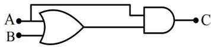

Logic circuit diagram showing an OR gate with inputs A and B, and an AND gate with one input connected to the output of the OR gate and the other input connected to A. The output of the AND gate is C.

| A | B | C |
|---|---|---|
| 0 | 0 | 0 |
| 1 | 0 | 0 |
| 0 | 1 | 0 |
| 1 | 1 | 1 |

(1)

| A | B | C |
|---|---|---|
| 0 | 0 | 0 |
| 0 | 1 | 0 |
| 1 | 0 | 1 |
| 1 | 1 | 1 |

(2)

| A | B | C |
|---|---|---|
| 0 | 0 | 1 |
| 1 | 0 | 0 |
| 0 | 1 | 0 |
| 1 | 1 | 0 |

(3)

| A | B | C |
|---|---|---|
| 0 | 0 | 1 |
| 0 | 1 | 0 |
| 1 | 0 | 0 |
| 1 | 1 | 0 |

(4)

Ans. (2)

Sol.

Logic circuit diagram showing an OR gate with inputs A and B, and an AND gate with one input connected to the output of the OR gate and the other input connected to A. The output of the AND gate is C. The expression C = A · (A + B) is written next to the diagram.

| A | B | A + B | C |
|---|---|-------|---|
| 0 | 0 | 0     | 0 |
| 1 | 0 | 1     | 1 |
| 0 | 1 | 1     | 0 |
| 1 | 1 | 1     | 1 |

39. A particle moves along the x-axis and has its displacement x varying with time t according to the equation

$$x = c_0(t^2 - 2) + c(t - 2)^2$$

where  $c_0$  and  $c$  are constants of appropriate dimensions. Then, which of the following statements is correct?

- (1) the acceleration of the particle is  $2c_0$
- (2) the acceleration of the particle is  $2c$
- (3) the initial velocity of the particle is  $4c$
- (4) the acceleration of the particle is  $2(c + c_0)$

Ans. (4)

$$\text{Sol. } v = \frac{dx}{dt} = 2tC_0 + 2C(t - 2)$$

$$a = \frac{dv}{dt} = 2C_0 + 2C$$

40. An electric bulb rated as 100 W-220 V is connected to an ac source of rms voltage 220 V. The peak value of current through the bulb is :

- (1) 0.64 A
- (2) 0.45 A
- (3) 2.2 A
- (4) 0.32 A

Ans. (1)

$$\text{Sol. } P = v_{\text{rms}} i_{\text{rms}}$$

$$i_{\text{rms}} = \frac{100}{220}$$

$$i_0 = \sqrt{2} i_{\text{rms}} = 0.64 \text{ A}$$

41. Match the LIST-I with LIST-II

| LIST-I |                          | LIST-II |                    |
|--------|--------------------------|---------|--------------------|
| A.     | Boltzmann constant       | I.      | $ML^2T^{-1}$       |
| B.     | Coefficient of viscosity | II.     | $MLT^{-1}K^{-1}$   |
| C.     | Planck's constant        | III.    | $ML^2T^{-2}K^{-1}$ |
| D.     | Thermal conductivity     | IV.     | $ML^{-1}T^{-1}$    |

Choose the *correct* answer from the options given below :

- (1) A-III, B-IV, C-I, D-II
- (2) A-II, B-III, C-IV, D-I
- (3) A-III, B-II, C-I, D-IV
- (4) A-III, B-IV, C-II, D-I

Ans. (1)

$$\text{Sol. (A) } [k] = \frac{PV}{NT} = \frac{ML^2T^{-2}}{K} = ML^2T^{-2}K^{-1}$$

$$\text{(B) } [\eta] = \frac{F}{6\pi r v} = \frac{MLT^{-2}}{L^2T^{-1}} = ML^{-1}T^{-1}$$

$$\text{(C) } [h] = \frac{E}{f} = \frac{ML^2T^{-2}}{T^{-1}} = ML^2T^{-1}$$

$$\text{(D) } \frac{dQ}{dt} = k \frac{AdT}{dx}$$

$$k = \frac{(ML^2T^{-3})L}{L^2K} = MLT^{-3}K^{-1}$$

42. Pressure of an ideal gas, contained in a closed vessel, is increased by 0.4% when heated by  $1^{\circ}\text{C}$ . Its initial temperature must be :
- (1)  $25^{\circ}\text{C}$  (2)  $2500\text{ K}$   
(3)  $250\text{ K}$  (4)  $250^{\circ}\text{C}$

Ans. (3)

Sol. Isochoric process

$$P \propto T$$

$$\frac{\Delta P}{P} = \frac{\Delta T}{T}$$

$$\frac{0.4}{100} = \frac{1}{T}$$

$$T = 250\text{ K}$$

43. A motor operating on  $100\text{ V}$  draws a current of  $1\text{ A}$ . If the efficiency of the motor is  $91.6\%$ , then the loss of power in units of cal/s is
- (1) 4 (2) 8.4  
(3) 2 (4) 6.2

Ans. (3)

$$\text{Sol. } P_{\text{input}} = Vi = 100\text{ W}$$

$$\eta = \frac{P_{\text{out}}}{P_{\text{input}}} = 0.916$$

$$P_{\text{out}} = 91.6\text{ W}$$

$$\text{Loss} = 100 - 91.6 = 8.4\text{ J/s} = 2\text{ cal/s}$$

44. A block of mass  $1\text{ kg}$ , moving along  $x$  with speed  $v_i = 10\text{ m/s}$  enters a rough region ranging from  $x = 0.1\text{ m}$  to  $x = 1.9\text{ m}$ . The retarding force acting on the block in this range is  $F_r = -kx\text{ N}$ , with  $k = 10\text{ N/m}$ . Then the final speed of the block as it crosses rough region is
- (1)  $10\text{ m/s}$  (2)  $4\text{ m/s}$   
(3)  $6\text{ m/s}$  (4)  $8\text{ m/s}$

Ans. (4)

$$\text{Sol. } a = \frac{F}{m} = -10x$$

$$v \frac{dv}{dx} = -10x$$

$$\int_{10}^v v dv = -10 \int_{0.1}^{1.9} x dx$$

$$\frac{v^2 - 100}{2} = -10 \left( \frac{1.9^2 - 0.1}{2} \right)^2$$

$$v = 8\text{ m/s}$$

45. Given below are two statements : one is labelled as **Assertion A** and the other is labelled as **Reason R**.  
**Assertion A** : If oxygen ion ( $\text{O}^{2-}$ ) and Hydrogen ion ( $\text{H}^+$ ) enter normal to the magnetic field with equal momentum, then the path of  $\text{O}^{2-}$  ion has a smaller curvature than that of  $\text{H}^+$ .

**Reason R** : A proton with same linear momentum as an electron will form a path of smaller radius of curvature on entering a uniform magnetic field perpendicularly.

In the light of the above statement, choose the **correct** answer from the options given below

- (1) A is true but R is false  
(2) Both A and R are true but R is **NOT** the correct explanation of A  
(3) A is false but R is true  
(4) Both A and R are true and R is the correct explanation of A

Ans. (1)

$$\text{Sol. } r = \frac{mv}{qB} = \frac{p}{qB}$$

$$r \propto \frac{1}{q}$$

Assertion is true reason is false

# SECTION-B

46. Light from a point source in air falls on a spherical glass surface (refractive index,  $\mu = 1.5$  and radius of curvature =  $50\text{ cm}$ ). The image is formed at a distance of  $200\text{ cm}$  from the glass surface inside the glass. The magnitude of distance of the light source from the glass surface is \_\_\_\_\_ m.

Ans. (4)

Sol.

Diagram showing a point source S in air at a distance x from a spherical glass surface. The surface has a refractive index mu = 1.5 and a radius of curvature R = 50 cm. The image is formed at a distance of 200 cm inside the glass. The diagram shows the optical axis, the point source S, the point P on the surface, and the center of curvature of the glass surface.

$$\frac{\mu_2}{v} - \frac{\mu_1}{u} = \frac{\mu_2 - \mu_1}{R}$$

$$\frac{1.5}{200} - \frac{1}{-x} = \frac{1.5 - 1}{50}$$

$$\frac{1}{x} = \frac{1}{100} - \frac{3}{400}$$

$$x = 400\text{ cm}$$

$$x = 4\text{ m}$$

47. The excess pressure inside a soap bubble A in air is half the excess pressure inside another soap bubble B in air. If the volume of the bubble A is  $n$  times the volume of the bubble B, then, the value of  $n$  is \_\_\_\_\_.

Ans. (8)

$$\text{Sol. } \Delta P = \frac{4T}{R}$$

$$\frac{R_A}{R_B} = \frac{\Delta P_B}{\Delta P_A} = 2$$

$$\frac{V_A}{V_B} = \left( \frac{R_A}{R_B} \right)^3 = 8$$

48. Two cells of emf 1V and 2V and internal resistance  $2\ \Omega$  and  $1\ \Omega$ , respectively, are connected in series with an external resistance of  $6\ \Omega$ . The total current in the circuit is  $I_1$ . Now the same two cells in parallel configuration are connected to same external resistance. In this case, the total current drawn is  $I_2$ . The value of  $\left( \frac{I_1}{I_2} \right)$  is  $\frac{x}{3}$ . The value of  $x$  is \_\_\_\_\_.

Ans. (4)

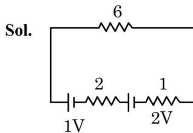

Sol.

Circuit diagram for series connection. A 1V cell with 2 ohm internal resistance and a 2V cell with 1 ohm internal resistance are connected in series with a 6 ohm external resistor. The current I1 flows through the circuit.

$$\varepsilon_{eq} = 3$$

$$R_{eq} = 9$$

$$i_1 = \frac{3}{9} = \frac{1}{3}$$

Circuit diagram for parallel connection. The 1V cell with 2 ohm internal resistance and the 2V cell with 1 ohm internal resistance are connected in parallel. This parallel combination is connected to a 6 ohm external resistor. The current I2 flows through the circuit.

$$\varepsilon_{eq} = \frac{\frac{\varepsilon_1}{r_1} + \frac{\varepsilon_2}{r_2}}{\frac{1}{r_1} + \frac{1}{r_2}}$$

$$\varepsilon_{eq} = \frac{\frac{1}{2} + \frac{2}{1}}{\frac{1}{2} + \frac{1}{1}} = \frac{5}{3}$$

$$r_{equ} = \frac{2 \times 1}{3} + 6 = \frac{20}{3}$$

$$i_2 = \frac{1}{4} \Rightarrow \frac{i_1}{i_2} = \frac{4}{3}$$

49. An electron in the hydrogen atom initially in the fourth excited state makes a transition to  $n^{\text{th}}$  energy state by emitting a photon of energy 2.86 eV. The integer value of  $n$  will be \_\_\_\_\_.

Ans. (2)

$$\text{Sol. } E = 13.6 \left( \frac{1}{n_1^2} - \frac{1}{n_2^2} \right)$$

$$2.86 = 13.6 \left( \frac{1}{n^2} - \frac{1}{5^2} \right)$$

$$\frac{1}{n^2} = 0.21 + \frac{1}{2.5}$$

$$n^2 = 4$$

$$n = 2$$

Ans. (2)

50. A physical quantity C is related to four other quantities p, q, r and s as follows

$$C = \frac{pq^2}{r^3 \sqrt{s}}$$

The percentage errors in the measurement of p, q, r and s are 1%, 2%, 3% and 2% respectively.

The percentage error in the measurement of C will be \_\_\_\_\_%.

Ans. (15)

$$\text{Sol. } C = P^1 q^2 r^{-3} s^{1/2}$$

$$\left( \frac{dC}{C} \right)_{\max} = \frac{dP}{P} + \frac{2dq}{q} + \frac{3dr}{r} + \frac{1}{2} \frac{ds}{s}$$

$$= (1 + 2 \times 2 + 3 \times 3 + \frac{1}{2} \times 2)\%$$

$$= 15\%$$

Ans. 15

# **SECTION-A**

51. 40 mL of a mixture of  $\text{CH}_3\text{COOH}$  and  $\text{HCl}$  (aqueous solution) is titrated against 0.1 M  $\text{NaOH}$  solution conductometrically. Which of the following statement is **correct**?

A conductometric titration graph showing Conductance (mS) on the y-axis versus V\_NaOH/mL on the x-axis. The curve starts at point A, decreases linearly to point B at 2.0 mL, then increases slightly to point C at 5.0 mL, and finally increases sharply to point D. The x-axis has markings at 2.0 and 5.0.

- (1) The concentration of  $\text{CH}_3\text{COOH}$  in the original mixture is 0.005 M
- (2) The concentration of  $\text{HCl}$  in the original mixture is 0.005 M
- (3)  $\text{CH}_3\text{COOH}$  is neutralised first followed by neutralisation of  $\text{HCl}$
- (4) Point 'C' indicates the complete neutralisation  $\text{HCl}$

**Ans. (2)**

**Sol.** From the given graph 2 ml  $\text{NaOH}$  solution is used for neutralisation of  $\text{HCl}$  and 3 ml  $\text{NaOH}$  solution is used for neutralisation of  $\text{CH}_3\text{COOH}$ .

$$\therefore \text{ Mole of HCl} = \text{ Mole of NaOH used}$$

$$M \times 40 = 0.1 \times 2$$

$$M = 0.005$$

$$\therefore \text{ Mole of CH}_3\text{COOH} = \text{ Mole of NaOH used}$$

$$M \times 40 = 0.1 \times 3$$

$$M = 0.0075$$

$\text{HCl}$  is strong acid and will be neutralised first.

52. 10 mL of 2 M  $\text{NaOH}$  solution is added to 20 mL of 1 M  $\text{HCl}$  solution kept in a beaker. Now, 10 mL of this mixture is poured into a volumetric flask of 100 mL containing 2 moles of  $\text{HCl}$  and made the volume upto the mark with distilled water. The solution in this flask is :

- (1) 0.2 M  $\text{NaCl}$  solution
- (2) 20 M  $\text{HCl}$  solution
- (3) 10 M  $\text{HCl}$  solution
- (4) Neutral solution

**Ans. (2)**

**Sol.** When 10 ml, 2M  $\text{NaOH}$  solution is added to 20 ml of 1M  $\text{HCl}$  solution :

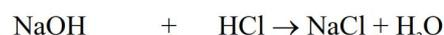

$$\text{NaOH} + \text{HCl} \rightarrow \text{NaCl} + \text{H}_2\text{O}$$

$$\begin{array}{ll} \text{Initial : } MV = 2 \times 0.1 & MV = 1 \times 0.2 \\ & = 0.2 \text{ mole} \end{array}$$

$$\begin{array}{ll} \text{Final} & 0 \quad 0 \end{array}$$

$\therefore$  Resulting solution becomes neutral.

Now when 10 ml of above solution is poured into a flask containing 2 mole  $\text{HCl}$  and made solution 100 ml with distilled water.

$$\text{Molarity of HCl} = \frac{2}{100} \times 1000 = 20$$

53. Fat soluble vitamins are :

- A. Vitamin  $\text{B}_1$
- B. Vitamin C
- C. Vitamin E
- D. Vitamin  $\text{B}_{12}$
- E. Vitamin K

Choose the **correct** answer from the options given below :

- (1) C & D Only
- (2) A & B Only
- (3) B & C Only
- (4) C & E Only

**Ans. (4)**

**Sol.** Vit D, E, K, A are fat soluble vitamins.

54. Match the **LIST-I** with **LIST-II**.

| <b>LIST-I</b> (Family) |                        | <b>LIST-II</b> (Symbol of Element) |    |
|---------------------------|------------------------|---------------------------------------|----|
| A.                        | Pnicogen (group 15) | I.                                    | Ts |
| B.                        | Chalcogen              | II.                                   | Og |
| C.                        | Halogen                | III.                                  | Lv |
| D.                        | Noble gas              | IV.                                   | Mc |

Choose the **correct** answer from the options given below :

- (1) A-IV, B-I, C-II, D-III  
 (2) A-IV, B-III, C-I, D-II  
 (3) A-III, B-I, C-IV, D-II  
 (4) A-II, B-III, C-IV, D-I

**Ans. (2)**

**Sol.** (A) Pnictogen  $\Rightarrow$  Mc (Moscovium),

Atomic No. = 115

(B) Chalcogen  $\Rightarrow$  Lv (Livermorium),

Atomic No. = 116

(C) Halogen  $\Rightarrow$  Ts (Tennessine),

Atomic No. = 117

(D) Noble gas  $\Rightarrow$  Og (Oganesson),

Atomic No. = 118

55. For electron in '2s' and '2p' orbitals, the orbital angular momentum values, respectively are :

- (1)  $\sqrt{2} \frac{h}{2\pi}$  and 0      (2)  $\frac{h}{2\pi}$  and  $\sqrt{2} \frac{h}{2\pi}$   
 (3) 0 and  $\sqrt{6} \frac{h}{2\pi}$       (4) 0 and  $\sqrt{2} \frac{h}{2\pi}$

**Ans. (4)**

**Sol.** Orbital angular momentum =  $\sqrt{\ell(\ell+1)} \frac{h}{2\pi}$

$\therefore$  For 2s orbital :  $\ell = 0$

Orbital angular momentum = 0

$\therefore$  For 2p orbital :  $\ell = 1$

$$\begin{aligned} \text{Orbital angular momentum} &= \sqrt{1(1+2)} \frac{h}{2\pi} \\ &= \sqrt{2} \frac{h}{2\pi} \end{aligned}$$

56. Compounds that should not be used as primary standards in titrimetric analysis are :

- A.  $\text{Na}_2\text{Cr}_2\text{O}_7$   
 B. Oxalic acid  
 C. NaOH  
 D.  $\text{FeSO}_4 \cdot 6\text{H}_2\text{O}$   
 E. Sodium tetraborate

Choose the **most appropriate** answer from the options given below:

- (1) B and D Only      (2) D and E Only  
 (3) C, D and E Only      (4) A, C and D Only

**Ans. (4)**

**Sol.** The primary standard is a highly pure stable compound with a known exact composition that can be accurately weighed and dissolved to create a solution of known concentration.

NaOH is hygroscopic and can't be used.

$\text{FeSO}_4 \cdot 6\text{H}_2\text{O}$  is unstable and can be easily oxidised.

$\text{Na}_2\text{Cr}_2\text{O}_7$  is hygroscopic and can't be used.

57. The major product (P) in the following reaction is :

$$\text{Ph}-\underset{\text{O}}{\underset{\parallel}{\text{C}}}-\underset{\text{O}}{\underset{\parallel}{\text{C}}}-\text{H} \xrightarrow[\Delta]{\text{KOH}} \text{P}$$

Major product

- (1)  $\text{Ph}-\underset{\text{OH}}{\underset{|}{\text{CH}}}-\text{CH}_2\text{OH}$       (2)  $\text{Ph}-\underset{\text{OH}}{\underset{|}{\text{CH}}}-\text{COO}^- \text{K}^+$   
 (3)  $\text{Ph}-\underset{\text{O}}{\underset{\parallel}{\text{C}}}-\text{COO}^- \text{K}^+$       (4)  $\text{Ph}-\underset{\text{O}}{\underset{\parallel}{\text{C}}}-\text{CH}_2\text{OH}$

**Ans. (2)**

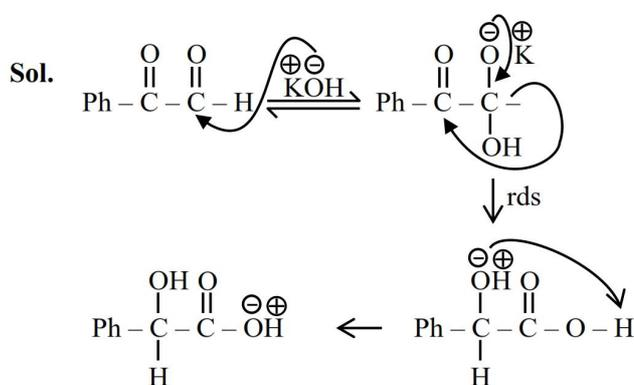

**Sol.**

$$\text{Ph}-\underset{\text{O}}{\underset{\parallel}{\text{C}}}-\underset{\text{O}}{\underset{\parallel}{\text{C}}}-\text{H} \xrightleftharpoons{\text{KOH}} \text{Ph}-\underset{\text{O}}{\underset{\parallel}{\text{C}}}-\underset{\text{OH}}{\underset{|}{\text{CH}}}-\text{O}^- \text{K}^+ \xrightarrow{\text{rds}} \text{Ph}-\underset{\text{OH}}{\underset{|}{\text{CH}}}-\underset{\text{O}}{\underset{\parallel}{\text{C}}}-\text{O}^- \text{K}^+ \xrightarrow{\text{H}_2\text{O}} \text{Ph}-\underset{\text{OH}}{\underset{|}{\text{CH}}}-\text{COO}^- \text{K}^+$$

58. In the following series of reactions identify the major products A & B respectively.

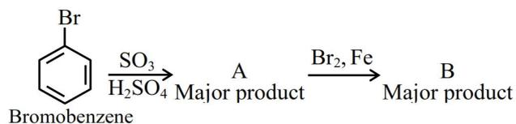

Brc1ccccc1  $\xrightarrow[\text{H}_2\text{SO}_4]{\text{SO}_3}$  A Major product  $\xrightarrow{\text{Br}_2, \text{Fe}}$  B Major product

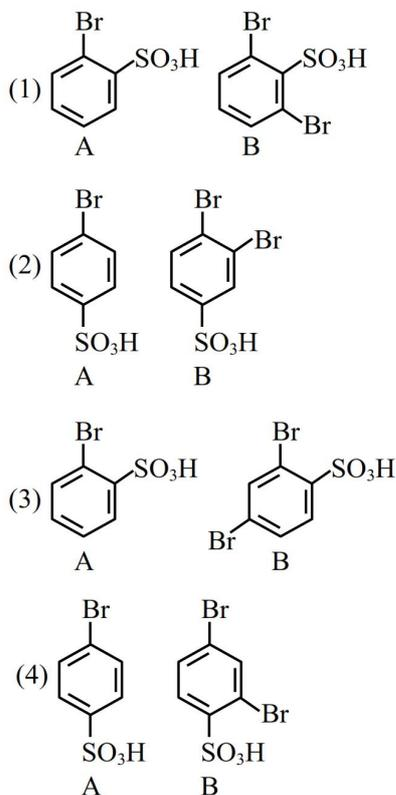

(1) Brc1ccc(S(=O)(=O)O)cc1 A Brc1ccc(Br)c(c1)S(=O)(=O)O B  
 (2) Brc1ccc(S(=O)(=O)O)cc1 A Brc1ccc(Br)c(c1)S(=O)(=O)O B  
 (3) Brc1ccc(S(=O)(=O)O)cc1 A Brc1ccc(S(=O)(=O)O)c(Br)c1 B  
 (4) Brc1ccc(S(=O)(=O)O)cc1 A Brc1ccc(Br)c(c1)S(=O)(=O)O B

Ans. (2)

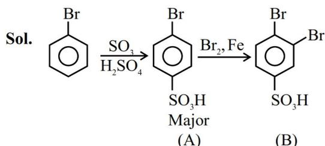

Sol. Brc1ccccc1  $\xrightarrow[\text{H}_2\text{SO}_4]{\text{SO}_3}$  Brc1ccc(S(=O)(=O)O)cc1 Major (A)  $\xrightarrow{\text{Br}_2, \text{Fe}}$  Brc1ccc(Br)c(c1)S(=O)(=O)O (B)

Both reactions are electrophilic substitution reaction, Ist is sulphonation and IInd is halogenation :

59. The standard cell potential ( $E_{\text{cell}}^\circ$ ) of a fuel cell based on the oxidation of methanol in air that has been used to power television relay station is measured as 1.21 V. The standard half cell reduction potential for  $\text{O}_2$  ( $E_{\text{O}_2/\text{H}_2\text{O}}^\circ$ ) is 1.229 V.

Choose the correct statement:

- (1) The standard half cell reduction potential for the reduction of  $\text{CO}_2$  ( $E_{\text{CO}_2/\text{CH}_3\text{OH}}^\circ$ ) is 19 mV
- (2) Oxygen is formed at the anode.
- (3) Reactants are fed at one go to each electrode.
- (4) Reduction of methanol takes place at the cathode.

Ans. (1)

Sol.  $\because E_{\text{cell}}^\circ = E_{\text{cathode}}^\circ - E_{\text{Anode}}^\circ$

$$1.21 = 1.229 - E_{\text{Anode}}^\circ$$

$\because$  Fuel cell involves oxidation of methanol which will occur at anode and reduction of  $\text{O}_2$  will occur at cathode.

60. Identify the diamagnetic octahedral complex ions from below :

- A.  $[\text{Mn}(\text{CN})_6]^{3-}$  B.  $[\text{Co}(\text{NH}_3)_6]^{3+}$   
 C.  $[\text{Fe}(\text{CN})_6]^{4-}$  D.  $[\text{Co}(\text{H}_2\text{O})_3\text{F}_3]$

Choose the **correct** answer from the options given below :

- (1) B and D Only (2) A and D Only  
 (3) A and C Only (4) B and C Only

Ans. (4)

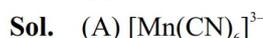

Sol. (A)  $[\text{Mn}(\text{CN})_6]^{3-}$

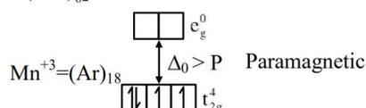

$\text{Mn}^{+3} = (\text{Ar})_{18}$   
 $\Delta_o > P$  Paramagnetic  
 $\begin{array}{c} \square \square \square \square \square \\ \uparrow \downarrow \uparrow \downarrow \uparrow \\ t_{2g}^4 \end{array}$

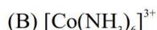

(B)  $[\text{Co}(\text{NH}_3)_6]^{3+}$

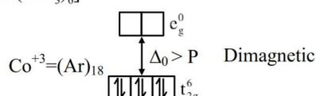

$\text{Co}^{+3} = (\text{Ar})_{18}$   
 $\Delta_o > P$  Diamagnetic  
 $\begin{array}{c} \square \square \square \square \square \\ \uparrow \downarrow \uparrow \downarrow \uparrow \downarrow \\ t_{2g}^6 \end{array}$

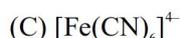

(C)  $[\text{Fe}(\text{CN})_6]^{4-}$

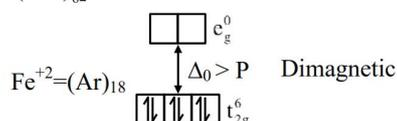

$\text{Fe}^{+2} = (\text{Ar})_{18}$   
 $\Delta_o > P$  Diamagnetic  
 $\begin{array}{c} \square \square \square \square \square \\ \uparrow \downarrow \uparrow \downarrow \uparrow \downarrow \\ t_{2g}^6 \end{array}$

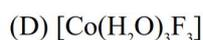

(D)  $[\text{Co}(\text{H}_2\text{O})_3\text{F}_3]$

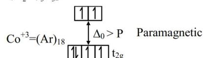

$\text{Co}^{+3} = (\text{Ar})_{18}$   
 $\Delta_o > P$  Paramagnetic  
 $\begin{array}{c} \square \square \square \square \square \\ \uparrow \downarrow \uparrow \downarrow \uparrow \\ t_{2g}^4 \end{array}$

61. In Dumas' method for estimation of nitrogen 0.4 g of an organic compound gave 60 mL of nitrogen collected at 300 K temperature and 715 mm Hg pressure. The percentage composition of nitrogen in the compound is

(Given : Aqueous tension at 300 K = 15 mm Hg)

- (1) 15.71%                      (2) 20.95%  
(3) 17.46%                      (4) 7.85%

**Ans. (1)**

$$\begin{aligned}\text{Sol. Pressure of N}_2 \text{ gas evolved} &= 715 - 15 \\ &= 700 \text{ mm Hg} \\ &= \frac{700}{760} \text{ atm.}\end{aligned}$$

$$\begin{aligned}\therefore \text{ Mole of N}_2 \text{ evolved} &= \frac{PV}{RT} \\ &= \frac{700 \times 60 \times 10^{-3}}{760 \times 0.0821 \times 300} \\ &= 0.0022 \text{ mole}\end{aligned}$$

$$\therefore \text{ wt. of N}_2 \text{ evolved} = 0.0022 \times 28 = 0.063 \text{ gm}$$

$$\begin{aligned}\therefore \text{ wt. \% of nitrogen in compound} &= \frac{\text{wt. of nitrogen}}{\text{wt. of compound}} \times 100 \\ &= \frac{0.063}{0.4} \times 100 \\ &= 15.71\%\end{aligned}$$

62. Mass of magnesium required to produce 220 mL of hydrogen gas at STP on reaction with excess of dil. HCl is

Given : Molar mass of Mg is 24 g mol-1.

- (1) 235.7 g                      (2) 0.24 mg  
(3) 236 mg                      (4) 2.444 g

**Ans. (3)**

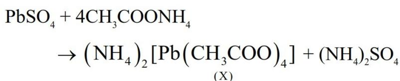

$$\text{Sol. Mg} + 2\text{HCl} \rightarrow \text{MgCl}_2 + \text{H}_2$$

$$\text{Volume H}_2 \text{ evolved} = 220 \text{ ml}$$

$$\text{Mole of H}_2 = \frac{220 \times 10^{-3}}{22.4} = \text{mole of Mg used}$$

$$\begin{aligned}\therefore \text{ Mass of Mg used} &= \frac{220 \times 10^{-3}}{22.4} \times 24 \\ &= 235.7 \times 10^{-3} \text{ gm} \\ &= 235.7 \text{ mg}\end{aligned}$$

63. Given below are two statements :

**Statement I :** Wet cotton clothes made of cellulose based carbohydrate takes comparatively longer time to get dried than wet nylon polymer based clothes.

**Statement II :** Intermolecular hydrogen bonding with water molecule is more in nylon-based clothes than in the case of cotton clothes.

In the light of above statements, choose the **Correct** answer from the options given below

- (1) Statement I is false but Statement II is true  
(2) Statement I is true but Statement II is false  
(3) Both Statement I and Statement II are true  
(4) Both Statement I and Statement II are false

**Ans. (2)**

**Sol.** Cellulose derivative has more number of hydroxy groups, so more H-bonding is present with water in cellulose derivatives cotton cloths.

64. Given below are two statements :

**Statement I :** CrO3 is a stronger oxidizing agent than MoO3

**Statement II :** Cr(VI) is more stable than Mo(VI)

In the light of the above statements, choose the **correct** answer from the options given below

- (1) Statement I is false but Statement II is true  
(2) Statement I is true but Statement II is false  
(3) Both Statement I and Statement II are true  
(4) Both Statement I and Statement II are false

**Ans. (2)**

**Sol.** Statement-I is true but statement II is false.

Cr(VI) is less stable than Mo(VI)

Hence, CrO3 easily reduce into Cr+3 as compared to MoO3 and show stronger oxidizing nature.

65. Given below are two statements :

**Statement I :** Hyperconjugation is not a permanent effect.

**Statement II :** In general, greater the number of alkyl groups attached to a positively charged C-atom, greater is the hyperconjugation interaction and stabilization of the cation.

In the light of the above statements, choose the **correct** answer from the options given below

- (1) Statement I is true but Statement II is false
- (2) Both Statement I and Statement II are false
- (3) Statement I is false but Statement II is true
- (4) Both Statement I and Statement II are true

**Ans. (3)**

**Sol.** Hyper conjugation is permanent effect because external reagent is not required, so Statement-I is false and Statement-II is true. because more alkyl group, more  $\alpha$ -H, so more hyperconjugation which results more stability of carbocation.

66. Given below are two statements :

**Statement I :** When a system containing ice in equilibrium with water (liquid) is heated, heat is absorbed by the system and there is no change in the temperature of the system until whole ice gets melted.

**Statement II :** At melting point of ice, there is absorption of heat in order to overcome intermolecular forces of attraction within the molecules of water in ice and kinetic energy of molecules is not increased at melting point.

In the light of the above statements, choose the **correct** answer from the options given below:

- (1) Statement I is true but Statement II is false
- (2) Both Statement I and Statement II are false
- (3) Both Statement I and Statement II are true
- (4) Statement I is false but Statement II is true

**Ans. (3)**

**Sol.** At melting point when ice melts, supplied heat is utilised to overcome intermolecular attraction within the molecules so temperature remain constant.

67. The sequence from the following that would result in giving predominantly 3, 4, 5 –Tribromoaniline is :

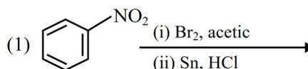

(1)  $\xrightarrow[\text{(ii) Sn, HCl}]{\text{(i) Br}_2, \text{ acetic}}$

Nitrobenzene structure

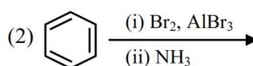

(2)  $\xrightarrow[\text{(ii) NH}_3]{\text{(i) Br}_2, \text{ AlBr}_3}$

Benzene structure

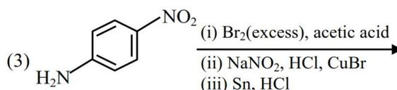

(3)  $\xrightarrow[\text{(ii) NaNO}_2, \text{ HCl, CuBr}]{\text{(i) Br}_2(\text{excess}), \text{ acetic acid}}$

Aniline structure

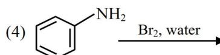

(4)  $\xrightarrow{\text{Br}_2, \text{ water}}$

Aniline structure

**Ans. (3)**

**Sol.**

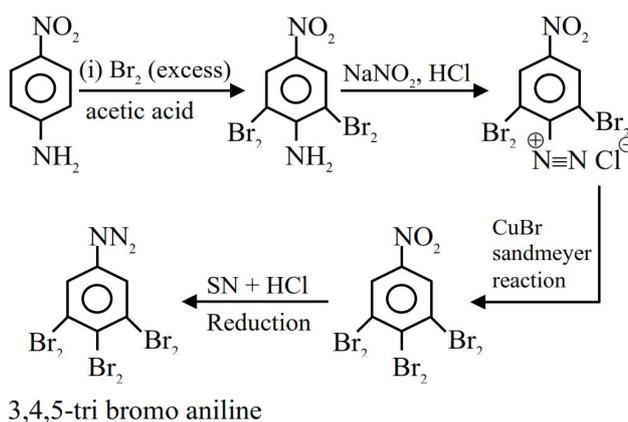

The reaction scheme shows the synthesis of 3,4,5-tribromoaniline from aniline. Aniline reacts with excess bromine in acetic acid to form 3,5-dibromoaniline. This intermediate is then treated with NaNO2 and HCl to form a diazonium salt (3,5-dibromobenzenediazonium chloride). This diazonium salt undergoes a Sandmeyer reaction with CuBr to form 1,3-dibromobenzene. Finally, 1,3-dibromobenzene is reduced with Sn + HCl to form 1,3-dibromobenzene-4,6-diamine, which is then brominated to form 3,4,5-tribromoaniline.

3,4,5-tri bromo aniline

Reaction scheme for the synthesis of 3,4,5-tribromoaniline from aniline

68. The correct orders among the following are  
 Atomic radius :  $B < Al < Ga < In < Tl$   
 Electronegativity :  $Al < Ga < In < Tl < B$   
 Density :  $Tl < In < Ga < Al < B$   
 1st Ionisation Energy :  $In < Al < Ga < Tl < B$   
 Choose the correct answer from the options given below :
- (1) B and D Only      (2) A and C Only  
 (3) C and D Only      (4) A and B Only

Ans. (1)

Sol.

|                              | B    | Al  | Ga  | In   | Tl    |
|------------------------------|------|-----|-----|------|-------|
| Atomic radius (pm)           | 88   | 143 | 135 | 167  | 170   |
| Electronegativity            | 2    | 1.5 | 1.6 | 1.7  | 1.8   |
| Density (g/cm 3 ) | 2.35 | 2.7 | 5.9 | 7.31 | 11.85 |
| Ionisation Energy (kJ/mol)   | 801  | 577 | 579 | 558  | 589   |

Radius Order  $Tl > In > Al > Ga > B$

EN Order  $B > Tl > In > Ga > Al$

Density Order  $Tl > In > Ga > Al > B$

IE1 Order  $B > Tl > Ga > Al > In$

69. What is the correct IUPAC name of

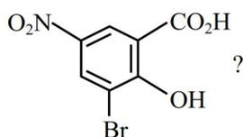

Chemical structure of 3-bromo-2-hydroxy-5-nitrobenzoic acid. A benzene ring has a CO2H group at position 1, an OH group at position 2, a Br atom at position 3, and an NO2 group at position 5. A question mark is placed next to the structure.

- (1) 3-Bromo-2-hydroxy-5-nitrobenzoic acid  
 (2) 3-Bromo-4-hydroxy-1-nitrobenzoic acid  
 (3) 2-Hydroxy-3-bromo-5-nitrobenzoic acid  
 (4) 5-Nitro-3-bromo-2-hydroxybenzoic acid

Ans. (1)

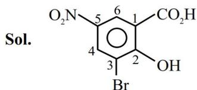

Sol.

Numbered chemical structure of 3-bromo-2-hydroxy-5-nitrobenzoic acid. The benzene ring is numbered 1 to 6 starting from the CO2H group. CO2H is at 1, OH is at 2, Br is at 3, and NO2 is at 5.

IUPAC 3-Bromo-2-hydroxy-5-nitro-Benzoic acid

70. Consider the following statements related to temperature dependence of rate constants.

Identify the correct statements,

- A. The Arrhenius equation holds true only for an elementary homogenous reaction.  
 B. The unit of A is same as that of k in Arrhenius equation.  
 C. At a given temperature, a low activation energy means a fast reaction.  
 D. A and Ea as used in Arrhenius equation depend on temperature.  
 E. When  $E_a \gg RT$ . A and Ea become interdependent.

Choose the **correct** answer from the options given below :

- (1) A, C and D Only      (2) B, D and E Only  
 (3) B and C Only      (4) A and B Only

Ans. (3)

Sol. Arrhenius equation hold true for elementary as well as complex reactions.

Unit of A is same as unit of k. Rate of reaction is high if activation energy is low,

A and Ea are temperature independent.

# SECTION-B

71. X g of nitrobenzene on nitration gave 4.2 g of m-dinitrobenzene.

X = \_\_\_\_\_ g. (nearest integer)

[Given : molar mass (in g mol-1) C : 12, H : 1, O : 16, N : 14]

Ans. (3)

Sol.

Chemical reaction showing nitrobenzene (a benzene ring with an NO2 group) undergoing nitration (indicated by an arrow with 'Nitration' and a delta symbol) to form m-dinitrobenzene (a benzene ring with two NO2 groups at positions 1 and 3). The product is labeled as 4.2 gm.

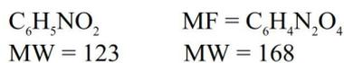

$$\begin{array}{ll} C_6H_5NO_2 & MF = C_6H_4N_2O_4 \\ MW = 123 & MW = 168 \end{array}$$

$$\therefore \frac{4.2}{168} = 0.025 \text{ mol}$$

$\therefore$  required gm of nitro benzene

$$= 123 \times 0.025$$

$$= 3.075$$

$\therefore$  Nearest integer is 3

72.

A P-V diagram showing a cyclic process for a gas. The y-axis is Pressure (P/atm) with values 1.00 and 3.00. The x-axis is Volume (V/cm³) with values 1000 and 2000. The cycle consists of four points: 1 (1000, 1.00), 2 (1000, 3.00), 3 (2000, 3.00), and 4 (2000, 1.00). Arrows indicate a clockwise direction: 1 to 2 (vertical up), 2 to 3 (horizontal right), 3 to 4 (vertical down), and 4 to 1 (horizontal left).

A perfect gas (0.1 mol) having  $\bar{C}_v = 1.50 R$  (independent of temperature) undergoes the above transformation from point 1 to point 4. If each step is reversible, the total work done ( $w$ ) while going from point 1 to point 4 is  $(-)$  \_\_\_\_\_ J (nearest integer) [Given :  $R = 0.082 \text{ L atm K}^{-1} \text{ mol}^{-1}$ ]

**Ans. (304)**

**Sol.**

$$\begin{aligned} W_{1 \rightarrow 2} &= 0 \\ W_{2 \rightarrow 3} &= -P\Delta V \\ &= -3 [2-1] \\ &= -3 \text{ atm} \cdot \ell \\ W_{3 \rightarrow 4} &= 0 \\ \text{Total work done} &= -3 \text{ atm} \cdot \ell \\ &= -3 \times 101.3 \text{ Joule} \\ &= -304 \text{ Joule} \end{aligned}$$

73. A sample of n-octane (1.14 g) was completely burnt in excess of oxygen in a bomb calorimeter, whose heat capacity is  $5 \text{ kJ K}^{-1}$ . As a result of combustion reaction, the temperature of the calorimeter is increased by 5 K. The magnitude of the heat of combustion of octane at constant volume is \_\_\_\_\_  $\text{kJ mol}^{-1}$  (nearest integer).

**Ans. (2500)**

**Sol.**

$$\begin{aligned} \text{Mole of octane} &= \frac{1.14}{114} = 0.01 \text{ mole} \\ \text{Heat evolved} &= C \times \Delta T \\ &= 5 \times 5 \text{ kJ} \\ &= 25 \text{ kJ} \\ \therefore \text{ Magnitude of Heat of combustion} &= \frac{25}{0.01} = 2500 \\ &\text{kJ/mole} \end{aligned}$$

74. Among, Sc, Mn, Co and Cu, identify the element with highest enthalpy of atomisation. The spin only magnetic moment value of that element in its +2 oxidation state is \_\_\_\_\_ BM (in nearest integer).

**Ans. (4)**

**Sol.**

|                                   | Sc  | Mn  | Co  | Cu  |
|-----------------------------------|-----|-----|-----|-----|
| Enthalpy of Atomisation (kJ/mole) | 326 | 281 | 425 | 339 |

Highest Co

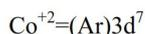

$$\text{Co}^{+2} = (\text{Ar})3d^7$$

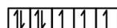

|   |   |   |   |   |   |   |
|---|---|---|---|---|---|---|
| ↑ | ↓ | ↑ | ↑ | ↑ | ↑ | ↑ |
|---|---|---|---|---|---|---|

$$n = 3$$

$$\mu = \sqrt{15} = 3.87$$

Nearest integer = 4

75. The total number of structural isomers possible for the substituted benzene derivatives with the molecular formula  $\text{C}_9\text{H}_{12}$  is \_\_\_\_\_.

**Ans. (8)**

**Sol.** MF =  $\text{C}_9\text{H}_{12}$

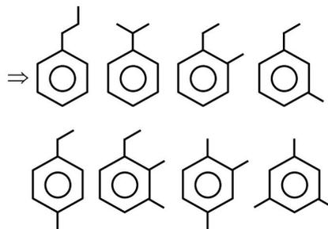

⇒

Eight structural isomers of C9H12 are shown. They include propylbenzene, isopropylbenzene, ethyltoluene (ortho, meta, and para), and trimethylbenzene (mesitylene, 1,2,3-trimethylbenzene, 1,2,4-trimethylbenzene, and 1,3,5-trimethylbenzene).
