# **JEE (Main)-2026 Session-1** **Question Paper with Solutions** **(Mathematics, Physics, And Chemistry)** **28 January 2026 Shift – 2**

Time: 3 hrs.

M.M: 300

### **IMPORTANT INSTRUCTIONS:**

- (1) The test is of 3 hours duration.
- (2) This test paper consists of 75 questions. Each subject (PCM) has 25 questions. The maximum marks are 300.
- (3) This question paper contains Three Parts. Part-A is Physics, Part-B is Chemistry and Part-C is Mathematics. Each part has only two sections: Section-A and Section-B.
- (4) Section - A: Attempt all questions.
- (5) Section - B: Attempt all questions.
- (6) Section - A (01 - 20) contains 20 multiple choice questions which have only one correct answer. Each question carries +4 marks for correct answer and -1 mark for wrong answer.
- (7) Section - B (21 - 25) contains 5 Numerical value-based questions. The answer to each question should be rounded off to the nearest integer. Each question carries +4 marks for correct answer and -1 mark for wrong answer.

### MATHEMATICS

#### SECTION-A

1. Given below two statements :

**Statement I :**  $25^{13} + 20^{13} + 8^{13} + 3^{13}$  is divisible by 7.

**Statement II :** The integral part of  $(7 + 4\sqrt{3})^{25}$  is an odd number.

In the light of the above statements, choose the **correct answer** from the options given below :

- (1) Both **Statement I** and **Statement II** are false.
- (2) Both **Statement I** and **Statement II** are true.
- (3) **Statement I** is false but **Statement II** is true.
- (4) **Statement I** is true but **Statement II** is false.

**Ans. (2)**

**Sol.** Statement I :

$$\begin{array}{ccc} 25^{13} + 3^{13} & + & 20^{13} + 8^{13} \\ \downarrow & & \downarrow \\ \text{divisible by } (25+3) & & \text{divisible by } (20+8) \\ & \searrow \quad \swarrow & \\ & \therefore \text{ divisible by } 7 & \end{array}$$

**Statement II :**  $R = (7 + 4\sqrt{3})^{25} = I + f$

$$R' = (7 - 4\sqrt{3})^{25} = f'$$

$$\therefore R + R' = 2 \left[ {}^{25}C_0 7^{25} + {}^{25}C_2 7^{23} (4\sqrt{3})^2 + \dots \right]$$

$I + f + f' = \text{even integer}$

$\therefore I = \text{odd integer}$

$$\because 0 < f + f' < 2 \Rightarrow f + f' = 1$$

$\Rightarrow$  Both the statements are correct

2. The sum of the coefficients of  $x^{499}$  and  $x^{500}$  in  $(1+x)^{1000} + x(1+x)^{999} + x^2(1+x)^{998} + \dots + x^{1000}$  is
- (1)  ${}^{1001}C_{501}$
  - (2)  ${}^{1002}C_{500}$
  - (3)  ${}^{1002}C_{501}$
  - (4)  ${}^{1000}C_{501}$

**Ans. (2)**

**Sol.**  $S = (1+x)^{1000} + x(1+x)^{999} + x^2(1+x)^{998} + \dots + x^{1000}$

$$\begin{aligned} &= (1+x)^{1000} \frac{\left( 1 - \left( \frac{x}{1+x} \right)^{1001} \right)}{1 - \frac{x}{1+x}} \\ &= (1+x)^{1001} - x^{1001} \end{aligned}$$

$$\text{Required sum} = {}^{1001}C_{499} + {}^{1001}C_{500} = {}^{1002}C_{500}$$

3. Let A be the focus of the parabola  $y^2 = 8x$ . Let the line  $y = mx + c$  intersect the parabola at two distinct points B and C. If the centroid of the triangle ABC is  $\left( \frac{7}{3}, \frac{4}{3} \right)$ , then  $(BC)^2$  is equal to :

- (1) 41
- (2) 80
- (3) 89
- (4) 32

**Ans. (2)**

**Sol.**

A diagram showing a parabola y^2 = 8x opening to the right. The focus A is at (2, 0) on the x-axis. A line segment BC is a chord of the parabola, with point B at (2t1^2, 4t1) and point C at (2t2^2, 4t2). The triangle ABC is formed by connecting the focus A to points B and C.

Coordinates of centroid of triangle ABC are

$$\frac{2}{3}(t_1^2 + t_2^2 + 1) = \frac{7}{3} \Rightarrow t_1^2 + t_2^2 = \frac{5}{2}$$

$$\frac{4}{3}(t_1 + t_2) = \frac{4}{3} \Rightarrow t_1 + t_2 = 1$$

$$(t_1 + t_2)^2 = t_1^2 + t_2^2 + 2t_1t_2 \Rightarrow t_1t_2 = \frac{-3}{4}$$

$$(t_1 - t_2)^2 = (t_1 + t_2)^2 - 4t_1t_2 = 4$$

$$(BC)^2 = 4(t_1^2 - t_2^2)^2 + 16(t_1 - t_2)^2$$

$$\Rightarrow (BC)^2 = 80$$

4. The probability distribution of a random variable X is given below :

|      |                |                 |                 |                 |                 |                 |                 |                |
|------|----------------|-----------------|-----------------|-----------------|-----------------|-----------------|-----------------|----------------|
| X    | 4k             | $\frac{30}{7}k$ | $\frac{32}{7}k$ | $\frac{34}{7}k$ | $\frac{36}{7}k$ | $\frac{38}{7}k$ | $\frac{40}{7}k$ | 6k             |
| P(X) | $\frac{2}{15}$ | $\frac{1}{15}$  | $\frac{2}{15}$  | $\frac{1}{5}$   | $\frac{1}{15}$  | $\frac{2}{15}$  | $\frac{1}{5}$   | $\frac{1}{15}$ |

If  $E(X) = \frac{263}{15}$ , then  $P(X < 20)$  is equal to :

(1)  $\frac{3}{5}$

(2)  $\frac{8}{15}$

(3)  $\frac{11}{15}$

(4)  $\frac{14}{15}$

Ans. (3)

Sol.  $E(X) = \sum X_i P(X_i) = \frac{526k}{15 \times 7} = \frac{263}{15} \Rightarrow k = \frac{7}{2}$

|      |                |                |                |               |                |                |               |                |
|------|----------------|----------------|----------------|---------------|----------------|----------------|---------------|----------------|
| X    | 14             | 15             | 16             | 17            | 18             | 19             | 20            | 21             |
| P(X) | $\frac{2}{15}$ | $\frac{1}{15}$ | $\frac{2}{15}$ | $\frac{1}{5}$ | $\frac{1}{15}$ | $\frac{2}{15}$ | $\frac{1}{5}$ | $\frac{1}{15}$ |

$$P(X < 20) = \sum_{X=14}^{19} P(X) = \frac{11}{15}$$

5. Let  $f(x) = \lim_{\theta \rightarrow 0} \left( \frac{\cos \pi x - x^{\binom{2}{\theta}} \sin(x-1)}{1 + x^{\binom{2}{\theta}} (x-1)} \right), x \in \mathbb{R}$ .

Consider the following two statements :

(I)  $f(x)$  is discontinuous at  $x = 1$ .

(II)  $f(x)$  is continuous at  $x = -1$ .

Then,

(1) Neither (I) nor (II) is True

(2) Both (I) and (II) are True

(3) Only (II) is True

(4) Only (I) is True

Ans. (1)

Sol.  $f(x) = \begin{cases} \cos \pi x & x \rightarrow 1^- \\ \frac{-\sin(x-1)}{(x-1)} & x \rightarrow 1^+ \end{cases}$

$$\text{RHL} = \lim_{x \rightarrow 1^+} \frac{-\sin(x-1)}{(x-1)} = -1$$

$$\text{LHL} = \lim_{x \rightarrow 1^-} \cos \pi x = -1, f(1) = -1$$

$f(x)$  is continuous at  $x = 1$

$$f(x) = \begin{cases} \frac{-\sin(x-1)}{-(x-1)} & x \rightarrow -1^- \\ \cos \pi x & x \rightarrow -1^+ \end{cases}$$

$$\text{RHL} = \lim_{x \rightarrow -1^-} \cos \pi x = -1$$

$$\text{LHL} = \lim_{x \rightarrow -1^+} \frac{-\sin(x-1)}{(x-1)} = \frac{\sin 2}{-2}$$

$f(x)$  is discontinuous at  $x = -1$

6. Considering the principal values of inverse trigonometric functions, the value of the expression

$$\tan \left( 2 \sin^{-1} \left( \frac{2}{\sqrt{13}} \right) - 2 \cos^{-1} \left( \frac{3}{\sqrt{10}} \right) \right) \text{ is equal to :}$$

(1)  $-\frac{33}{56}$

(2)  $\frac{33}{56}$

(3)  $\frac{16}{63}$

(4)  $-\frac{16}{63}$

Ans. (2)

Sol. Let  $\sin^{-1} \frac{2}{\sqrt{13}} = \theta$  &  $\cos^{-1} \frac{3}{\sqrt{10}} = \phi$

$$\sin \theta = \frac{2}{\sqrt{13}} \text{ \& } \cos \phi = \frac{3}{\sqrt{10}}$$

$$\tan(2\theta - 2\phi) = \frac{\tan 2\theta - \tan 2\phi}{1 + \tan 2\theta \tan 2\phi}$$

$$\left( \because \tan 2\theta = \frac{2 \tan \theta}{1 - \tan^2 \theta} \right)$$

$$= \frac{\frac{12}{5} - \frac{3}{4}}{1 + \frac{12}{5} \cdot \frac{3}{4}}$$

$$= \frac{33}{56}$$

7. Let the arithmetic mean of  $\frac{1}{a}$  and  $\frac{1}{b}$  be  $\frac{5}{16}$ ,  $a > 2$ .

If  $\alpha$  is such that  $a, 4, \alpha, b$  are in A.P., then the equation  $\alpha x^2 - ax + 2(\alpha - 2b) = 0$  has :

- (1) One root in  $(1, 4)$  and another in  $(-2, 0)$
- (2) One root in  $(0, 2)$  and another in  $(-4, -2)$
- (3) Complex roots of magnitude less than 2
- (4) Both roots in the interval  $(-2, 0)$

Ans. (1)

Sol.  $a = 4 - d, \alpha = 4 + d, b = 4 + 2d$

$$\Rightarrow (4 + d)x^2 - (4 - d)x + 2(4 + d - 8 - 4d) = 0$$

$$\Rightarrow (4 + d)x^2 - (4 - d)x + 2(-4 - 3d) = 0$$

$$\text{Also } \frac{\frac{1}{a} + \frac{1}{b}}{2} = \frac{5}{16}$$

$$\Rightarrow \frac{\frac{1}{4-d} + \frac{1}{4+2d}}{2} = \frac{5}{16}$$

$$\Rightarrow d = 2$$

Equation becomes

$$6x^2 - 2x - 20 = 0$$

$$3x^2 - x - 10 = 0$$

$$x = 2, \frac{-5}{3}$$

8. Given below are two statements :

**Statement I :** The function  $f : \mathbf{R} \rightarrow \mathbf{R}$  defined by

$$f(x) = \frac{x}{1+|x|} \text{ is one-one.}$$

**Statement II :** The function  $f : \mathbf{R} \rightarrow \mathbf{R}$  defined by

$$f(x) = \frac{x^2 + 4x - 30}{x^2 - 8x + 18} \text{ is many-one.}$$

In the light of the above statements, choose the **correct answer** from the options given below :

- (1) Both **Statement I** and **Statement II** are false.
- (2) Both **Statement I** and **Statement II** are true.
- (3) **Statement I** is false but **Statement II** is true .
- (4) **Statement I** is true but **Statement II** is false.

Ans. (2)

Sol. **Statement 1:**  $f(x) = \frac{x}{1+|x|}$

$$f(x) = \begin{cases} \frac{x}{1+x} & x \geq 0 \\ \frac{x}{1-x} & x < 0 \end{cases}$$

Graph of the function f(x) = x/(1+|x|). The graph is an S-shaped curve passing through the origin (0,0). It has horizontal asymptotes at y=1 and y=-1, represented by dashed lines. The curve is strictly increasing and passes the horizontal line test, indicating it is one-one.

$f(x)$  is one-one

**Statement 2:**  $f(x) = \frac{x^2 + 4x - 30}{x^2 - 8x + 18}, f(0) = \frac{-30}{18} = \frac{-5}{3}$

$$\frac{-5}{3} = \frac{x^2 + 4x - 30}{x^2 - 8x + 18}$$

On solving  $x = 0, -1$

$$\Rightarrow f(0) = f(-1) = \frac{-5}{3}$$

$\therefore f(x)$  is many-one

9. An ellipse has its center at  $(1, -2)$ , one focus at  $(3, -2)$  and one vertex at  $(5, -2)$ . Then the length of its latus rectum is :

- (1)  $\frac{16}{\sqrt{3}}$
- (2) 6
- (3)  $4\sqrt{3}$
- (4)  $6\sqrt{3}$

Ans. (2)

Sol.

Diagram of an ellipse centered at C(1, -2). The center C, focus F1(3, -2), and vertex A1(5, -2) are all on the horizontal line y = -2. The distance from the center to the focus is CF1 = 2, and the distance from the center to the vertex is CA1 = 4. The ellipse is elongated horizontally.

$$CA_1 = a = 4$$

$$CF_1 = ae = 2$$

$$e = \frac{1}{2}$$

$$\begin{aligned} LR &= 2e \left( \frac{a}{e} - ae \right) \\ &= 2 \times \frac{1}{2} \times \left( \frac{4}{1/2} - 2 \right) \end{aligned}$$

$$= 6$$

10. Let the ellipse  $E: \frac{x^2}{144} + \frac{y^2}{169} = 1$  and the hyperbola

$$H: \frac{x^2}{16} - \frac{y^2}{\lambda^2} = 1$$

have the same foci. If  $e$  and  $L$  respectively denote the eccentricity and the length of the latus rectum of  $H$ , then the value of  $24(e + L)$  is :

- (1) 296 (2) 126  
(3) 148 (4) 67

Ans. (1)

Sol. Equation of hyperbola :  $\frac{y^2}{\lambda^2} - \frac{x^2}{16} = 1$

Equation of ellipse :  $\frac{x^2}{144} + \frac{y^2}{169} = 1$

$$e' = \sqrt{1 - \frac{144}{169}} = \frac{5}{13}$$

focus  $\Rightarrow (0, 5)$

$$\Rightarrow \lambda \sqrt{1 + \frac{16}{\lambda^2}} = 5$$

$$\Rightarrow \lambda^2 + 16 = 25$$

$$\lambda = 3$$

$$\text{Eccentricity of hyperbola} = \sqrt{1 + \frac{16}{\lambda^2}} = \frac{5}{3}$$

$$\text{Length of latus rectum of hyperbola} = \frac{2(16)}{3} = \frac{32}{3}$$

$$24(e + L) = 24 \left[ \frac{5}{3} + \frac{32}{3} \right] = 8 \times 37 = 296$$

11. Let  $P_1 : y = 4x^2$  and  $P_2 : y = x^2 + 27$  be two parabolas. If the area of the bounded region enclosed between  $P_1$  and  $P_2$  is six times the area of the bounded region enclosed between the line  $y = \alpha x$ ,  $\alpha > 0$  and  $P_1$ , then  $\alpha$  is equal to :

- (1) 8 (2) 15  
(3) 12 (4) 6

Ans. (3)

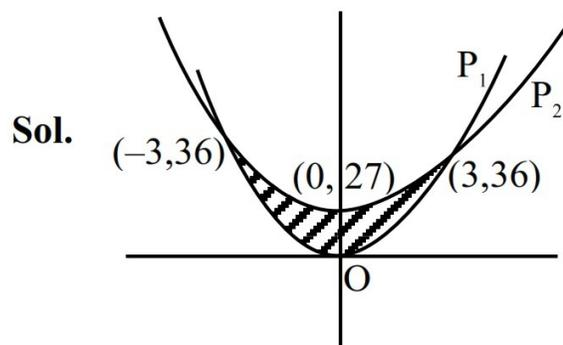

Sol.

Graph showing two parabolas, P1 and P2, intersecting at points (-3, 36), (0, 27), and (3, 36). The region between them is shaded. The origin is labeled O.

Area bounded between  $P_1$  &  $P_2$  is

$$\int_{-3}^3 ((x^2 + 27) - (4x^2)) dx$$

(P.O.I. of  $P_1$  &  $P_2$  is  $x = \pm 3$ )

$$= 2 \int_0^3 (27 - 3x^2) dx = 2 [27x - x^3]_0^3$$

$$= 2[81 - 27] = 108$$

$\therefore$  Area bounded between  $P_1$  &  $L$  is 18 sq. units

(Area between  $x^2 = 4ay$  & line  $x = my$ ) is  $\frac{8a^2}{3m^3}$

$\therefore$  Area between  $x^2 = \frac{y}{4}$  &  $x = \frac{y}{\alpha}$  is

$$\frac{8 \cdot \left(\frac{1}{16}\right)^2}{3 \cdot \left(\frac{1}{\alpha}\right)^3} = 18$$

$$\Rightarrow \frac{\frac{8}{16 \cdot 16}}{\frac{3}{\alpha^3}} = 18 \Rightarrow \alpha^3 = 2^6 \cdot 3^3$$

$$\Rightarrow \alpha = 12$$

12. Let the circle  $x^2 + y^2 = 4$  intersect x-axis at the points  $A(a, 0)$ ,  $a > 0$  and  $B(b, 0)$ . Let  $P(2 \cos \alpha, 2 \sin \alpha)$ ,  $0 < \alpha < \frac{\pi}{2}$  and  $Q(2 \cos \beta, 2 \sin \beta)$  be two

points such that  $(\alpha - \beta) = \frac{\pi}{2}$ . Then the point of

intersection of AQ and BP lies on :

- (1)  $x^2 + y^2 - 4y - 4 = 0$   
(2)  $x^2 + y^2 - 4x - 4 = 0$   
(3)  $x^2 + y^2 - 4x - 4y = 0$   
(4)  $x^2 + y^2 - 4x - 4y - 4 = 0$

Ans. (1)

**Sol.** Let point of intersection  $R(h,k)$

$$m_{BR} = m_{BP} \Rightarrow \frac{k}{h+2} = \frac{2 \sin \alpha}{2 \cos \alpha + 2} \Rightarrow \frac{k}{h+2} = \tan \frac{\alpha}{2}$$

$$m_{AR} = m_{AQ} \Rightarrow \frac{k}{h-2} = \frac{2 \sin \beta}{2 \cos \beta - 2} = \frac{\sin \beta}{\cos \beta - 1} = -\cot \frac{\beta}{2}$$

$$\frac{\alpha}{2} - \frac{\beta}{2} = \frac{\pi}{4}$$

$$\tan\left(\frac{\alpha}{2} - \frac{\beta}{2}\right) = \tan \frac{\pi}{4} = 1$$

$$\frac{\tan \frac{\alpha}{2} - \tan \frac{\beta}{2}}{1 + \tan \frac{\alpha}{2} \tan \frac{\beta}{2}} = 1$$

$$\frac{\frac{k}{h+2} + \frac{h-2}{k}}{1 + \left(\frac{k}{h+2}\right)\left(\frac{2-h}{k}\right)} = 1 \Rightarrow \frac{k^2 + h^2 - 4}{\frac{k(h+2)}{4}} = 1$$

$$\frac{h^2 + k^2 - 4}{4k} = 1$$

$$x^2 + y^2 - 4y - 4 = 0$$

13. Let  $[\cdot]$  denote the greatest integer function. Then

$$\int_{-\frac{\pi}{2}}^{\frac{\pi}{2}} \left( \frac{12(3 + [x])}{3 + [\sin x] + [\cos x]} \right) dx \text{ is equal to:}$$

- (1)  $15\pi + 4$                       (2)  $11\pi + 2$   
 (3)  $13\pi + 1$                       (4)  $12\pi + 5$

**Ans. (2)**

$$\text{Sol. } I = \int_{-\frac{\pi}{2}}^{\frac{\pi}{2}} \frac{12(3 + [x])dx}{3 + [\sin x] + [\cos x]}$$

$$I = \int_{-\frac{\pi}{2}}^{-1} \frac{12(1)dx}{2} + \int_{-1}^0 \frac{12(2)dx}{2} + \int_0^1 \frac{12(3)dx}{3} + \int_1^{\frac{\pi}{2}} \frac{12(4)dx}{3}$$

$$I = 6\left(\frac{\pi}{2} - 1\right) + 12(0 + 1) + 12(1 - 0) + 16\left(\frac{\pi}{2} - 1\right)$$

$$I = 3\pi - 6 + 12 + 12 + 8\pi - 16$$

$$I = 11\pi + 2$$

14. Let  $y = y(x)$  be the solution of the differential equation  $x \frac{dy}{dx} - y = x^2 \cot x, x \in (0, \pi)$ .

If  $y\left(\frac{\pi}{2}\right) = \frac{\pi}{2}$ , then  $6y\left(\frac{\pi}{6}\right) - 8y\left(\frac{\pi}{4}\right)$  is equal to :

- (1)  $3\pi$                                       (2)  $-3\pi$   
 (3)  $-\pi$                                       (4)  $\pi$

**Ans. (3)**

$$\text{Sol. } xdy - ydx = x^2 \cot x dx$$

$$x^2 d\left(\frac{y}{x}\right) = x^2 \cot x dx$$

$$d\left(\frac{y}{x}\right) = \cot x dx$$

$$\int d\left(\frac{y}{x}\right) = \int \cot x dx$$

$$\frac{y}{x} = \log_e \sin x + C$$

$$\text{given } y\left(\frac{\pi}{2}\right) = \frac{\pi}{2}$$

$$\Rightarrow C = 1$$

$$y = x(\log_e \sin x + 1)$$

$$y\left(\frac{\pi}{6}\right) = \frac{\pi}{6}[-\log_e 2 + 1]$$

$$y\left(\frac{\pi}{4}\right) = \frac{\pi}{4}\left[-\frac{1}{2} \log_e 2 + 1\right]$$

$$6y\left(\frac{\pi}{6}\right) - 8y\left(\frac{\pi}{4}\right)$$

$$= \pi \left[ (-\log_e 2 + 1) + 2 \left( \frac{1}{2} \log_e 2 - 1 \right) \right]$$

$$= \pi [1 - 2] = -\pi$$

15. The sum of all the elements in the range of  $f(x) = \text{Sgn}(\sin x) + \text{Sgn}(\cos x) + \text{Sgn}(\tan x) + \text{Sgn}(\cot x)$ ,  $x \neq \frac{n\pi}{2}, n \in \mathbb{Z}$ ,

$$\text{where } \text{Sgn}(t) = \begin{cases} 1, & \text{if } t > 0 \\ -1, & \text{if } t < 0 \end{cases}, \text{ is}$$

- (1) 4                                      (2) 2  
 (3) -2                                      (4) 0

**Ans. (2)**

**Sol.**  $x \in (0, \pi/2) \Rightarrow y = 1 + 1 + 1 + 1 = 4$   
 $x \in (\pi/2, \pi) \Rightarrow y = 1 - 1 - 1 - 1 = -2$   
 $x \in (\pi, 3\pi/2) \Rightarrow y = -1 - 1 + 1 + 1 = 0$   
 $x \in (3\pi/2, 2\pi) \Rightarrow y = -1 + 1 - 1 - 1 = -2$   
 $\therefore$  Range of  $y$  is  $\{-2, 0, 4\}$

Required sum  $= -2 + 0 + 4 = 2$

**16.** Let  $Q(a, b, c)$  be the image of the point  $P(3, 2, 1)$  in the line  $\frac{x-1}{1} = \frac{y}{2} = \frac{z-1}{1}$ . Then the distance of  $Q$  from the line  $\frac{x-9}{3} = \frac{y-9}{2} = \frac{z-5}{-2}$  is

- (1) 6  
 (2) 8  
 (3) 7  
 (4) 5

**Ans. (3)**

Diagram for Question 16: A 3D coordinate system showing point P(3, 2, 1) and a line passing through (1, 0, 1) with direction vector <1, 2, 1>. A perpendicular line segment PN is drawn from P to the line, meeting it at point N. The image point Q is shown on the extension of PN such that N is the midpoint of PQ.

**Sol.**

drs of PN  $= \langle r - 2, 2r - 2, r \rangle$   
 $1.(r - 2) + 2(2r - 2) + 1.(r) = 0$   
 $6r = 6 \Rightarrow r = 1$   
 $\therefore N \equiv (2, 2, 2)$   
 $\Rightarrow Q \equiv (1, 2, 3)$

Diagram for Question 16 solution: Shows point Q(1, 2, 3) and a line passing through A(9, 9, 5) with direction vector <3, 2, -2>. A perpendicular line segment QM is drawn from Q to the line, meeting it at point M. The distance AQ is labeled as sqrt(117) and AM is labeled as 2\*sqrt(17).

$$AQ = \sqrt{64 + 49 + 4} = \sqrt{117}$$

$$AM = \frac{|24 + 14 - 4|}{\sqrt{9 + 4 + 4}} = \frac{34}{\sqrt{17}} = 2\sqrt{17}$$

$$\therefore QM = \sqrt{117 - 68} = \sqrt{49} = 7$$

**17.** Let  $P$  be a point in the plane of the vector  $\vec{AB} = 3\hat{i} + \hat{j} - \hat{k}$  and  $\vec{AC} = \hat{i} - \hat{j} + 3\hat{k}$  such that  $P$  is equidistant from the lines  $AB$  and  $AC$ . If  $|\vec{AP}| = \frac{\sqrt{5}}{2}$ , then the area of the triangle  $ABP$  is :

- (1) 2  
 (2)  $\frac{3}{2}$   
 (3)  $\frac{\sqrt{30}}{4}$   
 (4)  $\frac{\sqrt{26}}{4}$

**Ans. (3)**

**Sol.**  $\cos 2\theta = \frac{3-1-3}{\sqrt{11} \cdot \sqrt{11}} = -\frac{1}{11}$

Diagram for Question 17: A triangle ABC with vertex A at the top. Point P is in the plane of the triangle. A line segment AP is drawn, and its length is labeled as sqrt(5)/2. The angle between AB and AC is labeled as 2\*theta. The length of AB is labeled as sqrt(11).

$$1 - 2\sin^2 \theta = -\frac{1}{11} \Rightarrow 2\sin^2 \theta = \frac{12}{11} \Rightarrow \sin \theta = \sqrt{\frac{6}{11}}$$

$$\therefore \text{Area}(\triangle ABP) = \frac{1}{2} \times \sqrt{11} \cdot \frac{\sqrt{5}}{2} \cdot \sqrt{\frac{6}{11}} = \frac{\sqrt{30}}{4}$$

**18.** Let

$$A = \{z \in \mathbb{C} : |z - 2| \leq 4\} \text{ and}$$

$$B = \{z \in \mathbb{C} : |z - 2| + |z + 2| = 5\}.$$

Then the max  $\{|z_1 - z_2| : z_1 \in A \text{ and } z_2 \in B\}$  is

- (1)  $\frac{15}{2}$   
 (2) 8  
 (3)  $\frac{17}{2}$   
 (4) 9

**Ans. (3)**

**Sol.**  $|z - 2| \leq 4 \Rightarrow (x - 2) + y^2 \leq 16$

$$|z - 2| + |z + 2| = 5 \Rightarrow \frac{x^2}{a^2} + \frac{y^2}{b^2} = 1$$

$$\Rightarrow \frac{4x^2}{25} + \frac{4y^2}{9} = 1$$

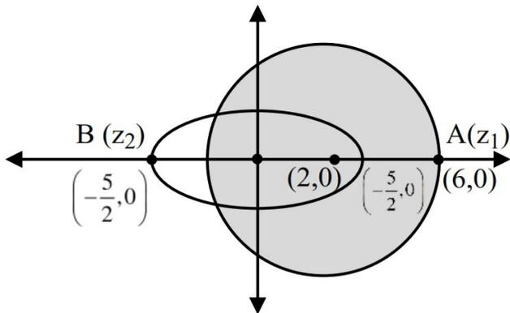

A graph showing an ellipse centered at (2,0) on the x-axis. The ellipse passes through points A(z1) at (6,0) and B(z2) at (-5/2, 0). The center is marked at (2,0). The x-axis is labeled with values -5/2, 0, 2, 6. The y-axis is also shown.

Maximum value of  $|z_1 - z_2| = 6 + \frac{5}{2} = \frac{17}{2}$

19. Let  $f(x) = \int \frac{dx}{x^{\frac{2}{3}} + 2x^{\frac{1}{2}}}$  be such that  $f(0) = -26 + 24 \log_e(2)$ . If  $f(1) = a + b \log_e(3)$ , where  $a, b \in \mathbb{Z}$ , then  $a + b$  is equal to:

- (1) -18 (2) -5  
(3) -11 (4) -26

**Ans. (3)**

**Sol.**  $f(x) = \int \frac{dx}{x^{2/3} + 2x^{1/2}}$

Put  $x = t^6 \Rightarrow dx = 6t^5 dt$

$$= \int \frac{6t^5 dt}{t^4 + 2t^3} = 6 \int \frac{(t^2 - 4) + 4}{t + 2} dt$$

$$= 6 \left[ \int (t - 2) dt + 4 \int \frac{1}{t + 2} dt \right]$$

$$= 6 \left[ \frac{t^2}{2} - 2t + 4 \ln(t + 2) \right] + C$$

$$= 3x^{1/3} - 12x^{1/6} + 24 \ln(x^{1/6} + 2) + C$$

$f(0) = 24 \ln 2 + C = -26 + 24 \ln 2$  (given)

$\Rightarrow C = -26$

Now

$f(1) = -35 + 24 \ln 3 = a + b \ln 3$  (as given in ques.)

$\Rightarrow a = -35$  &  $b = 24$

$\Rightarrow a + b = -11$

20.  $\frac{6}{3^{26}} + \frac{10.1}{3^{25}} + \frac{10.2}{3^{24}} + \frac{10.2^2}{3^{23}} + \dots + \frac{10.2^{24}}{3}$  is equal to

- (1)  $2^{25}$  (2)  $2^{26}$   
(3)  $3^{25}$  (4)  $3^{26}$

**Ans. (2)**

**Sol.**  $S = \frac{6}{3^{26}} + \frac{10}{3^{25}} \left[ \frac{(6)^{25} - 1}{6 - 1} \right]$

$$S = \frac{6}{3^{26}} + \frac{10}{3^{25}} \left[ \frac{6^{25} - 1}{5} \right]$$

$$S = \frac{2}{3^{25}} + 2 \left[ 2^{25} - \frac{1}{3^{25}} \right]$$

$$S = 2^{26}$$

#### SECTION-B

21. If  $\sum_{r=1}^{25} \left( \frac{r}{r^4 + r^2 + 1} \right) = \frac{p}{q}$ , where  $p$  and  $q$  are positive integers such that  $\gcd(p, q) = 1$ , then  $p + q$  is equal to \_\_\_\_\_.

**Ans. (976)**

**Sol.**  $S = \sum \frac{r}{(r^2 + r + 1)(r^2 - r + 1)}$

$$= \frac{1}{2} \sum_{r=1}^{25} \left( \frac{1}{r^2 - r + 1} - \frac{1}{r^2 + r + 1} \right)$$

$$= \frac{1}{2} \left[ \left( \frac{1}{1} - \frac{1}{3} \right) + \left( \frac{1}{3} - \frac{1}{7} \right) + \dots + \left( \frac{1}{601} - \frac{1}{651} \right) \right]$$

$$= \frac{1}{2} \left[ \frac{1}{1} - \frac{1}{651} \right]$$

$$= \frac{1}{2} \left[ \frac{650}{651} \right] = \frac{325}{651}$$

$$\frac{p}{q} = \frac{325}{651} \Rightarrow p + q = 976$$

22. Three persons enter in a lift at the ground floor. The lift will go upto 10th floor. The number of ways, in which the three persons can exit the lift at three different floors, if the lift does not stop at first, second and third floors, is equal to \_\_\_\_\_.

**Ans. (210)**

**Sol.**  ${}^7C_3 \times 3$

$$= 210$$

23. Let  $f$  be a differentiable function satisfying

$$f(x) = 1 - 2x + \int_0^x e^{(x-t)} f(t) dt, x \in \mathbf{R} \text{ and let}$$

$$g(x) = \int_0^x (f(t) + 2)^{15} (t - 4)^6 (t + 12)^{17} dt, x \in \mathbf{R}.$$

If  $p$  and  $q$  are respectively the points of local minima and local maxima of  $g$ , then the value of  $|p + q|$  is equal to \_\_\_\_\_.

Ans. (9)

$$\text{Sol. } f(x) = 1 - 2x + e^x \int_0^x e^{-t} f(t) dt$$

$$e^{-x} f(x) = (1 - 2x)e^{-x} + \int_0^x e^{-t} f(t) dt$$

$$e^{-x} f'(x) - e^{-x} f(x) = -2e^{-x} + (1 - 2x)e^{-x}(-1) + e^{-x} f(x)$$

$$f'(x) - 2f(x) = 2x - 3$$

$$\frac{dy}{dx} - 2y = 2x - 3$$

$$\Rightarrow y \cdot e^{-2x} = \int e^{-2x} (2x - 3) dx$$

On solving we get

$$f(x) = 1 - x$$

$$g(x) = \int_0^x (3 - t)^{15} (t - 4)^6 (t + 12)^{17} dt$$

$$g'(x) = (3 - x)^{15} (x - 4)^6 (x + 12)^{17}$$

$$= -(x - 3)^{15} (x - 4)^6 (x + 12)^{17}$$

$$\begin{array}{c} - & + & - & + & - \\ \hline & -12 & & 3 & & 4 \end{array}$$

Local maxima  $\Rightarrow q = 3$

Local minima  $\Rightarrow p = -12 = |p + q| = 9$

24. If the distance of the point  $P(43, \alpha, \beta)$ ,  $\beta < 0$ , from the line  $\vec{r} = 4\hat{i} - \hat{k} + \mu(2\hat{i} + 3\hat{k})$ ,  $\mu \in \mathbf{R}$  along a line with direction ratios 3, -1, 0 is  $13\sqrt{10}$ , then  $\alpha^2 + \beta^2$  is equal to \_\_\_\_\_.

Ans. (170)

$$\text{Sol. } \frac{x - 43}{3} = \frac{y - \alpha}{-1} = \frac{z - \beta}{0} \Rightarrow P_1(43 + 3\lambda, \alpha - \lambda, \beta)$$

$$\frac{x - 4}{2} = \frac{y}{0} = \frac{z + 1}{3} \Rightarrow P_1(2\mu + 4, 0, 3\mu - 1)$$

$$\therefore \mu = \frac{3\lambda + 39}{2}, \alpha = \lambda, \beta = \frac{9\lambda - 115}{2}$$

$$P(43, \alpha, \beta), P_1(43 + 3\alpha, 0, \beta)$$

$$(PP_1)^2 = 1690 = 10\alpha^2, \therefore \alpha = 13, \beta = 1$$

$$\therefore \alpha^2 + \beta^2 = 170$$

25. Let  $A = \begin{bmatrix} 3 & -4 \\ 1 & -1 \end{bmatrix}$  and  $B$  be two matrices such that

$A^{100} = 100B + I$ . Then the sum of all the elements of  $B^{100}$  is \_\_\_\_\_.

Ans. (0)

$$\text{Sol. } A = I + \begin{bmatrix} 2 & -4 \\ 1 & -2 \end{bmatrix}, \text{ let } M = \begin{bmatrix} 2 & -4 \\ 1 & -2 \end{bmatrix}$$

$$M^2 = \begin{bmatrix} 0 & 0 \\ 0 & 0 \end{bmatrix} = M^3 = M^4 = \dots = M^{100}$$

$$A^{100} = (I + M)^{100} = \sum_{r=0}^{100} \binom{100}{r} M^r \cdot I$$

$$A^{100} = I + 100M = I + 100B$$

$$\therefore M = B \Rightarrow M^{100} = B^{100} = \begin{bmatrix} 0 & 0 \\ 0 & 0 \end{bmatrix}$$

### PHYSICS

#### SECTION-A

26. A nucleus has mass number  $\alpha$  and radius  $R_\alpha$ . Another nucleus has mass number  $\beta$  and radius  $R_\beta$ . If  $\beta = 8\alpha$  then  $R_\alpha/R_\beta$  is :

(1) 2 (2) 8  
(3) 1 (4) 0.5

Ans. (4)

Sol.  $R_\alpha = R_0 \alpha^{1/3}$   
 $R_\beta = R_0 \beta^{1/3}$   
 $\frac{R_\alpha}{R_\beta} = \left(\frac{\alpha}{\beta}\right)^{1/3} = \frac{1}{2}$

27. A plane electromagnetic wave is moving in free space with velocity  $c = 3 \times 10^8$  m/s and its electric field is given as  $\vec{E} = 54 \sin(kz - \omega t) \hat{j}$  V/m, where  $\hat{j}$  is the unit vector along y-axis. The magnetic field vector  $\vec{B}$  of the wave is :
- (1)  $-1.8 \times 10^{-7} \sin(kz - \omega t) \hat{i}$   
(2)  $1.4 \times 10^{-7} \sin(kz - \omega t) \hat{k}$   
(3)  $1.4 \times 10^{-7} \sin(kz - \omega t) \hat{i}$   
(4)  $+1.8 \times 10^{-7} \sin(kz - \omega t) \hat{i}$

Ans. (1)

Sol.  $\hat{B} = \hat{C} \times \hat{E} = \hat{k} \times \hat{j} = -\hat{i}$   
 $\therefore \vec{B} = \frac{54}{3 \times 10^8} \sin(kz - \omega t)(-\hat{i})$   
 $= -1.8 \times 10^{-7} \sin(kz - \omega t) \hat{i}$

28. A biconvex lens is formed by using two thin planoconvex lenses, as shown in the figure. The refractive index and radius of curved surfaces are also mentioned in figure. When an object is placed on the left side of lens at a distance of 30 cm from the biconvex lens, the magnification of the image will be :

Diagram of a biconvex lens formed by two thin planoconvex lenses. The left surface has a refractive index μ = 1.5 and a radius of curvature of 15 cm. The right surface has a refractive index μ = 1.2 and a radius of curvature of 12 cm. The lens is shown with a vertical dashed line representing the optical axis.

(1) -2 (2) +2  
(3) +2.5 (4) -2.5

Ans. (1)

Sol.  $\frac{1}{v} - \frac{1}{u} = \frac{1}{f_{\text{net}}} = \frac{1}{f_1} + \frac{1}{f_2}$   
 $\frac{1}{v} + \frac{1}{30} = (1.5 - 1) \left( \frac{1}{15} - \frac{1}{\infty} \right) + (1.2 - 1) \left( \frac{1}{\infty} + \frac{1}{12} \right)$   
 $\frac{1}{v} + \frac{1}{30} = \frac{1}{30} + \frac{1}{60}$   
 $v = 60$   
 $m = \frac{v}{u} = \frac{60}{-30} = -2$

29. The mean free path of a molecule of diameter  $5 \times 10^{-10}$  m at the temperature  $41^\circ\text{C}$  and pressure  $1.38 \times 10^5$  Pa, is given as \_\_\_\_ m. (Given  $k_B = 1.38 \times 10^{-23}$  J/K).

(1)  $2\sqrt{2} \times 10^{-10}$   
(2)  $10\sqrt{2} \times 10^{-8}$   
(3)  $2\sqrt{2} \times 10^{-8}$   
(4)  $2 \times 10^{-8}$

Ans. (3)

Sol.  $\lambda = \frac{k_B T}{\sqrt{2} \pi \sigma^2 P}$   
 $= \frac{1.38 \times 10^{-23} \times (273 + 41) \times 100}{\sqrt{2} \times 3.14 \times (5 \times 10^{-10})^2 \times 1.38 \times 10^5} = 2\sqrt{2} \times 10^{-8}$

30. Two p-n junction diodes  $D_1$  and  $D_2$  are connected as shown in figure. A and B are input signals and C is the output. The given circuit will function as a \_\_\_\_\_.

Circuit diagram for Question 30. Two diodes, D1 and D2, are connected in parallel. The anode of D1 is connected to input A, and the anode of D2 is connected to input B. The cathodes of both diodes are connected together at a common node, which is then connected to the output C. A resistor R is connected between this common node and a DC voltage source V\_dc = 5V.

- (1) OR Gate (2) NOR Gate  
(3) NAND Gate (4) AND Gate

Ans. (4)

Sol. If either A or B is zero, in that case current flow and  $v_c = 0$ .

Hence the Gate will be AND Gate

31. A wheatstone bridge is initially at room temperature and all arms of the bridge have same value of resistances ( $R_1 = R_2 = R_3 = R_4$ ). When  $R_3$  resistance is heated to some temperature, its resistance value has gone up by 10%. The potential difference ( $V_a - V_b$ ) (after  $R_3$  is heated) is \_\_\_\_\_ V.

Circuit diagram for Question 31. A Wheatstone bridge with four resistors R1, R2, R3, and R4. R1 is between nodes A and C, R2 is between A and D, R3 is between C and B, and R4 is between D and B. A 40V DC source is connected across nodes C and D. Node A is connected to the negative terminal and node B to the positive terminal of the source.

- (1) 1.05 (2) 0 (3) 0.95 (4) 2

Ans. (3)

Sol.

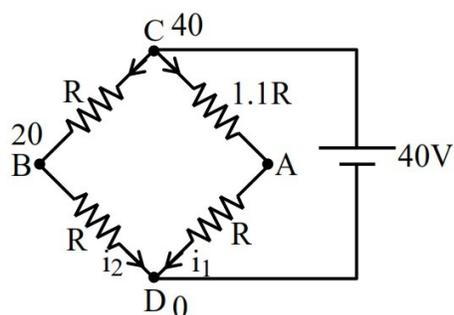

Circuit diagram for Question 31 with values. R1 = R, R2 = R, R3 = 1.1R, R4 = R. The 40V source is connected across C and D. Currents i1 and i2 are shown entering node D from R4 and R2 respectively.

$$V_A = \frac{V}{2}$$

$$V_B = \frac{V}{2.1R} \times R = \frac{V}{2.1}$$

$$\therefore V_A - V_B = V \left[ \frac{1}{2} - \frac{1}{2.1} \right]$$

$$V_A - V_B = \frac{0.1}{2 \times 2.1} \times 40$$

$$V_A - V_B = \frac{4}{4.2} = 0.95$$

32. In an experiment, a set of reading are obtained  $-1.24$  mm,  $1.25$  mm,  $1.23$  mm,  $1.21$  mm. The expected least count of the instrument used in recording these readings is \_\_\_\_\_ mm.

- (1) 0.01 (2) 0.001  
(3) 0.1 (4) 0.05

Ans. (1)

Sol. Least count will be 0.01 mm.

33. A particle starts moving from time  $t = 0$  and its coordinate is given as  $x(t) = 4t^3 - 3t$ .

- A. The particle returns to its original position (origin) 0.866 units later  
B. The particle is 1 unit away from origin at its turning point.  
C. Acceleration of the particle is non-negative.  
D. The particle is 0.5 units away from origin at its turning point.  
E. Particle never turns back as acceleration is non-negative.

Choose the **correct** answer from the options given below :

- (1) A,C,D only (2) A,B,C only  
(3) C,E only (4) A,C only

Ans. (2)

$$\text{Sol. } x = 0 \Rightarrow t = 0, \frac{\sqrt{3}}{2}$$

$$v = 12t^2 - 3$$

$$\text{At turning point, } v = 0$$

$$t = \frac{1}{2} \Rightarrow x = \frac{4}{8} - \frac{3}{2} = -1$$

$$a = 24t \text{ (always positive)}$$

34. The speed of a longitudinal wave in a metallic bar is 400 m/s. If the density and Young's modulus of the bar material are increased by 0.5% and 1% respectively then the speed of the wave is changed approximately to \_\_\_\_\_ m/s.

- (1) 399 (2) 398 (3) 402 (4) 401

Ans. (4)

$$\text{Sol. } V_{\text{sound}} = \sqrt{\frac{Y}{\rho}}$$

$$\frac{\Delta V}{V} \times 100 = \frac{1}{2} \left( \frac{\Delta Y}{Y} \times 100 \right) - \frac{1}{2} \left( \frac{\Delta \rho}{\rho} \times 100 \right)$$

$$= \frac{1}{2} \times 1 - \frac{1}{2} \times 0.5$$

$$\frac{\Delta V}{V} \times 100 = \frac{1}{4}$$

$$\Delta V = \frac{1}{4} \times \frac{V}{100}$$

$$\Delta V = 1 \text{ m/s}$$

$$V_{\text{final}} = 400 + 1 = 401 \text{ m/s}$$

35. Identify the correct statements :

- A. Effective capacitance of a series combination of capacitors is always smaller than the smallest capacitance of the capacitor in the combination.
- B. When a dielectric medium is placed between the charged plates of a capacitor, displacement of charges cannot occur due to insulation property of dielectric.
- C. Increasing of area of capacitor plate or decreasing of thickness of dielectric is an alternate method to increase the capacitance.
- D. For a point charge, concentric spherical shells centered at the location of the charge are equipotential surfaces.

Choose the **correct** answer from the options given below.

- (1) A, B and C only
- (2) C and D only
- (3) A, C and D only
- (4) B and D only

Ans. (3)

Sol. For series combination

$$\frac{1}{C_{\text{eq}}} = \frac{1}{C_1} + \frac{1}{C_2}$$

$\therefore C_{\text{eq}}$  is less than  $C_1$  &  $C_2$ .

**Note :** In statement C, capacitor is assumed to be completely filled with dielectric then on decreasing thickness of dielectric capacitance will increase.

36. Number of photons of equal energy emitted per second by a 6 mW laser source operating at 663 nm is \_\_\_\_\_.

(Given :  $h = 6.63 \times 10^{-34}$  J.s and  $c = 3 \times 10^8$  m/s)

- (1)  $5 \times 10^{16}$
- (2)  $5 \times 10^{15}$
- (3)  $10 \times 10^{15}$
- (4)  $2 \times 10^{16}$

Ans. (4)

$$\text{Sol. } P = \frac{nhc}{\lambda}$$

$$6 \times 10^{-3} = \frac{n \times 6.63 \times 10^{-34} \times 3 \times 10^8}{663 \times 10^{-9}}$$

$$n = 2 \times 10^{16} \text{ photons}$$

37. When the position vector  $\vec{r} = x\hat{i} + y\hat{j} + z\hat{k}$  changes sign as  $-\vec{r}$ , which one of the following vector will not flip under sign change ?

- (1) Linear momentum
- (2) Velocity
- (3) Acceleration
- (4) Angular momentum

Ans. (4)

$$\text{Sol. } \vec{r} = x\hat{i} + y\hat{j} + z\hat{k}$$

$$\vec{v} = \frac{d\vec{r}}{dt} = v_x\hat{i} + v_y\hat{j} + v_z\hat{k}$$

$$\vec{p} = m\vec{v}$$

$$\vec{L} = m(\vec{r} \times \vec{v})$$

$$= (x\hat{i} + y\hat{j} + z\hat{k}) \times m(v_x\hat{i} + v_y\hat{j} + v_z\hat{k})$$

When sign of  $\vec{r}$  changes,  $\vec{L}$  remains same.

38. Which one of the following is **not** a measurable quantity ?

- (1) Voltage difference
- (2) Resistance
- (3) Voltage
- (4) Displacement current

Ans. (3)

Sol. Here from voltage, question refers to potential. We can measure potential difference between two points but not potential at any point.

**Note :** If the potential of reference point is known then we can measure potential as well.

39. A long cylindrical conductor with large cross section carries an electric current distributed uniformly over its cross-section. Magnetic field due to this current is :

- A. maximum at either ends of the conductor and minimum at the midpoint
- B. maximum at the axis of the conductor
- C. minimum at the surface of the conductor
- D. minimum at the axis of the conductor
- E. same at all points in the cross-section of the conductor

Choose the **correct** answer from the options given below :

- (1) D Only
- (2) A, D Only
- (3) B, C Only
- (4) E Only

Ans. (1)

Sol. Solid cylinder

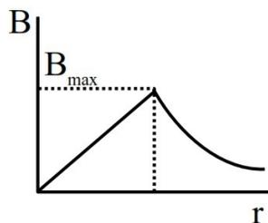

Graph of Magnetic Field (B) versus radial distance (r) for a solid cylinder. The graph shows a linear increase from the origin to a peak value B\_max at the surface, followed by a non-linear decrease for r > surface radius.

$B_{\max}$  at surface

$B_{\min}$  at Axis

40. A small block of mass  $m$  slides down from the top of a frictionless inclined surface, while the inclined plane is moving towards left with constant acceleration  $a_0$ . The angle between the inclined plane and ground is  $\theta$  and its base length is  $L$ . Assuming that initially the small block is at the top of the inclined plane, the time it takes to reach the lowest point of the inclined plane is \_\_\_\_\_.

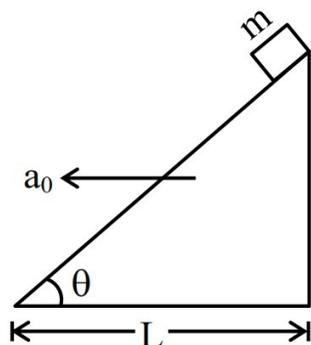

Diagram of an inclined plane with angle theta and base length L. The plane is moving to the left with acceleration a\_0. A small block of mass m is at the top of the incline.

- (1)  $\sqrt{\frac{2L}{g \sin 2\theta - a_0 (1 + \cos 2\theta)}}$
- (2)  $\sqrt{\frac{4L}{g \sin 2\theta - a_0 (1 + \cos 2\theta)}}$
- (3)  $\sqrt{\frac{4L}{g \cos^2 \theta - a_0 \sin \theta \cos \theta}}$
- (4)  $\sqrt{\frac{2L}{g \sin \theta - a_0 \cos \theta}}$

Ans. (2)

Free body diagram of the block on the inclined plane. Forces shown are: Normal force (N) perpendicular to the plane, gravitational force (mg) vertically downwards, pseudo force (ma\_0 cos theta) perpendicular to the plane, and pseudo force (ma\_0 sin theta) parallel to the plane. The angle theta is also indicated.

Sol.

$$mg \sin \theta - ma_0 \cos \theta = ma$$

$$a = g \sin \theta - a_0 \cos \theta$$

Now using,

$$S = ut + \frac{1}{2} a_{\text{down}} t^2$$

$$\frac{L}{\cos \theta} = \frac{1}{2} (g \sin \theta - a_0 \cos \theta) t^2$$

$$t = \sqrt{\frac{2L}{g \sin \theta \cos \theta - a_0 \cos^2 \theta}}$$

$$t = \sqrt{\frac{4L}{g \sin 2\theta - a_0 (1 + \cos 2\theta)}}$$

41. Identify the correct statements :

- A. Electrostatic field lines form closed loops.
- B. The electric field lines point radially outward when charge is greater than zero.
- C. The Gauss-Law is valid only for inverse-square force.
- D. The workdone in moving a charged particle in a static electric field around a closed path is zero.
- E. The motion of a particle under Coulomb's force must take place in a plane.

Choose the **correct** answer from the options given below :

- (1) A, B, D, E Only
- (2) A, B, C, D Only
- (3) B, C, D, E Only
- (4) A, C, E Only

Ans. (3)

Sol. Theoretical

42. As shown in the figure, a spring is kept in a stretched position with some extension by holding the masses 1 kg and 0.2 kg with a separation more than spring natural length and are released. Assuming the horizontal surface to be frictionless, the angular frequency (in SI unit) of the system is :

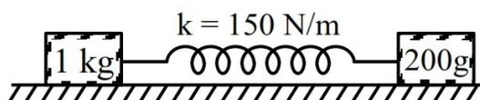

Diagram of a spring-mass system. A spring with constant k = 150 N/m is attached to two masses, 1 kg and 200 g, on a frictionless horizontal surface. The masses are being held in a stretched position.

- (1) 30 (2) 27 (3) 20 (4) 5

Ans. (1)

$$\text{Sol. } \mu = \frac{m_1 m_2}{m_1 + m_2} = \frac{1 \times 0.2}{1.2}$$

$$\mu = \frac{1}{6}$$

$$\omega = \sqrt{\frac{k}{\mu}} = \sqrt{\frac{150}{1/6}} = 30$$

43. For a transparent prism, if the angle of minimum deviation is equal to its refracting angle, the refractive index  $n$  of the prism satisfies.

- (1)  $\sqrt{2} < n < 2\sqrt{2}$  (2)  $1 < n < 2$   
(3)  $n \geq 2$  (4)  $\sqrt{2} < n < 2$

Ans. (4)

$$\text{Sol. } \delta_{\min} = 2i - A \Rightarrow i = \delta_{\min} = A$$

$$\text{Also, } \mu = \frac{\sin\left(\frac{\delta_{\min} + A}{2}\right)}{\sin\left(\frac{A}{2}\right)}$$

$$\Rightarrow \mu = \frac{\sin A}{\sin \frac{A}{2}} = 2 \cos\left(\frac{A}{2}\right)$$

$$1 < \mu < 2 \quad \dots (1)$$

$$\delta_{\min} = 2i - A$$

$$A = 2i - A \Rightarrow i = A$$

$$i < 90^\circ \text{ (grazing incidence)}$$

$$A < 90^\circ$$

$$\mu = 2 \cos(A/2)$$

$$\& A < 90^\circ$$

$$\mu > \sqrt{2} \quad \dots (2)$$

$$\text{from (i) \& (2)}$$

$$\sqrt{2} < \mu < 2$$

44. The time period of a simple harmonic oscillator is

$$T = 2\pi\sqrt{\frac{k}{m}}$$

The measured value of mass (m) of the object is 10 g with an accuracy of 10 mg, and time for 50 oscillations of the spring is found to be 60 s using a watch of 2 s resolution. Percentage error in determination of spring constant(k) is \_\_\_\_\_%.

- (1) 3.43 (2) 3.35 (3) 7.60 (4) 6.76

Ans. (4)

$$\text{Sol. } \frac{\Delta K}{K} = \frac{2\Delta T}{T} + \frac{\Delta m}{m}$$

$$T = \frac{60}{50} = 1.2 \text{ sec}$$

$$\Delta T = \frac{2}{50}$$

$$\therefore \frac{\Delta K}{K} = \frac{2 \times 2}{50 \times 1.2} + \frac{10 \times 10^{-3}}{10} = 0.0676$$

$$\therefore \% \text{ Error} = 6.76\%$$

45. Match List-I with List-II.

|    | List-I                   |      | List-II           |
|----|--------------------------|------|-------------------|
| A. | Coefficient of viscosity | I.   | $[ML^{-1}T^{-2}]$ |
| B. | Surface tension          | II.  | $[ML^2T^{-2}]$    |
| C. | Pressure                 | III. | $[ML^0T^{-2}]$    |
| D. | Surface energy           | IV.  | $[ML^{-1}T^{-1}]$ |

Choose the **correct** answer from the options given below :

- (1) A-I, B-II, C-IV, D-III  
(2) A-IV, B-III, C-I, D-II  
(3) A-I, B-III, C-II, D-IV  
(4) A-IV, B-I, C-II, D-III

Ans. (2)

$$\text{Sol. (A) } \eta = \frac{F_{\text{dr}}}{A_{\text{dv}}} = \frac{[MLT^{-2}][L]}{[L^2][LT^{-1}]} = [ML^{-1}T^{-1}]$$

$$\text{(B) } S = \frac{F}{L} = \frac{[MLT^{-2}]}{[L]} = [MT^{-2}]$$

$$\text{(C) } P = \frac{F}{A} = \frac{[MLT^{-2}]}{[L^2]} = [ML^{-1}T^{-2}]$$

$$\text{(D) } E = S \times A = [MT^{-2}][L^2] = [ML^2T^{-2}]$$

#### SECTION-B

46. Two tuning forks A and B are sounded together giving rise to 8 beats in 2 s. When fork A is loaded with wax, the beat frequency is reduced to 4 beats in 2 s. If the original frequency of tuning fork B is 380 Hz, then the original frequency of tuning fork A is \_\_\_\_\_ Hz.

Ans. (384)

Sol.  $|f_A - f_B| = 4$   
 $|f_A - 380| = 4$   
 So,  $f_A = 384$  Hz or 376 Hz  
 on loading with wax  $f_A$  decreases  
 So,  $f_A = 384$  Hz

47. A thermodynamic system is taken through the cyclic process ABC as shown in the figure. The total work done by the system during the cycle ABC is \_\_\_\_\_ J.

A P-V diagram showing a cyclic process ABC. The vertical axis is Pressure P in Pascals (Pa) with values 100 and 300. The horizontal axis is Volume V in cubic meters (m³) with values 2 and 5. The cycle consists of three points: A(2, 100), B(5, 300), and C(5, 100). The path is A to B (a straight line), B to C (a vertical line down), and C to A (a horizontal line left).

Ans. (300)

Sol. Work done = Area bounded by cycle  
 $= \frac{1}{2} \times 3 \times 200 = 300$  J

48. An inductor stores 16 J of magnetic field energy and dissipates 32 W of thermal energy due to its resistance when an a.c. current of 2 A (rms) and frequency 50 Hz flows through it. The ratio of inductive reactance to its resistance is \_\_\_\_\_. ( $\pi = 3.14$ )

Ans. (314)

Sol.  $\frac{1}{2} L i_{rms}^2 = 16 \Rightarrow L = 8$   
 $i^2 R = 32 \Rightarrow R = 8$   
 $x_L = \omega L \Rightarrow 2 \times 3.14 \times 50 \times 8$   
 $\Rightarrow 800 \times 3.14$   
 $R = 8$   
 $\frac{x_L}{R} = 314$

49. A beam of light consisting of wavelengths 650 nm and 550 nm illuminates the Young's double slits with separation of 2 mm such that the interference fringes are formed on a screen, placed at a distance of 1.2 m from the slits. The least distance of a point from the central maximum, where the bright fringes due to both the wavelengths coincide, is \_\_\_\_\_  $\times 10^{-5}$  m.

Ans. (429)

Sol.  $y = n \frac{\lambda D}{d}$   
 $y_1 = y_2$   
 $n_1 \lambda_1 \frac{D}{d} = n_2 \lambda_2 \frac{D}{d}$   
 $\frac{n_1}{n_2} = \frac{\lambda_2}{\lambda_1} = \frac{550}{650} = \frac{11}{13}$   
 $y = 11 \times \frac{\lambda_1 D}{d} = \frac{11 \times 650 \times 10^{-9} \times 1.2}{2 \times 10^{-3}}$   
 $y = 429 \times 10^{-5}$

50. A fly wheel having mass 3 kg and radius 5 m is free to rotate about a horizontal axis. A string having negligible mass is wound around the wheel and the loose end of the string is connected to a 3 kg mass. The mass is kept at rest initially and released. Kinetic energy of the wheel when the mass descends by 3 m is \_\_\_\_\_ J. ( $g = 10$  m/s2)

Ans. (30)

Sol.

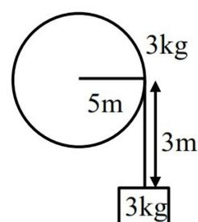

A diagram of a flywheel with mass 3 kg and radius 5 m. A string is wound around its circumference, and a 3 kg mass is attached to the loose end. The mass is shown hanging 3 m below the wheel.

$$mg \times 3 = \frac{1}{2} \cdot \frac{mR^2}{2} \omega^2 + \frac{1}{2} m v^2 \quad \dots(i)$$

$$\& v = \omega R \quad \dots(ii)$$

From equation (i) & (ii)

$$g \times 3 = \frac{3}{4} \cdot v^2$$

$$\begin{aligned} \text{K.E. of flywheel} &= \frac{1}{2} \times \frac{mR^2}{2} \times \omega^2 = \frac{1}{4} m v^2 \\ &= \frac{1}{4} \times 3 \times 40 = 30 \text{ Joule} \end{aligned}$$

### CHEMISTRY

#### SECTION-A

51. Identify the **correct** statements :

The presence of  $\text{-NO}_2$  group in benzene ring

- A. activates the ring towards electrophilic substitutions.
- B. deactivates the ring towards electrophilic substitutions.
- C. activates the ring towards nucleophilic substitutions.
- D. deactivates the ring towards nucleophilic substitutions.

- (1) B and D Only
- (2) C and A Only
- (3) A and D Only
- (4) B and C Only

Ans. (4)

Sol. Presence of  $\text{NO}_2$  group in Benzene ring deactivate ring towards electrophilic substitution reaction due to  $\text{-M}$  effective & activate ring towards nucleophilic substitution.

Ans.  $\rightarrow$  (4) B & C

52. Given below are two statements :

**Statement I :** The increasing order of boiling point of hydrogen halides is  $\text{HCl} < \text{HBr} < \text{HI} < \text{HF}$ .

**Statement II :** The increasing order of melting point of hydrogen halides is  $\text{HCl} < \text{HBr} < \text{HF} < \text{HI}$ .

In the light of the above statements, choose the **correct** answer from the options given below :

- (1) Both Statement I and Statement II are true
- (2) Statement I is true but Statement II is false
- (3) Both Statement I and Statement II are false
- (4) Statement I is false but Statement II is true

Ans. (1)

Sol. Correct order of

- (i) Boiling point :  $\text{HF} > \text{HI} > \text{HBr} > \text{HCl}$
- (ii) Melting point :  $\text{HI} > \text{HF} > \text{HBr} > \text{HCl}$

53. Consider the elements N, P, O, S, Cl and F. The number of valence electrons present in the elements with most and least metallic character from the above list is respectively.

- (1) 7 and 5
- (2) 5 and 6
- (3) 5 and 7
- (4) 6 and 7

Ans. (3)

Sol. Least metallic = F, valence electrons = 7

Most metallic = P, valence electrons = 5

54. Observe the following equilibrium in a 1 L flask.

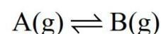

$$\text{A(g)} \rightleftharpoons \text{B(g)}$$

At  $\text{T(K)}$ , the equilibrium concentrations of A and B are 0.5 M and 0.375 M respectively. 0.1 moles of A is added into the flask and heated to  $\text{T(K)}$  to establish the equilibrium again. The new equilibrium concentrations (in M) of A and B are respectively.

- (1) 0.367, 0.275
- (2) 0.53, 0.4
- (3) 0.742, 0.557
- (4) 0.557, 0.418

Ans. (4)

Sol.  $\text{A} \rightleftharpoons \text{B}$

0.5M            0.375 M            (At equilibrium)

$$K_{\text{eq}} = \frac{[\text{B}]_{\text{eq}}}{[\text{A}]_{\text{eq}}} = \frac{0.375}{0.5} = 0.75$$

Now 0.1 mole of A is added so reaction will move in forward direction.

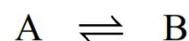

$$\text{A} \rightleftharpoons \text{B}$$

$0.6 - x$        $0.375 + x$

$$K_{\text{eq}} = 0.75 = \frac{0.375 + x}{0.6 - x}$$

$$0.45 - 0.75x = 0.375 + x$$

$$1.75x = 0.075$$

$$x = \frac{0.075}{1.75} = \frac{3}{70} = 0.043$$

Moles of A =  $0.043 + 0.557$

Moles of B = 0.418

Ans. (4) is correct.

55. The plot of  $\log_{10} K$  vs  $\frac{1}{T}$  gives a straight line. The intercept and slope respectively are (where K is equilibrium constant).

- (1)  $\frac{2.303R}{\Delta H^\circ}, \frac{2.303R}{\Delta S^\circ}$  (2)  $\frac{\Delta S^\circ}{2.303R}, -\frac{\Delta H^\circ}{2.303R}$   
 (3)  $-\frac{\Delta S^\circ R}{2.303}, \frac{\Delta H^\circ R}{2.303}$  (4)  $-\frac{\Delta H^\circ}{2.303R}, \frac{\Delta S^\circ}{2.303R}$

Ans. (2)

Sol.  $\log_{10} K = -\frac{\Delta H^\circ}{2.303RT} + \frac{\Delta S^\circ}{2.303R}$

y-intercept =  $\frac{\Delta S^\circ}{2.303R}$

Slope =  $-\frac{\Delta H^\circ}{2.303R}$

Ans. (2) is correct.

56. The reactions which produce alcohol as the product are :

- A.  $\text{CH}_4 + \text{O}_2 \xrightarrow[\Delta]{\text{Mo}_2\text{O}_3}$   
 B.  $2\text{CH}_3\text{CH}_3 + 3\text{O}_2 \xrightarrow[\Delta]{(\text{CH}_3\text{COO})_2\text{Mn}}$   
 C.  $(\text{CH}_3)_3\text{CH} \xrightarrow{\text{KMnO}_4}$   
 D.  $2\text{CH}_4 + \text{O}_2 \xrightarrow{\text{Cu}/523\text{K}/100\text{ atm.}}$   
 E.  $\text{CH}_3-\text{CH}=\text{CH}-\text{CH}_3 \xrightarrow{\text{KMnO}_4/\text{H}^+}$

Choose the **correct** answer from the options given below :

- (1) A and D Only (2) A, C and E Only  
 (3) C and D Only (4) B, D and E Only

Ans. (3)

Sol. Reaction given Alcohol

- (A)  $\text{CH}_4 + \text{O}_2 \xrightarrow[\Delta]{\text{Mo}_2\text{O}_3} \text{HCHO}$   
 (B)  $2\text{CH}_3\text{CH}_3 + 3\text{O}_2 \xrightarrow[\Delta]{(\text{CH}_3\text{COO})_2\text{Mn}} \text{CH}_3\text{COOH}$   
 (C) 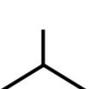  $\xrightarrow{\text{KMnO}_4}$  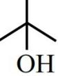  
 (D)  $2\text{CH}_4 + \text{O}_2 \xrightarrow[523\text{K}, 100\text{ atm.}]{\text{Cu}} \text{CH}_3-\text{OH}$   
 (E) 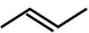  $\xrightarrow{\text{KMnO}_4/\text{H}^+} \text{CH}_3\text{COOH}$

And.  $\rightarrow$  (3) C, D

57. Consider the following statements about manganate and permanganate ions. Identify the **correct** statements :

- A. The geometry of both manganate and permanganate ions is tetrahedral.  
 B. The oxidation states of Mn in manganate and permanganate are +7 and +6, respectively.  
 C. Oxidation of Mn(II) salt by peroxodisulphate gives manganate ion as the final product.  
 D. Manganate ion is paramagnetic and permanganate ions is diamagnetic.  
 E. Acidified permanganate ion reduces oxalate, nitrite and iodide ions.

Choose the **correct** answer from the options given below:

- (1) A, C and D Only (2) A, B and C Only  
 (3) A, D and E Only (4) A and D Only

Ans. (4)

Sol. Manganate ion  $\rightarrow \text{MnO}_4^{-2}$

Permanganate ion  $\rightarrow \text{MnO}_4^-$

- (A) Both are tetrahedral ( $d^3$  s Hybridisation)  
 (B)  $\text{MnO}_4^-$  (+7 oxidation state)  
 $\text{MnO}_4^{-2}$  (+6 oxidation state)  
 (C)  $\text{Mn}^{2+} + \text{S}_2\text{O}_8^{2-} \rightarrow \text{MnO}_4^-$  (Permanganate ion)  
 (D)  $\text{MnO}_4^- \rightarrow$  Diamagnetic  
 $\text{MnO}_4^{-2} \rightarrow$  Paramagnetic  
 (E) It is oxidising agent

58. Which of the following reaction is NOT correctly represented ?

- (1) 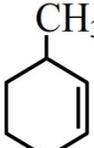  $\xrightarrow{\text{Br}_2, h\nu}$  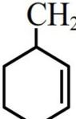  
 (2) 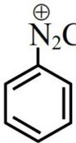  $\xrightarrow{\text{Cu}_2\text{Br}_2/\text{HBr}}$  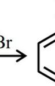  
 (3) 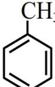  $\xrightarrow{\text{Br}_2, h\nu}$  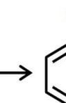  
 (4) 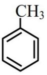  $\xrightarrow[\text{dark}]{\text{Br}_2, \text{Fe}} \text{Ortho and para Bromotoluenes}$

Ans. (1)

Sol. (1)

(2)

(3)

(4)

Reaction of methylcyclohexane with Br2 under hv to form bromomethylcyclohexane Reaction of aniline with Cu2Br2/HB to form bromobenzene Reaction of toluene with Br2 under hv to form benzyl bromide Reaction of toluene with Br2 in the dark with Fe to form ortho-bromotoluene and para-bromotoluene

Major product of reaction (1) will be

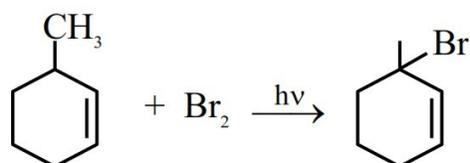

Reaction of methylcyclohexane with Br2 under hv to form 1-bromomethylcyclohexane

As 3° radical more stable

Ans. (1)

59. The wavelength of photon 'A' is 400 nm. The frequency of photon 'B' is  $10^{16} \text{ s}^{-1}$ . The wave number of photon 'C' is  $10^4 \text{ cm}^{-1}$ . The correct order of energy of these photons is :

- (1)  $C > B > A$                       (2)  $B > A > C$   
 (3)  $A > B > C$                       (4)  $A > C > B$

Ans. (2)

Sol. (1) Wavelength of A = 400 nm.

$$(2) \text{ Wavelength of B } (\lambda) = \frac{C}{\nu} = \frac{3 \times 10^8}{10^{16}} \\ = 3 \times 10^{-8} = 30 \times 10^{-9} = 30 \text{ nm.}$$

$$(3) \text{ Wavelength of C } (\lambda) = \frac{1}{\bar{\nu}} = \frac{1}{10^4} = 10^{-4} \text{ cm} \\ = 10^{-6} \text{ m} = 1000 \text{ nm}$$

Here  $\lambda_C > \lambda_A > \lambda_B$

$$\text{Energy}(E) \propto \frac{1}{\lambda}$$

So  $E_B > E_A > E_C$

Ans. (2) is correct.

60. The cyclic cations having the same number of hyperconjugation are :

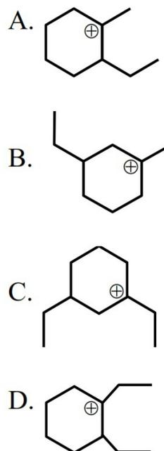

A.

B.

C.

D.

Cyclic cation structure A Cyclic cation structure B Cyclic cation structure C Cyclic cation structure D

Choose the **correct** answer from the options given below :

- (1) A and C Only  
 (2) B and C Only  
 (3) A and B Only  
 (4) A, C and D only

Ans. (1)

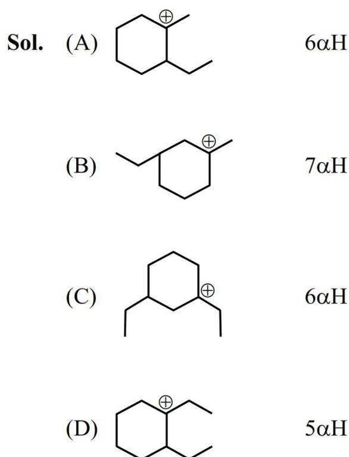

Sol. (A)  $6\alpha\text{H}$

(B)  $7\alpha\text{H}$

(C)  $6\alpha\text{H}$

(D)  $5\alpha\text{H}$

Cyclic cation structure A Cyclic cation structure B Cyclic cation structure C Cyclic cation structure D

Ans. – (1) A & C

61. Structures of four disaccharides are given below. Among the given disaccharides, the non-reducing sugar is :

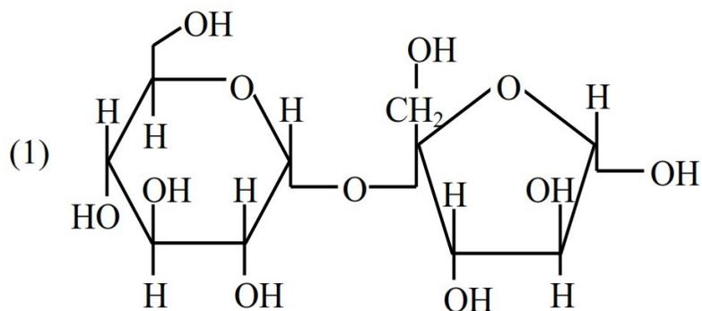

(1)

Structure of sucrose: A glucose unit (pyranose) linked via an alpha-1,2-glycosidic bond to a fructose unit (furanose). The linkage is between the anomeric carbons of both units, making it a non-reducing sugar.

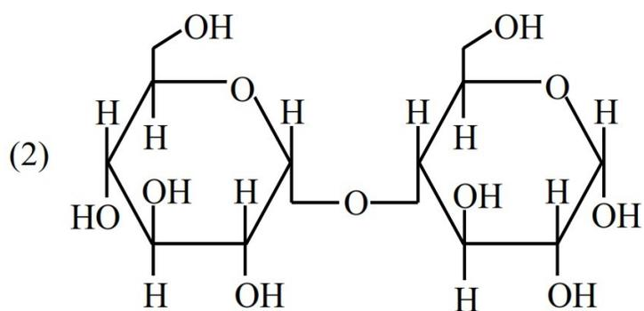

(2)

Structure of maltose: A glucose unit linked via an alpha-1,4-glycosidic bond to another glucose unit. The right glucose unit has a free anomeric carbon, making it a reducing sugar.

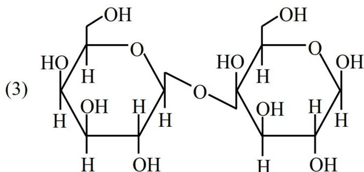

(3)

Structure of cellobiose: Two glucose units linked via a beta-1,4-glycosidic bond. The right glucose unit has a free anomeric carbon, making it a reducing sugar.

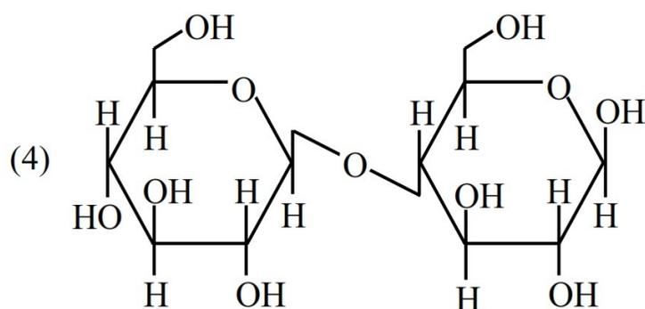

(4)

Structure of lactose: A galactose unit linked via a beta-1,4-glycosidic bond to a glucose unit. The right glucose unit has a free anomeric carbon, making it a reducing sugar.

Ans. (1)

Sol. Structure (1) given is of sucrose which is non reducing.

For non reducing sugar compound should have acetal linkage not hemi acetal linkage.

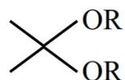

General structure of an acetal: A central carbon atom bonded to two -OR groups and two other groups (represented by lines).

62. Match List-I with List-II according to shape.

| List-I                      | List-II               |
|-----------------------------|-----------------------|
| A. $\text{XeO}_3$           | I. $\text{BrF}_5$     |
| B. $\text{XeF}_2$           | II. $\text{NH}_3$     |
| C. $\text{XeO}_2\text{F}_2$ | III. $[\text{I}_3]^-$ |
| D. $\text{XeOF}_4$          | IV. $\text{SF}_4$     |

Choose the **correct** answer from the options given below :

- (1) A-II, B-I, C-III, D-IV  
 (2) A-II, B-III, C-IV, D-I  
 (3) A-II, B-III, C-I, D-IV  
 (4) A-III, B-II, C-IV, D-I

Ans. (2)

Sol.  $\text{XeF}_2$  &  $[\text{I}_3]^-$  : 2 bond pair 3 lone pair ; Linear

$\text{XeOF}_4$  &  $\text{BrF}_5$  : 5 bond pair 1 lone pair ; Square pyramidal

$\text{XeO}_2\text{F}_2$  &  $\text{SF}_4$  : 4 bond pair 1 lone pair ; See saw

$\text{XeO}_3$  &  $\text{NH}_3$  : 3 bond pair 1 lone pair ; Pyramidal

63. A student performed analysis of aliphatic organic compound 'X' which on analysis gave C = 61.01%, H=15.25%, N=23.74%.

This compound, on treatment with  $\text{HNO}_2/\text{H}_2\text{O}$  produced another compound 'Y' which did not contain any nitrogen atom. However, the compound 'Y' upon controlled oxidation produced another compound 'Z' that responded to iodoform test.

The structure of 'X' is:

- (1)  $\text{CH}_3\text{CH}_2\text{CH}_2\text{NH}_2$       (2)  $\text{Ph}-\underset{\text{CH}_3}{\underset{|}{\text{CH}}}-\text{NH}_2$   
 (3)  $\text{CH}_3-\underset{\text{CH}_3}{\underset{|}{\text{CH}}}-\text{NH}_2$       (4)  $\text{CH}_3-\text{CH}_2\underset{\text{NH}_2}{\underset{|}{\text{CH}}}-\text{CH}_3$

Ans. (3)

Sol.

Reaction scheme: Isopropylamine (CH3-CH(CH3)-NH2) reacts with HNO2 to form isopropyldiazonium ion (CH3-CH(CH3)-N2+). Loss of N2 gives isopropyl cation (CH3-CH(CH3)+). Reaction with H2O gives isopropanol (CH3-CH(CH3)-OH), labeled as (Y). Oxidation of (Y) gives acetone (CH3-C(=O)-CH3), labeled as (Z). Acetone is noted to give a positive iodoform test.

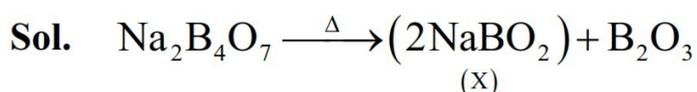

Sol.  $\text{Na}_2\text{B}_4\text{O}_7 \xrightarrow{\Delta} (2\text{NaBO}_2) + \text{B}_2\text{O}_3$   
(X)

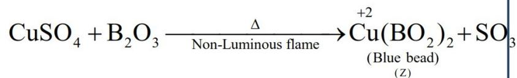

$\text{CuSO}_4 + \text{B}_2\text{O}_3 \xrightarrow[\text{Non-Luminous flame}]{\Delta} \overset{+2}{\text{Cu}(\text{BO}_2)_2} + \text{SO}_3$   
(Blue bead) (Z)

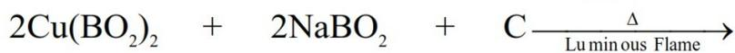

$2\text{Cu}(\text{BO}_2)_2 + 2\text{NaBO}_2 + \text{C} \xrightarrow{\Delta} \text{Cu}_2\text{O} + 2\text{Na}_2\text{B}_4\text{O}_7 + \text{CO}_2$   
Luminous Flame

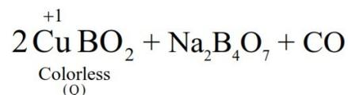

$2\overset{+1}{\text{Cu}}\text{BO}_2 + \text{Na}_2\text{B}_4\text{O}_7 + \text{CO}_2$   
Colorless (Q)

68. For the given reaction;

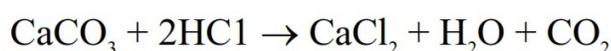

$\text{CaCO}_3 + 2\text{HCl} \rightarrow \text{CaCl}_2 + \text{H}_2\text{O} + \text{CO}_2$

If 90 g  $\text{CaCO}_3$  is added to 300 mL of HCl which contains 38.55% HCl by mass and has density  $1.13 \text{ g mL}^{-1}$ , then which of the following option is correct?

Given molar mass of H, Cl, Ca and O are 1, 35.5, 40 and 16  $\text{g mol}^{-1}$  respectively.

- (1) 64.97 g of HCl remains unreacted
- (2) 32.85 g of  $\text{CaCO}_3$  remains unreacted
- (3) 97.30 g of HCl reacted
- (4) 60.32 g of HCl remains unreacted

Ans. (1)

Sol. Density of HCl solution (d) =  $1.13 \text{ g/mL}$

V = 300 mL

Wt. of HCl solution = 339 g

$$\text{Wt. of HCl} = 339 \times \frac{38.55}{100} = 130.68 \text{ g}$$

(LR)

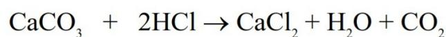

$\text{CaCO}_3 + 2\text{HCl} \rightarrow \text{CaCl}_2 + \text{H}_2\text{O} + \text{CO}_2$

$$\begin{array}{cc} 90 & 130.68 \\ 100 & 36.5 \end{array}$$

$$= 0.90 \text{ mole} \quad = 3.58 \text{ mole}$$

Moles of HCl remained = 1.78 mole.

Mass of HCl remained = 64.97 g.

69. The correct increasing order of spin-only magnetic moment values of the complex ions  $[\text{MnBr}_4]^{2-}$  (A),  $[\text{Cu}(\text{H}_2\text{O})_6]^{2+}$  (B),  $[\text{Ni}(\text{CN})_4]^{2-}$  (C) and  $[\text{Ni}(\text{H}_2\text{O})_6]^{2+}$  (D) is:

- (1)  $A = B < C < D$
- (2)  $A = B < D < C$
- (3)  $C = D < B < A$
- (4)  $C < B < D < A$

Ans. (4)

Sol.  $\text{Mn}^{2+} 3\text{d}^5 \text{ n} = 5$

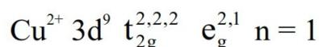

$\text{Cu}^{2+} 3\text{d}^9 \text{ t}_{2\text{g}}^{2,2,2} \text{ e}_\text{g}^{2,1} \text{ n} = 1$

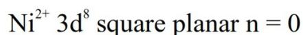

$\text{Ni}^{2+} 3\text{d}^8$  square planar  $\text{n} = 0$

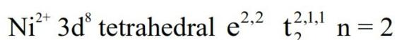

$\text{Ni}^{2+} 3\text{d}^8$  tetrahedral  $\text{e}^{2,2} \text{ t}_2^{2,1,1} \text{ n} = 2$

70. A student has been given 0.314 g of an organic compound and asked to estimate Sulphur. During the experiment, the student has obtained 0.4813 g of barium sulphate. The percentage of sulphur present in the compound is \_\_\_\_\_.

(Given Molar mass in  $\text{g mol}^{-1}$  S:32,  $\text{BaSO}_4$ : 233)

- (1) 42.10%
- (2) 63.15%
- (3) 21.05%
- (4) 48.24%

Ans. (3)

$$\begin{aligned} \text{Sol. } \% \text{S} &= \frac{32}{233} \times \frac{0.4813}{0.314} \times 100 \\ &= 21.052\% \end{aligned}$$

Ans. (3) 21.05%

#### SECTION-B

71. Two positively charged particles  $m_1$  and  $m_2$  have been accelerated across the same potential difference of 200 keV as shown below.

Diagram showing two positively charged particles, m1 and m2, being accelerated across a potential difference of 200 keV in a vacuum. The particles are shown moving from left to right towards a negatively charged plate. The potential difference is indicated by a double-headed arrow labeled '200 keV'.

[Given mass of  $m_1 = 1 \text{ amu}$  and  $m_2 = 4 \text{ amu}$ ]

The deBroglie wavelength of  $m_1$  will be x times of  $m_2$ . The value of x is \_\_\_\_\_. (nearest integer)

Ans. (2)

$$\text{Sol. } \lambda_d = \frac{h}{\sqrt{2m \text{K.E.}}}$$

Here KE is same i.e. 200 k eV

$$\text{So } \lambda_d \propto \frac{1}{\sqrt{m}}$$

$$\frac{(\lambda_d)_{m_1}}{(\lambda_d)_{m_2}} = \sqrt{\frac{m_2}{m_1}} = \sqrt{4} = 2$$

$$(\lambda_d)_{m_1} = 2(\lambda_d)_{m_2}$$

$$\text{So } x = 2.$$

72. A  $\rightarrow$  B (first reaction)

C  $\rightarrow$  D (second reaction)

Consider the above two first-order reactions. The rate constant for first reaction at 500 K is double of the same at 300 K. At 500 K, 50% of the reaction becomes complete in 2 hour. The activation energy of the second reaction is half of that of first reaction. If the rate constant at 500 K of the second reaction becomes double of the rate constant of first reaction at the same temperature; then rate constant for the second reaction at 300 K is \_\_\_\_\_  $\times 10^{-1}$  hour $^{-1}$  (nearest integer).

Ans. (5)

Sol. For A  $\xrightarrow{K_1}$  B

$$\ln(2) = \frac{E_{a_1}}{R} \left[ \frac{1}{300} - \frac{1}{500} \right]$$

$$E_{a_1} = \frac{\ln 2 \times R \times 1500}{2}$$

$$E_{a_2} = \frac{E_{a_1}}{2} = \frac{\ln 2 \times R \times 1500}{4}$$

$$(K_1)_{\text{at } 500 \text{ K}} = \frac{\ln 2}{2}$$

$$(K_2)_{\text{at } 500 \text{ K}} = \ln 2$$

Now for C  $\xrightarrow{K_2}$  D

$$\ln \left[ \frac{(K_2)_{\text{at } 500 \text{ K}}}{(K_2)_{\text{at } 300 \text{ K}}} \right] = \left( \frac{\ln 2 \times R \times 1500}{4} \right) \times \frac{1}{R} \times \left[ \frac{1}{300} - \frac{1}{500} \right]$$

$$(K_2)_{\text{at } 300 \text{ K}} = \frac{\ln 2}{\sqrt{2}} = 0.49$$

$$(K_2)_{\text{at } 300 \text{ K}} = 4.9 \times 10^{-1}$$

Ans is 5.

73. For strong electrolyte  $\Lambda_m$  increases slowly with dilution and can be represented by the equation

$$\Lambda_m = \Lambda_m^\circ - Ac^{1/2}$$

Molar conductivity values of the solutions of strong electrolyte AB at 18°C are given below :

|                                      |      |      |      |      |
|--------------------------------------|------|------|------|------|
| c [mol L $^{-1}$ ]                   | 0.04 | 0.09 | 0.16 | 0.25 |
| $\Lambda_m$ [S cm $^2$ mol $^{-1}$ ] | 96.1 | 95.7 | 95.3 | 94.9 |

The value of constant A based on the above data [in S cm $^2$  mol $^{-1}$ /(mol/L) $^{1/2}$ ] unit is \_\_\_\_\_.

Ans. (4)

Sol. Using equation :  $\Lambda_m = \Lambda_m^\circ - A \sqrt{c}$

$$96.1 = \Lambda_m^\circ - A \sqrt{0.04}$$

$$96.1 = \Lambda_m^\circ - A \times 0.2 \dots\dots\dots(1)$$

$$95.7 = \Lambda_m^\circ - A \times \sqrt{0.09}$$

$$95.7 = \Lambda_m^\circ - A \times 0.3 \dots\dots\dots(2)$$

From eq. (1) and eq. (2)

$$A = 4$$

74. A volume of x mL of 5 M NaHCO $_3$  solution was mixed with 10 mL of 2 M H $_2$ CO $_3$  solution to make an electrolytic buffer. If the same buffer was used in the following electrochemical cell to record a cell potential of 235.3 mV, then the value of x = \_\_\_\_\_ mL (nearest integer).

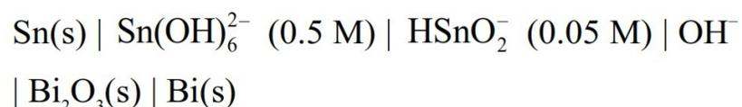

$$\text{Sn(s)} \mid \text{Sn(OH)}_6^{2-} \text{ (0.5 M)} \mid \text{HSnO}_2^- \text{ (0.05 M)} \mid \text{OH}^- \mid \text{Bi}_2\text{O}_3\text{(s)} \mid \text{Bi(s)}$$

Consider upto one place of decimal for intermediate calculations

$$\left[ \begin{array}{l} \text{Given :} \\ E_{\text{HSnO}_2^- \mid \text{Sn(OH)}_6^{2-}}^\circ = -0.9 \text{ V} \\ E_{\text{Bi}_2\text{O}_3 \mid \text{Bi}}^\circ = -0.44 \text{ V} \\ \text{pK}_{a(\text{H}_2\text{CO}_3)} = 6.11 \\ \frac{2.303 RT}{F} = 0.059 \text{ V} \\ \text{Anti log}(1.29) = 19.5 \end{array} \right]$$

Ans. (78)

**Sol.** We have considered

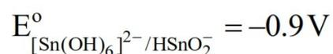

$$E_{[\text{Sn(OH)}_6]^{2-}/\text{HSnO}_2^-}^{\circ} = -0.9 \text{ V}$$

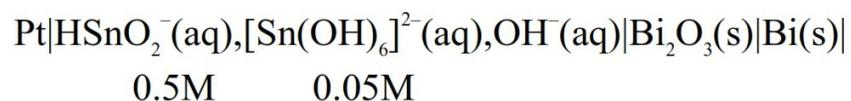

$$\text{Pt} | \text{HSnO}_2^-(\text{aq}), [\text{Sn(OH)}_6]^{2-}(\text{aq}), \text{OH}^-(\text{aq}) | \text{Bi}_2\text{O}_3(\text{s}) | \text{Bi}(\text{s})$$

0.5M            0.05M

$$E_{\text{cell}}^{\circ} = +0.9 - 0.44 = 0.46 \text{ V}$$

**Oxidation Half :**

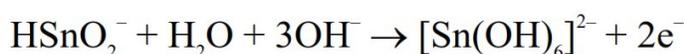

$$\text{HSnO}_2^- + \text{H}_2\text{O} + 3\text{OH}^- \rightarrow [\text{Sn(OH)}_6]^{2-} + 2\text{e}^-$$

**Reduction Half :**

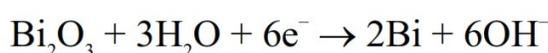

$$\text{Bi}_2\text{O}_3 + 3\text{H}_2\text{O} + 6\text{e}^- \rightarrow 2\text{Bi} + 6\text{OH}^-$$

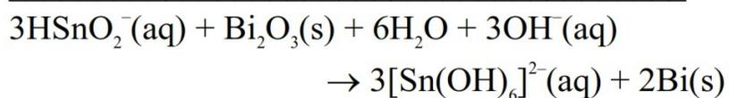

$$3\text{HSnO}_2^-(\text{aq}) + \text{Bi}_2\text{O}_3(\text{s}) + 6\text{H}_2\text{O} + 3\text{OH}^-(\text{aq}) \rightarrow 3[\text{Sn(OH)}_6]^{2-}(\text{aq}) + 2\text{Bi}(\text{s})$$

$$E_{\text{cell}} = E_{\text{cell}}^{\circ} - \frac{0.059}{6} \log \frac{(0.5)^3}{(0.05)^3 \times [\text{OH}^-]^3}$$

$$0.2353 = 0.46 - \frac{0.059}{6} \times 3 \log \left[ \frac{10}{[\text{OH}^-]} \right]$$

$$\log \left[ \frac{10}{\text{OH}^-} \right] = \frac{2 \times 0.2247}{0.059} = 7.6$$

$$1 + \text{pOH} = 7.6$$

$$\text{pOH} = 6.6$$

$$\text{pH} = 14 - 6.6 = 7.4$$

$$\text{pH} = \text{pK}_{a1} + \log \frac{[\text{HCO}_3^-]}{[\text{H}_2\text{CO}_3]}$$

$$7.4 = 6.11 + \log \frac{5x}{20}$$

$$1.29 = \log \frac{x}{4}$$

$$\frac{x}{4} = 19.5$$

$$x = 78$$

**Note :** In question paper,  $E_{\text{HSnO}_2^-/[\text{Sn(OH)}_6]^{2-}}^{\circ} = -0.9 \text{ V}$

data is given, but NTA has given answer by considering  $E_{[\text{Sn(OH)}_6]^{2-}/\text{HSnO}_2^-}^{\circ} = -0.9 \text{ V}$  therefore this question should be **BONUS**.

**75.** The number of isoelectronic species among  $\text{Sc}^{3+}$ ,  $\text{Cr}^{2+}$ ,  $\text{Mn}^{3+}$ ,  $\text{Co}^{3+}$  and  $\text{Fe}^{3+}$  is 'n'. If 'n' moles of AgCl is formed during the reaction of complex with formula  $\text{CoCl}_3(\text{en})_2\text{NH}_3$  with excess of  $\text{AgNO}_3$  solution, then the number of electrons present in the  $t_{2g}$  orbital of the complex is \_\_\_\_\_.

**Ans. (6)**

**Sol.**

|                  |    |
|------------------|----|
| $\text{Sc}^{+3}$ | 18 |
| $\text{Cr}^{+2}$ | 22 |
| $\text{Mn}^{+3}$ | 22 |
| $\text{Co}^{+3}$ | 24 |
| $\text{Fe}^{+3}$ | 23 |

$\text{Cr}^{2+}$  and  $\text{Mn}^{3+}$  are isoelectronic

$$n = 2$$

Complex is :  $[\text{Co(en)}_2\text{NH}_3\text{Cl}]\text{Cl}_2$

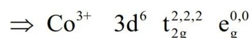

$$\Rightarrow \text{Co}^{3+} \quad 3\text{d}^6 \quad t_{2g}^{2,2,2} \quad e_g^{0,0}$$