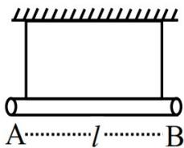
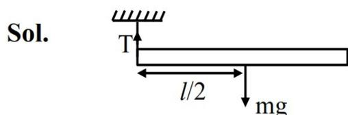
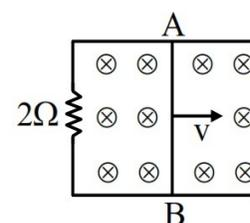
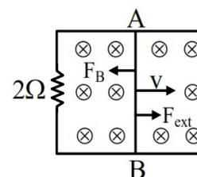

39. A uniform rod of mass  $m$  and length  $l$  suspended by means of two identical inextensible light strings as shown in figure. Tension in one string immediately after the other string is cut, is \_\_\_\_\_. (g acceleration due to gravity)

Diagram of a uniform rod of length l suspended by two vertical strings from a horizontal ceiling. The strings are attached at points A and B at the ends of the rod.

- (1)  $mg/2$  (2)  $mg/4$   
(3)  $mg/3$  (4)  $mg$

Ans. (2)

Sol.

Diagram of a rod of length l suspended by a string at point A. The center of mass is at l/2. Tension T acts upwards at A, and weight mg acts downwards at l/2.

$$mg \frac{l}{2} = \frac{ml^2}{3} \alpha$$

$$\alpha = \frac{3g}{2l} \dots(1)$$

$$mg - T = ma_c$$

$$T = mg - ma_c$$

$$= mg - m \left( \frac{l}{2} \alpha \right)$$

$$= mg - m \left( \frac{l}{2} \cdot \frac{3g}{2l} \right)$$

$$T = \frac{mg}{4}$$

Correct option (2)

40. An aluminium and steel rods having same lengths and cross-sections are joined to make total length of 120 cm at  $30^\circ\text{C}$ . The coefficient of linear expansion of aluminium and steel are  $24 \times 10^{-6}/^\circ\text{C}$  and  $1.2 \times 10^{-5}/^\circ\text{C}$ , respectively. The length of this composite rod when its temperature is raised to  $100^\circ\text{C}$ , is \_\_\_\_\_ cm.

- (1) 120.20 (2) 120.15  
(3) 120.03 (4) 120.06

Ans. (2)

$$\begin{aligned} \text{Sol. } l_{\text{final}} &= l_0(1 + \alpha_A \Delta T) + l_0(1 + \alpha_B \Delta T) \\ &= l_0 [2 + (\alpha_A + \alpha_B) \Delta T] \\ &= 60 [2 + (36 \times 10^{-6}) \times 70] \\ &= 60 [2 + 0.0025] \\ &= 120.15 \text{ cm} \end{aligned}$$

Correct option (2)

41. A 1 m long metal rod AB completes the circuit as shown in figure. The area of circuit is perpendicular to the magnetic field of 0.10 T. If the resistance of the total circuit is  $2\Omega$  then the force needed to move the rod towards right with constant speed (v) of 1.5 m/s is \_\_\_\_\_ N.

Diagram of a circuit with a 2-ohm resistor and a metal rod AB of length 1 m moving with velocity v to the right in a uniform magnetic field B directed into the page. The rod AB completes the circuit.

- (1)  $7.5 \times 10^{-2}$  (2)  $5.7 \times 10^{-3}$   
(3)  $5.7 \times 10^{-2}$  (4)  $7.5 \times 10^{-3}$

Ans. (4)

Sol. To maintain constant speed

$$F_{\text{ext}} = F_B$$

$$\Rightarrow F_{\text{ext}} = iBl$$

$$= \left( \frac{vBl}{R} \right) lB$$

$$= \frac{B^2 l^2 v}{R}$$

$$= \frac{(0.1)^2 \times (1)^2 \times 1.5}{2}$$

$$= 7.5 \times 10^{-3} \text{ N}$$

Diagram of the circuit showing the rod AB moving with velocity v to the right. The magnetic field B is into the page. The force F\_B acts on the rod to the left, and the external force F\_ext acts to the right.

Correct option (4)

42. The given circuit works as :

Logic circuit diagram with two inputs A and B. Input A is connected to the top input of an OR gate. Input B is connected to the bottom input of an OR gate. The output of the OR gate is connected to the input of a NAND gate. The output of the NAND gate is connected to the input of another OR gate. The output of this OR gate is the final output of the circuit.

- (1) AND gate (2) NOR gate  
(3) NAND gate (4) OR gate

Ans. (3)

**Sol.**

Logic gate diagram showing two NOT gates in parallel followed by an OR gate, and then a NOT gate. Inputs are A and B. NOT gate outputs are P and Q. OR gate output is R. Final NOT gate output is S.

$$P = \bar{A}$$

$$Q = \bar{B}$$

$$R = \bar{A} + \bar{B} = \overline{AB} = AB$$

$$S = \overline{AB} \Rightarrow \text{NAND Gate}$$

**Correct option (3)**

- 43.** Two strings (A, B) having linear densities  $\mu_A = 2 \times 10^{-4}$  kg/m and  $\mu_B = 4 \times 10^{-4}$  kg/m and lengths  $L_A = 2.5$  m and  $L_B = 1.5$  m respectively are joined. Free ends of A and B are tied to two rigid supports C and D, respectively creating a tension of 500 N in the wire. Two identical pulses, sent from C and D ends, take time  $t_1$  and  $t_2$ , respectively, to reach the joint. The ratio  $t_1/t_2$  is :

- (1) 1.08 (2) 1.90  
(3) 1.67 (4) 1.18

**Ans. (4)**

**Sol.** Given  $L_A = 2.5$  m,

$$L_B = 1.5$$
 m,

$$T = 500$$
 N

$$v_A = \sqrt{\frac{T}{\mu_A}} = \sqrt{\frac{500}{2 \times 10^{-4}}} = 5\sqrt{10} \times 10^2 \text{ m/s}$$

$$v_B = \sqrt{\frac{T}{\mu_B}} = \sqrt{\frac{500}{4 \times 10^{-4}}} = 5\sqrt{5} \times 10^2 \text{ m/s}$$

$$t_1 = \frac{L_A}{v_A} = \frac{2.5}{5\sqrt{10}} \times 10^{-2} \text{ s}$$

$$t_2 = \frac{L_B}{v_B} = \frac{1.5}{5\sqrt{5}} \times 10^{-2} \text{ s}$$

$$\therefore \frac{t_1}{t_2} = \frac{2.5}{5\sqrt{10}} \times \frac{5\sqrt{5}}{1.5} = \frac{5}{3} \times \frac{1}{\sqrt{2}} = \frac{1.66}{1.41} = 1.18$$

**Correct Option (4)**

- 44.** Initially a satellite of 100 kg is in a circular orbit of radius  $1.5R_E$ . This satellite can be moved to a circular orbit of radius  $3R_E$  by supplying  $\alpha \times 10^6$  J of energy. The value of  $\alpha$  is \_\_\_\_\_.

(Take Radius of Earth  $R_E = 6 \times 10^6$  m and  $g = 10$  m/s2)

- (1) 150 (2) 500  
(3) 100 (4) 1000

**Ans. (4)**

**Sol.** Energy of a satellite in a circular orbit is given as

$$E = \frac{-GM_E m}{2r}; r = \text{radius of circular orbit}$$

Required energy to be supplied  $= \Delta E = E_f - E_i$

$$\begin{aligned} \Delta E &= \left( \frac{-GM_E m}{2(3R_E)} \right) - \left( \frac{-GM_E m}{2(1.5R_E)} \right) \\ &= \frac{GM_E m}{6R_E} \end{aligned}$$

$$\text{Now, } g = \frac{GM_E}{R_E^2} \Rightarrow \frac{GM_E}{R_E} = gR_E$$

$$\begin{aligned} \therefore \Delta E &= \frac{1}{6} gmR_E \\ &= \frac{1}{6} \times 10 \times 100 \times 6 \times 10^6 \\ &= 1000 \times 10^6 \end{aligned}$$

$$\alpha = 1000$$

**Correct option (4)**

- 45.** A point charge of  $10^{-8}$  C is placed at origin. The work done in moving a point charge  $2 \mu\text{C}$  from point A(4, 4, 2) m to B(2, 2, 1) m is \_\_\_\_\_ J.

$$\left( \frac{1}{4\pi\epsilon_0} = 9 \times 10^9 \text{ in SI units} \right)$$

- (1)  $45 \times 10^{-6}$   
(2) 0  
(3)  $30 \times 10^{-6}$   
(4)  $15 \times 10^{-6}$

**Ans. (3)**

**Sol.** Work done by external agent :

$$W_{\text{ext}} = \Delta U;$$

$\Delta U \rightarrow$  Change in potential energy in taking the charge from initial to final configuration

$$\Rightarrow W_{\text{ext}} = \frac{1}{4\pi\epsilon_0} \frac{q_1 q_2}{r_f} - \frac{1}{4\pi\epsilon_0} \frac{q_1 q_2}{r_i}$$