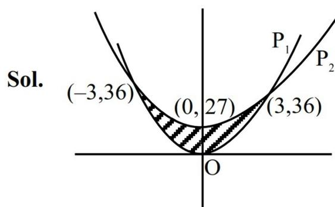

7. Let the arithmetic mean of  $\frac{1}{a}$  and  $\frac{1}{b}$  be  $\frac{5}{16}$ ,  $a > 2$ .

If  $\alpha$  is such that  $a, 4, \alpha, b$  are in A.P., then the equation  $\alpha x^2 - ax + 2(\alpha - 2b) = 0$  has :

- (1) One root in  $(1, 4)$  and another in  $(-2, 0)$
- (2) One root in  $(0, 2)$  and another in  $(-4, -2)$
- (3) Complex roots of magnitude less than 2
- (4) Both roots in the interval  $(-2, 0)$

Ans. (1)

Sol.  $a = 4 - d, \alpha = 4 + d, b = 4 + 2d$

$$\Rightarrow (4 + d)x^2 - (4 - d)x + 2(4 + d - 8 - 4d) = 0$$

$$\Rightarrow (4 + d)x^2 - (4 - d)x + 2(-4 - 3d) = 0$$

$$\text{Also } \frac{\frac{1}{a} + \frac{1}{b}}{2} = \frac{5}{16}$$

$$\Rightarrow \frac{\frac{1}{4-d} + \frac{1}{4+2d}}{2} = \frac{5}{16}$$

$$\Rightarrow d = 2$$

Equation becomes

$$6x^2 - 2x - 20 = 0$$

$$3x^2 - x - 10 = 0$$

$$x = 2, \frac{-5}{3}$$

8. Given below are two statements :

**Statement I :** The function  $f : \mathbf{R} \rightarrow \mathbf{R}$  defined by

$$f(x) = \frac{x}{1+|x|} \text{ is one-one.}$$

**Statement II :** The function  $f : \mathbf{R} \rightarrow \mathbf{R}$  defined by

$$f(x) = \frac{x^2 + 4x - 30}{x^2 - 8x + 18} \text{ is many-one.}$$

In the light of the above statements, choose the **correct answer** from the options given below :

- (1) Both **Statement I** and **Statement II** are false.
- (2) Both **Statement I** and **Statement II** are true.
- (3) **Statement I** is false but **Statement II** is true .
- (4) **Statement I** is true but **Statement II** is false.

Ans. (2)

Sol. **Statement 1:**  $f(x) = \frac{x}{1+|x|}$

$$f(x) = \begin{cases} \frac{x}{1+x} & x \geq 0 \\ \frac{x}{1-x} & x < 0 \end{cases}$$

Graph of the function f(x) = x/(1+|x|). The graph is an S-shaped curve passing through the origin (0,0). It has horizontal asymptotes at y=1 and y=-1, indicated by dashed lines. The curve is strictly increasing and passes the horizontal line test, making it one-one.

$f(x)$  is one-one

**Statement 2:**  $f(x) = \frac{x^2 + 4x - 30}{x^2 - 8x + 18}, f(0) = \frac{-30}{18} = \frac{-5}{3}$

$$\frac{-5}{3} = \frac{x^2 + 4x - 30}{x^2 - 8x + 18}$$

On solving  $x = 0, -1$

$$\Rightarrow f(0) = f(-1) = \frac{-5}{3}$$

$\therefore f(x)$  is many-one

9. An ellipse has its center at  $(1, -2)$ , one focus at  $(3, -2)$  and one vertex at  $(5, -2)$ . Then the length of its latus rectum is :

- (1)  $\frac{16}{\sqrt{3}}$
- (2) 6
- (3)  $4\sqrt{3}$
- (4)  $6\sqrt{3}$

Ans. (2)

Sol.

Diagram of an ellipse centered at C(1, -2). The center C, focus F1(3, -2), and vertex A1(5, -2) are all on the x-axis. The distance from the center to the focus is CF1 = 2, and the distance from the center to the vertex is CA1 = 4. The ellipse is elongated horizontally.

$$CA_1 = a = 4$$

$$CF_1 = ae = 2$$

$$e = \frac{1}{2}$$

$$\begin{aligned} LR &= 2e \left( \frac{a}{e} - ae \right) \\ &= 2 \times \frac{1}{2} \times \left( \frac{4}{1/2} - 2 \right) \end{aligned}$$

$$= 6$$

10. Let the ellipse  $E: \frac{x^2}{144} + \frac{y^2}{169} = 1$  and the hyperbola

$H: \frac{x^2}{16} - \frac{y^2}{\lambda^2} = 1$  have the same foci. If  $e$  and  $L$

respectively denote the eccentricity and the length of the latus rectum of  $H$ , then the value of  $24(e + L)$  is :

- (1) 296 (2) 126  
(3) 148 (4) 67

Ans. (1)

Sol. Equation of hyperbola :  $\frac{y^2}{\lambda^2} - \frac{x^2}{16} = 1$

Equation of ellipse :  $\frac{x^2}{144} + \frac{y^2}{169} = 1$

$$e' = \sqrt{1 - \frac{144}{169}} = \frac{5}{13}$$

focus  $\Rightarrow (0, 5)$

$$\Rightarrow \lambda \sqrt{1 + \frac{16}{\lambda^2}} = 5$$

$$\Rightarrow \lambda^2 + 16 = 25$$

$$\lambda = 3$$

$$\text{Eccentricity of hyperbola} = \sqrt{1 + \frac{16}{\lambda^2}} = \frac{5}{3}$$

$$\text{Length of latus rectum of hyperbola} = \frac{2(16)}{3} = \frac{32}{3}$$

$$24(e + L) = 24 \left[ \frac{5}{3} + \frac{32}{3} \right] = 8 \times 37 = 296$$

11. Let  $P_1: y = 4x^2$  and  $P_2: y = x^2 + 27$  be two parabolas. If the area of the bounded region enclosed between  $P_1$  and  $P_2$  is six times the area of the bounded region enclosed between the line  $y = \alpha x$ ,  $\alpha > 0$  and  $P_1$ , then  $\alpha$  is equal to :

- (1) 8 (2) 15  
(3) 12 (4) 6

Ans. (3)

Graph showing two parabolas, P1 and P2, intersecting at points (-3, 36), (0, 27), and (3, 36). The region between them is shaded. The origin is labeled O.

Sol.

Area bounded between  $P_1$  &  $P_2$  is

$$\int_{-3}^3 ((x^2 + 27) - (4x^2)) dx$$

(P.O.I. of  $P_1$  &  $P_2$  is  $x = \pm 3$ )

$$= 2 \int_0^3 (27 - 3x^2) dx = 2 [27x - x^3]_0^3$$

$$= 2[81 - 27] = 108$$

$\therefore$  Area bounded between  $P_1$  &  $L$  is 18 sq. units

(Area between  $x^2 = 4ay$  & line  $x = my$ ) is  $\frac{8a^2}{3m^3}$

$\therefore$  Area between  $x^2 = \frac{y}{4}$  &  $x = \frac{y}{\alpha}$  is

$$\frac{8 \cdot \left(\frac{1}{16}\right)^2}{3 \cdot \left(\frac{1}{\alpha}\right)^3} = 18$$

$$\Rightarrow \frac{\frac{8}{16 \cdot 16}}{\frac{3}{\alpha^3}} = 18 \Rightarrow \alpha^3 = 2^6 \cdot 3^3$$

$$\Rightarrow \alpha = 12$$

12. Let the circle  $x^2 + y^2 = 4$  intersect x-axis at the points  $A(a, 0)$ ,  $a > 0$  and  $B(b, 0)$ . Let  $P(2 \cos \alpha, 2 \sin \alpha)$ ,  $0 < \alpha < \frac{\pi}{2}$  and  $Q(2 \cos \beta, 2 \sin \beta)$  be two

points such that  $(\alpha - \beta) = \frac{\pi}{2}$ . Then the point of

intersection of AQ and BP lies on :

- (1)  $x^2 + y^2 - 4y - 4 = 0$   
(2)  $x^2 + y^2 - 4x - 4 = 0$   
(3)  $x^2 + y^2 - 4x - 4y = 0$   
(4)  $x^2 + y^2 - 4x - 4y - 4 = 0$

Ans. (1)

**Sol.** Let point of intersection  $R(h,k)$

$$m_{BR} = m_{BP} \Rightarrow \frac{k}{h+2} = \frac{2 \sin \alpha}{2 \cos \alpha + 2} \Rightarrow \frac{k}{h+2} = \tan \frac{\alpha}{2}$$

$$m_{AR} = m_{AQ} \Rightarrow \frac{k}{h-2} = \frac{2 \sin \beta}{2 \cos \beta - 2} = \frac{\sin \beta}{\cos \beta - 1} = -\cot \frac{\beta}{2}$$

$$\frac{\alpha}{2} - \frac{\beta}{2} = \frac{\pi}{4}$$

$$\tan\left(\frac{\alpha}{2} - \frac{\beta}{2}\right) = \tan \frac{\pi}{4} = 1$$

$$\frac{\tan \frac{\alpha}{2} - \tan \frac{\beta}{2}}{1 + \tan \frac{\alpha}{2} \tan \frac{\beta}{2}} = 1$$

$$\frac{\frac{k}{h+2} + \frac{h-2}{k}}{1 + \left(\frac{k}{h+2}\right)\left(\frac{2-h}{k}\right)} = 1 \Rightarrow \frac{k^2 + h^2 - 4}{\frac{k(h+2)}{4}} = 1$$

$$\frac{h^2 + k^2 - 4}{4k} = 1$$

$$x^2 + y^2 - 4y - 4 = 0$$

13. Let  $[\cdot]$  denote the greatest integer function. Then

$$\int_{-\frac{\pi}{2}}^{\frac{\pi}{2}} \left( \frac{12(3 + [x])}{3 + [\sin x] + [\cos x]} \right) dx \text{ is equal to:}$$

- (1)  $15\pi + 4$                       (2)  $11\pi + 2$   
 (3)  $13\pi + 1$                       (4)  $12\pi + 5$

**Ans. (2)**

$$\text{Sol. } I = \int_{-\frac{\pi}{2}}^{\frac{\pi}{2}} \frac{12(3 + [x])dx}{3 + [\sin x] + [\cos x]}$$

$$I = \int_{-\frac{\pi}{2}}^{-1} \frac{12(1)dx}{2} + \int_{-1}^0 \frac{12(2)dx}{2} + \int_0^1 \frac{12(3)dx}{3} + \int_1^{\frac{\pi}{2}} \frac{12(4)dx}{3}$$

$$I = 6\left(\frac{\pi}{2} - 1\right) + 12(0 + 1) + 12(1 - 0) + 16\left(\frac{\pi}{2} - 1\right)$$

$$I = 3\pi - 6 + 12 + 12 + 8\pi - 16$$

$$I = 11\pi + 2$$

14. Let  $y = y(x)$  be the solution of the differential equation  $x \frac{dy}{dx} - y = x^2 \cot x, x \in (0, \pi)$ .

If  $y\left(\frac{\pi}{2}\right) = \frac{\pi}{2}$ , then  $6y\left(\frac{\pi}{6}\right) - 8y\left(\frac{\pi}{4}\right)$  is equal to :

- (1)  $3\pi$                                       (2)  $-3\pi$   
 (3)  $-\pi$                                       (4)  $\pi$

**Ans. (3)**

$$\text{Sol. } xdy - ydx = x^2 \cot x dx$$

$$x^2 d\left(\frac{y}{x}\right) = x^2 \cot x dx$$

$$d\left(\frac{y}{x}\right) = \cot x dx$$

$$\int d\left(\frac{y}{x}\right) = \int \cot x dx$$

$$\frac{y}{x} = \log_e \sin x + C$$

$$\text{given } y\left(\frac{\pi}{2}\right) = \frac{\pi}{2}$$

$$\Rightarrow C = 1$$

$$y = x(\log_e \sin x + 1)$$

$$y\left(\frac{\pi}{6}\right) = \frac{\pi}{6}[-\log_e 2 + 1]$$

$$y\left(\frac{\pi}{4}\right) = \frac{\pi}{4}\left[-\frac{1}{2} \log_e 2 + 1\right]$$

$$6y\left(\frac{\pi}{6}\right) - 8y\left(\frac{\pi}{4}\right)$$

$$= \pi \left[ (-\log_e 2 + 1) + 2 \left( \frac{1}{2} \log_e 2 - 1 \right) \right]$$

$$= \pi [1 - 2] = -\pi$$

15. The sum of all the elements in the range of  $f(x) = \text{Sgn}(\sin x) + \text{Sgn}(\cos x) + \text{Sgn}(\tan x) + \text{Sgn}(\cot x)$ ,  $x \neq \frac{n\pi}{2}, n \in \mathbb{Z}$ ,

where  $\text{Sgn}(t) = \begin{cases} 1, & \text{if } t > 0 \\ -1, & \text{if } t < 0 \end{cases}$ , is

- (1) 4                                      (2) 2  
 (3) -2                                      (4) 0

**Ans. (2)**